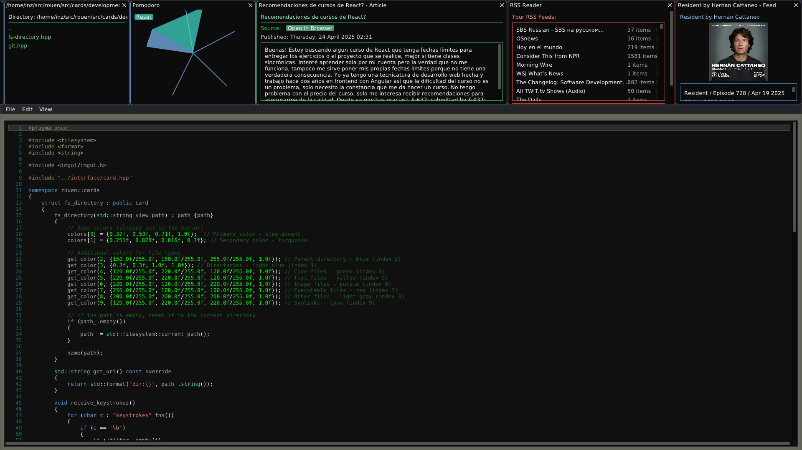

# Rouen

A modern, card-based productivity dashboard with a clean, dark interface built on ImGui and SDL2.



## About

Rouen is an opinionated productivity tool that organizes functionality into interactive cards. It provides a customizable workspace with tools for development, time management, and system monitoring.

The name "Rouen" is inspired by the Rouen pattern, a historic French playing card suit system. This naming reflects the application's card-based UI design, where each feature is presented as an interactive card that can be arranged and managed in your workspace.

## Features

### Development Tools
- **Git Integration**: View repository status, commits, branches and diffs visually
- **File System Navigation**: Browse, filter, and manage directories with color-coded file types
- **Code Editor**: Syntax highlighting powered by ImGuiColorTextEdit

### Productivity
- **Pomodoro Timer**: Stay focused with built-in time management techniques
- **Cards System**: Modular design with draggable, resizable, and persistent cards
- **Menu Launcher**: Quick-access command palette with search functionality

### Information & Planning
- **Calendar**: Sync and view events with Google Calendar integration
- **Travel Planner**: Create and manage travel plans with destinations and budgets
- **Email Client**: Connect to IMAP/SMTP servers to read and compose emails
- **Weather Info**: Check current conditions and forecasts for any location
- **RSS Reader**: Follow news, podcasts, and blogs with integrated feed reader
- **AI Assistant**: Interact with Grok AI for help and information

### System Utilities
- **System Monitor**: Track CPU, memory, disk usage, and uptime
- **Environment Variables**: View and manage system environment variables
- **Database Repair**: Maintain and fix SQLite database files

### Media
- **Internet Radio**: Listen to streaming radio stations

### Interface
- **Dark Theme**: Eye-friendly interface designed for long coding sessions
- **Customizable Colors**: Each card features its own themed color scheme
- **Keyboard Shortcuts**: Power user navigation and quick access to functions
- **Card Snapshots**: Capture and save card contents as images
- **Persistent State**: Automatically save and restore your workspace layout

## Documentation

- [Card Infrastructure](src/cards/README.md) - Guide to the card and deck architecture
- [Hosts Infrastructure](src/hosts/README.md) - Documentation for external service connectors
- [Models Infrastructure](src/models/README.md) - Guide to data models and business logic

## Building from Source

### Prerequisites

- C++23 compatible compiler
- CMake 3.30+
- SDL2 and SDL2_image
- ImGui
- GLFW

### Build Instructions

```bash
# Clone the repository
git clone https://github.com/ignacionr/rouen.git
cd rouen

# Create build directory
mkdir -p build && cd build

# Configure and build
cmake ..
make

# Run the application
./rouen
```

## License

Open source - see LICENSE file for details.

## Contributing

Contributions welcome. Fork the repository, make your changes, and submit a pull request.