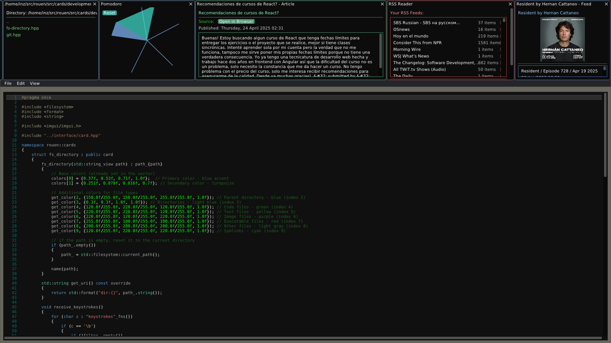

# Rouen

A modern, card-based productivi### Information & Communication
- **Email Client**: Connect to IMAP/SMTP servers to read and compose emails with secure SSL/TLS support
- **Weather Info**: Check current conditions and forecasts for any location
- **RSS Reader**: Follow news, podcasts, and blogs with integrated feed reader and AI-powered feed discovery
  - Add RSS feeds manually by URL
  - **AI Feed Discovery**: Use Cmd+Enter (macOS) or Ctrl+Enter (Windows/Linux) to search for RSS feeds by topic using AI
  - Supports multiple AI providers (Grok, OpenAI, Groq, Gemini) with internet search capabilities
  - Smart feed suggestions with descriptions and one-click addition
  - **Media Extraction**: Automatically detects and extracts video/audio content from RSS feeds (supports MP4, WebM, YouTube, Vimeo)
  - **Enhanced Content Processing**: Intelligently processes `content:encoded` sections for rich media content (optimized for RT.com and similar feeds)
  - **Right-click Context Menu**: Right-click on any feed to copy feed URL or title to clipboard
- **AI Assistant**: Interact with multiple LLM providers (Grok, OpenAI, Groq, or custom endpoints) with optimized chat interface, cached rendering, and smooth scrolling
- **Radio Player**: Stream internet radio with MPV-based audio playback, volume control, and video supporthboard with a clean, dark interface built on ImGui and SDL2.



## About

Rouen is an opinionated productivity tool that organizes functionality into interactive cards. It provides a customizable workspace with tools for development, time management, and system monitoring.

The name "Rouen" is inspired by the Rouen pattern, a historic French playing card suit system. This naming reflects the application's card-based UI design, where each feature is presented as an interactive card that can be arranged and managed in your workspace.

## Table of Contents

- [Features](#features)
- [Installation](#installation)
- [Building from Source](#building-from-source)
- [Architecture](#architecture)
- [Development](#development)
- [Usage](#usage)
- [Contributing](#contributing)
- [License](#license)

## Features

### Development Tools
- **Git Integration**: View repository status, commits, branches and diffs visually
- **GitHub Integration**: Enhanced CI/CD monitoring with workflow diagnostics, repository management, and real-time status updates
- **File System Navigation**: Browse, filter, and manage directories with color-coded file types
- **Code Editor**: Syntax highlighting powered by ImGuiColorTextEdit
- **CMake Integration**: Project viewer and builder with visual configuration
- **Environment Variables**: Comprehensive viewer and editor for system environment variables
- **JIRA Integration**: Issue management, project visualization, and advanced JQL search capabilities

### Productivity & Time Management
- **Pomodoro Timer**: Stay focused with built-in time management techniques and sound notification when a session completes
- **Alarm Card**: Set alarms with configurable sound notifications, snooze and stop controls. Choose from multiple alarm sounds (Classic Beep, Modern Alert, Simple Tone) with test sound functionality
- **Calendar**: Sync and view events with Google Calendar integration
- **Trello Integration**: Comprehensive Trello API integration with support for:
  - **General Access** (`trello:`): Browse all boards, search cards globally, manage multiple boards
  - **Board-Specific Access** (`trello-board:<board_id>`): Direct access to specific boards with optimized interface
  - **Full CRUD Operations**: Create, read, update, and delete boards, lists, and cards
  - **Advanced Features**: Card search, profile management, real-time sync, and rich metadata display
- **Travel Planner**: Create and manage travel plans with destinations and budgets

### Information & Communication
- **Email Client**: Connect to IMAP/SMTP servers to read and compose emails with secure SSL/TLS support
- **Weather Info**: Check current conditions and forecasts for any location
- **RSS Reader**: Follow news, podcasts, and blogs with integrated feed reader and right-click clipboard functionality
- **Markdown Notes**: Personal markdown knowledge base with wiki-style links (`[[note]]`), backlinks, tags, and GitHub repository synchronization
- **AI Assistant**: Interact with multiple LLM providers (Grok, OpenAI, Groq, or custom endpoints) with optimized chat interface, cached rendering, and smooth scrolling
- **Radio Player**: Stream internet radio with MPV-based audio playback, volume control, and video support

### Financial & Trading
- **Bybit Assets**: View cryptocurrency assets and account balance on Bybit exchange using secure API integration
- **Unit Converter**: Convert between different units of measurement including temperature, length, weight, volume, and area

### Games & Entertainment
- **Chess Replay**: Advanced chess game analysis with PGN support, AI-powered commentary, and strategic insights
- **Media Player**: Robust audio/video playback with MPV backend, streaming support, and network optimization

### System & Configuration
- **Settings Card**: Centralized configuration management with category-based organization, search filtering, and secure handling of sensitive data
- **System Information**: Real-time system monitoring and hardware information
- **Database Repair**: Database maintenance and repair utilities
- **Cards System**: Modular design with draggable, resizable, and persistent cards
- **Menu Launcher**: Quick-access command palette with search functionality

## Installation

Rouen provides convenient installation options for Windows and macOS platforms with automated releases and dependency management.

### Windows Installation

#### Option 1: MSI Installer (Recommended)
> **✅ NEW**: User-mode MSI installer with automatic dependency management

1. **Download** the latest `.msi` file from the [Releases page](https://github.com/ignaciorodriguez/rouen/releases)
2. **Run** the MSI installer (no administrator privileges required)
3. **Install** in user mode - the application will be installed to your local AppData folder
4. **Launch** from Start Menu or Desktop shortcut

**MSI Installer Features:**
- **User-mode Installation**: No administrator privileges required
- **Automatic Dependencies**: All required DLLs and runtime libraries included
- **Start Menu Integration**: Creates Start Menu and Desktop shortcuts
- **Clean Uninstall**: Proper Windows uninstall support via Control Panel
- **Version Management**: Automatic updates and version tracking

#### Option 2: Portable ZIP Package
1. **Download** the `rouen-windows-x64.zip` file from the [Releases page](https://github.com/ignaciorodriguez/rouen/releases)
2. **Extract** to any folder on your computer
3. **Run** `rouen.exe` directly (no installation required)

**ZIP Package Features:**
- **Portable**: Run from any location without installation
- **Self-contained**: All dependencies included in the package
- **No Registry Changes**: Leaves no traces on the system
- **Multiple Versions**: Run different versions side-by-side

### macOS Installation

#### DMG Package (Apple Silicon)
1. **Download** the latest `.dmg` file from the [Releases page](https://github.com/ignaciorodriguez/rouen/releases)
2. **Mount** the DMG by double-clicking
3. **Drag** Rouen.app to your Applications folder
4. **Launch** from Applications or Spotlight

**macOS Requirements:**
- **Apple Silicon Mac** (M1, M2, M3+) - ARM64 native
- **macOS 11.0 (Big Sur)** or later - optimized for modern macOS
- **Automatic Dependencies**: All required libraries bundled in the app package
- **Enhanced Build System**: Robust dependency management with Nix (see below)

### Linux Installation

#### TAR.GZ Package (Ubuntu 20.04+)
> **✅ NEW**: Native Linux builds with Nix dependency management

1. **Download** the latest `rouen-linux-x64.tar.gz` file from the [Releases page](https://github.com/ignaciorodriguez/rouen/releases)
2. **Extract** the archive: `tar -xzf rouen-linux-x64.tar.gz`
3. **Install** system dependencies:
   ```bash
   sudo apt-get update
   sudo apt-get install libx11-6 libgl1-mesa-glx libasound2
   ```
4. **Run** using the launcher script: `./run-rouen.sh`

**Linux Package Features:**
- **Native Linux Build**: Compiled specifically for Linux x64 architecture
- **Nix Dependencies**: All required libraries built and bundled consistently
- **Launcher Script**: Convenient startup script with proper library path configuration
- **Self-contained**: All dependencies included, minimal system requirements
- **Universal Compatibility**: Tested on Ubuntu 20.04+ and compatible distributions

**Linux Requirements:**
- **Ubuntu 20.04 LTS** or newer (or equivalent Linux distribution)
- **X11 Display Server** (Wayland compatibility via XWayland)
- **OpenGL Support** (Mesa or proprietary drivers)
- **4 GB RAM** minimum, 8 GB recommended
- **100 MB** disk space for installation

### System Requirements

#### Windows
- **Windows 10** version 1903 or later (64-bit)
- **DirectX 11** compatible graphics card
- **4 GB RAM** minimum, 8 GB recommended
- **100 MB** disk space for installation

#### macOS
- **Apple Silicon Mac** (M1/M2/M3+ processors)
- **macOS 13.3 (Ventura)** or later
- **4 GB RAM** minimum, 8 GB recommended
- **100 MB** disk space for installation

#### Linux
- **Ubuntu 20.04 LTS** or newer (or equivalent distribution)
- **X11 Display Server** (Wayland via XWayland)
- **OpenGL Support** (Mesa or proprietary graphics drivers)
- **4 GB RAM** minimum, 8 GB recommended
- **100 MB** disk space for installation

### Multi-Platform Release Support
Rouen supports automated builds and releases for **Windows x64**, **macOS ARM64**, and **Linux x64** with comprehensive packaging and dependency management.

---

## Architecture


Rouen uses a modular, card-based architecture that promotes reusability and maintainability. The diagram above provides a comprehensive visual overview of all architectural components and their relationships.

### Core Components

#### Card System
The application is built around a card-based UI where each functional component is represented as a "card" - a rectangular widget with its own presentation and behavior.

**Card Base Class** (`src/interface/card.hpp`)
- Foundation of the UI system with color theming
- Window management with focus handling
- Virtual render methods for custom behavior
- Performance optimization with configurable refresh rates

**Available Cards**:
- `menu` - Application menu and card launcher
- `git` - Git repository browser with visual diff support
- `github` - GitHub repository browser with CI/CD monitoring
- `github_ci_card` - Dedicated CI/CD diagnostics and monitoring
- `cmake` - CMake project viewer and builder
- `sysinfo` - System information display
- `settings` - Centralized configuration management
- `fs_directory` - File system explorer
- `pomodoro` - Time management tool
- `calendar` - Google Calendar integration
- `grok` - AI chat assistant with multi-provider support
- `rss` - RSS feed reader
- `travel` - Travel planner
- `notes` - Markdown notes editor with backlinks and sync
- `weather` - Weather information
- `mail` - Email client with SSL/TLS support
- `radio` - Internet radio player
- `jira` - Jira issue management
- `jira-projects` - Jira project overview and visualization
- `jira-search` - Advanced Jira search with JQL
- `trello` - Trello board and card management (general access)
- `trello-board` - Trello board viewer with specific board ID
- `envvars` - Environment variables viewer
- `dbrepair` - Database repair tool
- `alarm` - Alarm with sound notification
- `chess_replay` - Chess game analysis with AI commentary
- `bybit` - Cryptocurrency trading interface

#### Deck Management
The `deck` class (`src/interface/deck.hpp`) manages collections of cards:
- Card creation using factory pattern
- Horizontal layout and positioning
- Persistence of card states in configuration
- Global keyboard shortcuts (Cmd+W/Ctrl+W to close, Cmd+Shift+S/Ctrl+Shift+S for snapshots)

#### Helper Libraries

**Configuration Management** (`src/helpers/config_service.hpp`)
- Centralized .env file support with automatic loading
- Category-based organization (API_CREDENTIALS, SYSTEM_PATHS, LLM_CONFIG, etc.)
- Priority-based value resolution: .env → environment → defaults
- Export/import functionality with sensitive data handling

**HTTP Client** (`src/helpers/fetch.hpp`)
- libcurl-based HTTP client with SSL/TLS configuration
- Multiple SSL modes: strict, relaxed, compatible, insecure
- Environment variable configuration (ROUEN_SSL_MODE, etc.)
- Corporate firewall and proxy support

**LLM Integration** (`src/helpers/llm_config.hpp`)
- Multi-provider LLM support (Grok, OpenAI, Groq, custom endpoints)
- Provider-specific configuration and instructions
- Centralized API key management
- Template-compatible adapter pattern

**Media Playback** (`src/helpers/media_player.hpp`)
- MPV-based audio/video playback with socket communication
- Network streaming optimization
- Volume control and video window management
- Simple sound effects with `play_sound_once()`

**Database Access** (`src/helpers/sqlite.hpp`)
- SQLite wrapper with key-value storage
- Thread-safe operations
- Connection pooling and error handling

#### Host Infrastructure
Data hosts (`src/hosts/`) provide access to external services:
- **RSS Host**: Feed fetching, parsing, and caching
- **Travel Host**: Travel data management and persistence
- **Weather Host**: Weather API integration with caching

### Design Patterns

#### Factory Pattern
Card creation uses the factory pattern (`src/interface/factory.hpp`) for dynamic instantiation based on URI strings.

#### Template Compatibility
LLM adapters use template-compatible interfaces allowing seamless switching between providers while maintaining the same API surface.

#### Observer Pattern
Cards can communicate through the registrar system for loose coupling and event-driven interactions.

#### Resource Management
Platform-specific resource path management (`src/helpers/platform_utils.hpp`) handles differences between development and bundled application environments.

### Multi-Platform Support

#### Build System
- **Nix-based builds**: Reproducible, isolated dependencies for Linux and macOS
- **vcpkg integration**: Windows dependency management
- **CMake 3.30+**: Modern build system with C++23 support

#### Platform-Specific Features
- **macOS**: Application bundle creation with proper icon handling
- **Windows**: MSI installer generation with dependency management
- **Linux**: TAR.GZ packages with launch scripts

#### CI/CD Pipeline
- Unified multi-platform release workflow
- Automated builds for Windows x64, macOS ARM64, and Linux x64
- Comprehensive testing with Google Test and legacy test suites

---

## Environment Setup

Rouen requires certain environment variables for full functionality, particularly for API integrations like weather services. The project supports multiple ways to configure your environment.

### Required Environment Variables

- `OPENWEATHER_KEY`: API key for OpenWeather services (required for weather functionality)
- `GIT_PATH`: Path to Git executable (optional, defaults to system Git)

### Configuration Methods

1. **Global Secrets File** (Recommended for development):
   Create `~/.secrets` with your sensitive configuration:
   ```bash
   OPENWEATHER_KEY=your_api_key_here
   ```

2. **Project Environment File**:
   Copy the template and configure your local environment:
   ```bash
   cp .env.template .env
   # Edit .env with your actual API keys
   ```
   Note: The `.env` file is gitignored and contains your secrets.

3. **System Environment Variables**:
   Set variables directly in your shell profile.

### Setup and Validation

Use the provided scripts to set up and validate your environment:

```bash
# Load environment (from project root)
source scripts/source-secrets.sh

# Validate complete environment setup
./scripts/validate-environment.sh

# Nix users - environment is loaded automatically
nix develop  # or nix-shell
```

For detailed setup instructions, see [docs/ENVIRONMENT_SETUP.md](docs/ENVIRONMENT_SETUP.md).

---

## Development Environment with Nix (Recommended)

Rouen now supports fully isolated, reproducible development and build environments using [Nix](https://nixos.org/). This replaces vcpkg and system/Homebrew dependencies for all supported platforms.

### Why Nix?
- **Reproducible builds**: All dependencies, compilers, and tools are pinned and isolated
- **Multi-platform**: Works on macOS (Apple Silicon), Linux, and (experimental) Windows
- **No system pollution**: No need for Homebrew, vcpkg, or system package managers
- **Easy onboarding**: One command to get a working build environment

### Getting Started with Nix

1. **Install Nix** (if you don't have it):
   See the [Nix installation guide](https://nixos.org/download.html).

2. **Enter the Nix shell**:
   ```sh
   nix-shell
   ```
   This will drop you into a shell with CMake, a modern C++23 compiler, all required libraries, and the correct macOS SDK (on macOS).

3. **Build using CMake**:
   ```sh
   cmake -B build-nix -DCMAKE_TOOLCHAIN_FILE=cmake/nix-toolchain.cmake
   cmake --build build-nix --parallel
   ./build-nix/rouen.app/Contents/MacOS/rouen  # macOS
   ./build-nix/rouen  # Linux
   ```
   Or use the VS Code build task: **Nix Build (Debug)**

4. **Run tests**:
   ```sh
   mkdir -p build-tests && cd build-tests
   cmake ../tests -DCMAKE_TOOLCHAIN_FILE=../cmake/nix-toolchain.cmake -DCMAKE_BUILD_TYPE=Debug
   cmake --build . --parallel
   ctest --output-on-failure
   ```
   Or use the VS Code test tasks (all labeled with "(Nix)").

   **VS Code Test Integration**: Tests are integrated through VSCode tasks and can be run in multiple ways:
   
   **Method 1: VSCode Tasks (Recommended)**
   - Use Command Palette (`Cmd+Shift+P` on macOS or `Ctrl+Shift+P` on Windows/Linux) → "Tasks: Run Task"
   - Select from available test tasks:
     - `Configure Tests (Nix)` - Set up test build environment
     - `Build Tests (Nix)` - Compile all test executables  
     - `Run All Tests (Nix)` - Execute complete test suite
     - `Run Google Tests Only (Nix)` - Execute only Google Test based tests
     - `Run Legacy Tests Only (Nix)` - Execute only console-based tests
   
   **Method 2: Manual CTest Execution**
   - After building tests, open terminal in `build-tests` directory
   - Run specific tests: `./test_math_operations`, `./test_fetch_ssl`, etc.
   - Run via CTest: `ctest --output-on-failure --verbose`
   
   **Method 3: Debugging Tests**
   - Use VSCode debugger with pre-configured launch configurations:
     - `🧪 Debug HTTP/SSL Tests (Nix)`
     - `📊 Debug Example Math Tests (Nix)`
   - Set breakpoints in test files and debug interactively

### VS Code Integration

Rouen provides pre-configured VS Code tasks and launch configurations for Nix-based development:
- **Build**: `Nix Build (Debug)` (default build task)
- **Test**: All test tasks use Nix builds and are labeled with "(Nix)"
- **Test Integration**: Task-based test execution with debugging support
- **Debug**: Launch configs use Nix-built binaries and set up the correct environment

> **Note:** All previous vcpkg/system build tasks and launch configs have been removed in favor of Nix-only workflows. See `.vscode/tasks.json` and `.vscode/launch.json` for details.

**VSCode Test Integration Features**:
- Comprehensive task-based test execution with pre-configured commands
- Individual and batch test running capabilities  
- Integrated debugging support with breakpoints in test code
- Multiple test frameworks: Google Test for modern unit tests, legacy console tests
- Nix-based reproducible test environment matching CI/CD pipeline
- Detailed test output with failure diagnostics and verbose logging

### Nix Build Status

✅ **Fully Working**: The Nix build system is now fully operational for both local development and CI:
- **Local builds**: All compilation warnings/errors are caught with strict GCC 14.3.0/Clang 19 flags
- **Nix flake builds**: `nix build` produces working binaries for both Linux and macOS
- **CI integration**: GitHub Actions use the same Nix environment as local development
- **Icon handling**: Pre-generated application icons are used for reproducible builds across platforms
- **Test suite**: All tests pass with the strict warning configuration

### Customizing the Nix Environment

- Edit `shell.nix` to add or update dependencies
- The CMake toolchain file is at `cmake/nix-toolchain.cmake`
- The Nix shell removes Homebrew and `/usr/local` from `PATH` for full isolation on macOS
- macOS SDK frameworks are provided by Nix for proper header/library isolation

### Network Isolation and ImGui

Rouen now uses **system ImGui packages from Nix**, eliminating network dependencies during build:

- **All Builds**: ImGui is provided via Nix system packages (`imgui` in `flake.nix`)
- **CI/Release Builds**: Network isolation is fully supported (`FETCHCONTENT_FULLY_DISCONNECTED=ON`)
- **Texture Compatibility**: Enhanced `texture_utils.hpp` provides robust ImTextureID casting using C++23 `decltype` and type traits

#### C++23 Texture Utilities

The migration includes a sophisticated texture ID conversion system that handles different ImTextureID definitions:

```cpp
// Automatic type-safe conversion using decltype and constexpr
auto texture_id = rouen::helpers::texture_id_cast(gl_texture_handle);
auto sdl_texture_id = rouen::helpers::sdl_texture_cast(sdl_texture_ptr);
```

**Key Features:**
- **Compile-time type inference** using `decltype(ImTextureID{})`
- **Universal conversion** between pointer and integral types via `uint64_t` bridge
- **Zero runtime overhead** with `constexpr` functions and template metaprogramming
- **Type safety** with SFINAE and C++23 concepts

This ensures compatibility across different ImGui builds (system packages vs FetchContent) without runtime type checking.

---

## Building from Source

### Prerequisites

- **C++23 compatible compiler** (GCC 13+, Clang 16+, or MSVC 2022+)
- **CMake 3.30+**
- **Nix** (for all platforms)

### Nix-Based Build (Recommended)

The project has been **fully migrated to Nix** for dependency management, ensuring reproducible builds across all platforms and network isolation.

#### Dependencies Managed by Nix:
- ImGui (system package with local backends)
- Glaze (JSON serialization)
- SDL2, OpenSSL, SQLite, curl
- All required development tools and compilers

#### Build Instructions:

1. **Enter the Nix shell**:
   ```sh
   nix-shell  # Loads all dependencies automatically
   ```

2. **Configure and build**:
   ```sh
   cmake -B build-nix -DCMAKE_TOOLCHAIN_FILE=cmake/nix-toolchain.cmake
   cmake --build build-nix --parallel
   ```

3. **Run the application**:
   ```sh
   ./build-nix/rouen.app/Contents/MacOS/rouen  # macOS
   ./build-nix/rouen  # Linux
   ```

#### Benefits of Nix Migration:
- ✅ **Network isolation**: No FetchContent downloads at build time
- ✅ **Reproducible builds**: Exact same dependencies across environments
- ✅ **CI/CD efficiency**: Faster builds with dependency caching
- ✅ **Developer experience**: Single command setup (`nix-shell`)
- ✅ **Robust ImGui handling**: Seamless system package integration with custom backends

### Precompiled Headers (Performance Optimization)

Rouen uses a **dual-tier precompiled header (PCH) strategy** to significantly improve compilation times, especially beneficial for the 88+ source files in the project.

#### Performance Benefits
- **22-49% faster compilation** across different build configurations
- **70%+ improvement** for incremental builds
- **Automatic optimization** based on build type (Debug vs Release)

#### PCH Strategy
The system automatically selects appropriate headers based on build configuration:

**Conservative PCH (Debug builds)**:
- Standard library headers (`<memory>`, `<string>`, `<vector>`, etc.)
- Platform-specific headers (SDL, system includes)
- Safe for incremental development and debugging

**Aggressive PCH (Release builds)**:
- All conservative headers plus heavy template libraries
- ImGui complete interface (`imgui.h`, `imgui_internal.h`)
- Glaze JSON serialization (`glaze/glaze.hpp`)
- Maximum performance for production builds

#### Usage
PCH is **automatically enabled** in all builds - no manual configuration required:

```bash
# PCH automatically applied during build
cmake -B build-nix -DCMAKE_TOOLCHAIN_FILE=cmake/nix-toolchain.cmake
cmake --build build-nix --parallel  # 22-49% faster than without PCH
```

#### Cross-Platform Compatibility
- **Full compatibility** with CMake 3.31+ built-in PCH support
- **Compiler support**: Clang 19+, GCC 14+, MSVC 2022+
- **Platform tested**: macOS (Apple Silicon), Linux x64, Windows x64
- **CI integration**: All strictness levels pass with PCH enabled

#### Troubleshooting
If you encounter PCH-related issues during development:

```bash
# Disable PCH for specific files (automatically handled)
# See cmake/precompiled_headers.cmake for configuration

# Clean rebuild to refresh PCH
rm -rf build-nix && cmake -B build-nix -DCMAKE_TOOLCHAIN_FILE=cmake/nix-toolchain.cmake
```

The PCH system is designed to be transparent and robust - it enhances performance without affecting code quality or debugging capabilities.

### Legacy vcpkg Workflow (Deprecated)

> **⚠️ Deprecated**: vcpkg-based builds are deprecated and will be removed in a future release. Use Nix for all new development.

---

## Contributing

Contributions are welcome! Here's how to get involved:

### Development Setup

1. **Install Nix** (recommended for reproducible builds):
   ```bash
   curl -L https://nixos.org/nix/install | sh
   ```

2. **Clone the repository**:
   ```bash
   git clone https://github.com/ignacionr/rouen.git
   cd rouen
   ```

3. **Enter development environment**:
   ```bash
   nix-shell  # Loads all dependencies automatically
   ```

4. **Build the project**:
   ```bash
   cmake -B build-nix -DCMAKE_TOOLCHAIN_FILE=cmake/nix-toolchain.cmake
   cmake --build build-nix --parallel
   ```

### Creating a New Card

1. **Define the card class** in `src/cards/`:
   ```cpp
   namespace rouen::cards {
       class my_card : public card {
       public:
           my_card() {
               colors[0] = {0.2f, 0.5f, 0.8f, 1.0f}; // Primary color
               name("My Card");
               width = 400.0f;
           }
           
           bool render() override {
               return render_window([this]() {
                   ImGui::Text("Hello, world!");
               });
           }
           
           std::string get_uri() const override {
               return "my-card";
           }
       };
   }
   ```

2. **Register in factory** (`src/interface/factory.hpp`):
   ```cpp
   {"my-card", [](std::string_view uri, SDL_Renderer*) {
       return std::make_shared<my_card>();
   }}
   ```

### Adding a Helper Library

1. **Create header file** in `src/helpers/`
2. **Follow existing patterns** for error handling and logging
3. **Add documentation** to the helper's header file
4. **Consider thread safety** for shared resources

### Code Quality Standards

- **C++23 compliance**: Use modern C++ features and best practices
- **Warning-free code**: All builds must pass with `-Werror`
- **Precompiled headers**: PCH system automatically optimizes build performance
- **Documentation**: Comment complex algorithms and public APIs
- **Testing**: Add tests for new functionality in `tests/`
- **DRY principle**: Reuse existing code and patterns where possible

### Submitting Changes

1. **Fork the repository** on GitHub
2. **Create a feature branch**: `git checkout -b feature-name`
3. **Make your changes** following the code style
4. **Test thoroughly**: Run the full test suite
5. **Submit a pull request** with a clear description

### Testing

```bash
# Configure tests
nix-shell --run 'mkdir -p build-tests && cd build-tests && cmake ../tests -DCMAKE_TOOLCHAIN_FILE=../cmake/nix-toolchain.cmake'

# Build tests
nix-shell --run 'cmake --build build-tests --parallel'

# Run all tests
nix-shell --run 'cd build-tests && ctest --output-on-failure'
```

### Documentation

- **Update README.md** for user-facing changes
- **Add inline documentation** for complex code
- **Update helper documentation** when modifying APIs
- **Include usage examples** for new features

## License

Open source - see [LICENSE](LICENSE) file for details.

This project uses the MIT License, allowing for both commercial and non-commercial use with proper attribution.

### Strict Warnings Configuration ✅ COMPLETED

Rouen now uses **extremely strict compiler warnings** with the same configuration as CI builds. The migration to strict warnings is **complete** and all builds are clean with no warnings.

#### Enabled Warnings

All builds (local and CI) use these strict warning flags:

- **`-Werror`**: Treat all warnings as errors (fail fast on issues)
- **`-Weverything`** (Clang): Enable all available warnings for maximum safety
- **`-Wunused-result`**: Catch unused `system()` calls and similar issues
- **`-Wshadow-all`**: Detect all variable shadowing problems
- **`-Wconversion`**: Catch implicit type conversions that may lose data
- **`-Wold-style-cast`**: Enforce modern C++ casting (static_cast, etc.)
- **`-Wnull-dereference`**: Detect potential null pointer dereferences
- **`-Wfloat-equal`**: Prevent unsafe floating-point equality comparisons
- **`-Wcast-align`**: Detect alignment issues in pointer casts
- **`-Wformat=2`**: Strict printf/format string validation
- **`-Wpedantic`**: Enforce strict ISO C++23 compliance

#### Completed Fixes

The strict warning migration addressed:

1. **Old-style Casts**: Replaced all C-style casts with modern C++ `static_cast`/`reinterpret_cast`
2. **Variable Shadowing**: Fixed all parameter and variable name conflicts
3. **Float Comparisons**: Use epsilon-based comparisons for floating-point values
4. **Unused Results**: Proper handling of `system()` calls with `[[maybe_unused]]`
5. **ImGuiColorTextEdit Modernization**: Updated "abandonware" code to modern C++23
6. **Macro Semicolons**: Removed inappropriate semicolons from macro invocations
7. **Exhaustive Enum Switches**: Ensured all enum values are handled

#### Warning Configuration Files

- **`cmake/warnings.cmake`**: Defines all warning flags with compiler-specific handling
- **Clang 19.1.7**: Full `-Weverything` with carefully chosen exclusions
- **GCC 14.3.0**: Equivalent warnings for cross-platform compatibility
- **Selective Disabling**: Only specific warnings disabled (e.g., `-Wno-padded`, `-Wno-unsafe-buffer-usage`)

#### Local-CI Parity

✅ **Achievement**: Local builds now catch **exactly the same warnings as CI**, eliminating surprises:

1. **Early Error Detection**: All issues caught during development, not in CI
2. **Consistent Code Quality**: Same ultra-strict standards across all platforms
3. **Maintainable Codebase**: Prevents common programming mistakes at compile time
4. **Future-Proof**: Ready for compiler updates and new warning flags

> **Success**: The codebase is now 100% warning-free with the strictest possible compiler settings. All builds pass with `-Werror` and comprehensive warning detection.

## Development

### Build System and CI/CD

Rouen uses a modern multi-platform CI/CD pipeline with automated builds and releases for all supported platforms.

#### Workflow Structure

**CI Testing (`ci-nix.yml`)**
- Triggered on push/PR to `main` branch
- Tests Linux and macOS builds using Nix
- Runs comprehensive test suite
- Fast feedback for development

**Platform-Specific Builds**
- `linux-release.yml`: Linux build testing with Nix
- `macos-release.yml`: macOS ARM64 build testing with vcpkg/Homebrew  
- `windows-release.yml`: Windows x64 build testing with vcpkg

**Unified Release (`release.yml`)**
- Triggered manually with `workflow_dispatch` or on release publication
- Coordinates all three platforms to create unified releases
- Produces release-ready assets:
  - `rouen-linux-x64.tar.gz` - Portable Linux archive
  - `rouen-macos-universal.dmg` - macOS disk image installer
  - `rouen-windows-x64.zip` - Windows portable archive
  - `rouen-windows-x64.msi` - Windows MSI installer

#### Creating a Release

1. **Manual Release Creation**:
   ```bash
   # Go to GitHub Actions -> Multi-Platform Release
   # Click "Run workflow"
   # Enter tag name (e.g., "v1.2.0")
   # Optionally mark as pre-release
   ```

2. **Automatic Process**:
   - Creates GitHub release with specified tag
   - Builds all three platforms in parallel
   - Uploads all release assets automatically
   - Generates comprehensive release notes

#### Local Development

**Linux/macOS (with Nix)**:
```bash
nix-shell --run "cmake -B build -DCMAKE_TOOLCHAIN_FILE=cmake/nix-toolchain.cmake"
nix-shell --run "cmake --build build --parallel"
```

**macOS (with vcpkg)**:
```bash
./scripts/setup-macos-build.sh
cmake -B build -DCMAKE_TOOLCHAIN_FILE=vcpkg/scripts/buildsystems/vcpkg.cmake
cmake --build build --parallel
```

**Windows (with vcpkg)**:
```cmd
git clone https://github.com/Microsoft/vcpkg.git vcpkg
cd vcpkg && bootstrap-vcpkg.bat && vcpkg install --triplet x64-windows
cmake -B build -DCMAKE_TOOLCHAIN_FILE=vcpkg/scripts/buildsystems/vcpkg.cmake
cmake --build build --parallel
```

#### Quality Assurance

All builds enforce C++23 standards with strict compiler warnings:
- `-Werror` (warnings as errors)
- Full warning sets for GCC 14+ and Clang 19+
- Comprehensive test suite covering HTTP/SSL, math operations, and UI components

---

## Usage

### Getting Started

1. **Launch Rouen** from your platform's application launcher
2. **Configure settings** by accessing the Settings card (System → Settings)
3. **Add cards** using the Menu launcher (right-click or use command palette)
4. **Arrange workspace** by dragging and resizing cards
5. **Set up integrations** by configuring API keys for external services

### Card Management

#### Creating Cards
- **Menu Card**: Access the menu launcher to browse available cards
- **Command Palette**: Quick search and creation of cards
- **URI-based Creation**: Direct card creation using URI patterns (e.g., `dir:/path/to/folder`)
  - Markdown notes URIs: `notes:` (main interface) and `notes:<note-name>` (open/create specific note)

#### Card Interactions
- **Focus Management**: Click cards to focus, use Tab to cycle through cards
- **Resizing**: Drag card borders to resize
- **Closing**: Use Cmd+W (macOS) or Ctrl+W (Windows/Linux) to close focused card
- **Snapshots**: Use Cmd+Shift+S (macOS) or Ctrl+Shift+S (Windows/Linux) to capture card as PNG image
- **Window Fitting**: Use Cmd+Shift+F (macOS) or Ctrl+Shift+F (Windows/Linux) to fit window to total card width

### Configuration Management

#### Environment Variables
Rouen uses a comprehensive configuration system with .env file support:

```bash
# Core API Keys
GROK_API_KEY=your_grok_api_key_here
OPENAI_API_KEY=your_openai_key
GROQ_API_KEY=your_groq_key

# LLM Configuration
LLM_PROVIDER=grok  # Options: grok, openai, groq, custom
LLM_CUSTOM_URL=https://api.custom-llm.com/v1
LLM_CUSTOM_MODEL=custom-model-name

# External Services
BYBIT_API_KEY=your_bybit_key
BYBIT_SECRET_KEY=your_bybit_secret
GOOGLE_CALENDAR_CLIENT_ID=your_google_client_id
GOOGLE_CALENDAR_CLIENT_SECRET=your_google_secret

# JIRA Integration
JIRA_URL=https://your-company.atlassian.net
JIRA_EMAIL=your-email@company.com
JIRA_API_TOKEN=your_jira_token

# HTTP/SSL Configuration
ROUEN_SSL_MODE=strict  # Options: strict, relaxed, compatible, insecure
ROUEN_SSL_VERIFY_PEER=true
ROUEN_SSL_VERIFY_HOST=true

# System Configuration
ROUEN_LOG_LEVEL=INFO
ROUEN_DEBUG=false
```

#### Settings Card
Access centralized configuration management:
- **Category Organization**: Settings grouped by function (API keys, JIRA profiles, etc.)
- **Search & Filter**: Real-time search across all configuration options
- **Security Features**: Sensitive values masked with toggle visibility
- **Status Indicators**: Color-coded badges show configuration state

### Development Workflow Integration

#### Git & GitHub
- **Repository Browser**: Navigate code, view commits, and track changes
- **CI/CD Monitoring**: Real-time workflow status with detailed diagnostics
- **Branch Management**: Visual branch overview and switching
- **Diff Viewer**: Side-by-side code comparison

#### Project Management
- **JIRA Integration**: Issue tracking, project visualization, and JQL search
- **File System Explorer**: Navigate project directories with syntax highlighting
- **CMake Integration**: Build configuration and project management

### Media & Entertainment

#### Audio/Video Playback
- **Internet Radio**: Stream radio stations with MPV backend
- **Podcast Playback**: RSS feed integration with media player
- **Volume Control**: Real-time volume adjustment during playback
- **Video Support**: Automatic video window for multimedia content

#### Chess Analysis
- **PGN Import**: Load chess games from files or Chess.com
- **AI Commentary**: Get detailed game analysis using LLM providers
- **Move Navigation**: Step through games with autoplay functionality
- **Strategic Insights**: Player improvement suggestions and game summaries

### Productivity Features

#### Time Management
- **Pomodoro Timer**: Customizable work/break intervals with sound notifications
- **Alarm System**: Set multiple alarms with snooze functionality
- **Calendar Integration**: Google Calendar sync with event management

#### Information Management
- **RSS Reader**: Follow blogs, news, and podcasts with feed management and right-click clipboard functionality
- **Email Client**: IMAP/SMTP integration with SSL/TLS security
- **Weather Tracking**: Location-based weather forecasts and conditions
- **Travel Planning**: Destination management with budget tracking

### AI Integration

#### Multi-Provider Support
Configure and switch between LLM providers:
- **Grok (X.AI)**: Web-enabled AI with real-time information
- **OpenAI**: GPT models for general AI assistance
- **Groq**: Fast inference for quick responses
- **Custom Endpoints**: Configure your own LLM API

#### Chat Interface
- **Optimized Rendering**: Cached message bubbles for responsive interaction
- **Context Management**: Conversation history with external conversation support
- **Streaming Responses**: Real-time response rendering
- **Error Handling**: Graceful degradation with informative error messages

### Financial Integration

#### Cryptocurrency Trading
- **Bybit Integration**: View account balances and trading positions
- **Real-time Data**: Current asset values and portfolio overview
- **Secure API**: Encrypted API key storage and communication

### Advanced Features

#### Database Management
- **SQLite Integration**: Local data storage for cards and configuration
- **Database Repair**: Built-in tools for database maintenance
- **Key-Value Storage**: Efficient storage for application state

#### System Monitoring
- **System Information**: Real-time hardware and software monitoring
- **Environment Variables**: Comprehensive environment management
- **Resource Monitoring**: Track application resource usage

### Keyboard Shortcuts

| Shortcut | Action |
|----------|--------|
| `Ctrl+W` (Windows/Linux) / `Cmd+W` (macOS) | Close focused card |
| `Ctrl+Shift+S` (Windows/Linux) / `Cmd+Shift+S` (macOS) | Capture card snapshot |
| `Ctrl+Shift+F` (Windows/Linux) / `Cmd+Shift+F` (macOS) | Fit window to card width |
| `Tab` | Cycle through cards |
| `F11` | Toggle fullscreen |
| `Escape` | Cancel current operation |

### Troubleshooting

#### Common Issues

**SSL/TLS Connection Problems**
- Set `ROUEN_SSL_MODE=relaxed` for corporate environments
- Use `ROUEN_SSL_MODE=compatible` for problematic servers
- Check firewall and proxy settings

**API Key Configuration**
- Verify .env file is in the executable directory
- Check environment variable names match expected format
- Use Settings card to validate configuration status

**Build Issues**
- Use Nix shell for reproducible development environment
- Ensure C++23 compatible compiler (GCC 13+, Clang 16+)
- Run tests to verify build integrity

**Performance Optimization**
- Adjust card `requested_fps` based on content type
- Use background operations for heavy processing
- Monitor memory usage with system information card

---