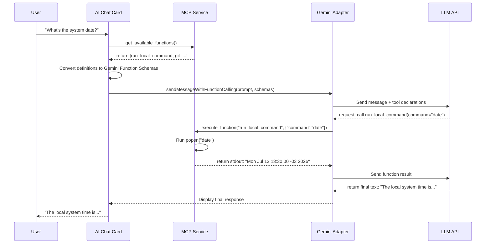

# AI Integration and Model Context Protocol (MCP)

This document details how AI features are integrated into Rouen, how the Model Context Protocol (MCP) is implemented, and how tools are dynamically gathered and presented to the AI Chat.

---

## AI Features in Rouen

Rouen integrates AI capabilities across multiple cards and helpers:

1. **AI Chat Card (`ai_chat`)**: An interactive chat interface that supports conversational history, speech synthesis, and local tool execution (function calling).
2. **Terminal Card Commands**: Converts natural language prompts (e.g., `Ctrl+Enter`) into valid shell commands.
3. **Productivity Helpers**:
   - **Email Metadata Analyzer**: Inspects email headers and bodies to suggest categories, priorities, and action items.
   - **Chess Game Analyzer**: Evaluates game PGNs to highlight mistakes, blunders, and strategic advice.

---

## Supported LLM Providers

You can configure your preferred LLM provider via environment variables or a local `.env` file:

* **Grok (x.ai)**: Enabled by setting `GROK_API_KEY`. Defaults to `grok-3-latest`. Supports grounding/web search.
* **OpenAI (GPT)**: Enabled by setting `OPENAI_API_KEY`. Supports standard GPT-4/GPT-3.5 models.
* **Groq**: Enabled by setting `GROQ_API_KEY`. Used for ultra-low latency completions.
* **Gemini**: Supports native Gemini schemas and function calling adapter interfaces.

---

## Model Context Protocol (MCP)

Rouen implements a local **Model Context Protocol (MCP)** service to expose application and system-level capabilities to the AI Chat. This allows the AI to act as an agentic assistant that can execute commands, inspect repository statuses, and interact with the local environment.

### MCP Registry Architecture

The central registry [mcp_service](file:///Users/ignaciorodriguez/src/rouen/src/helpers/mcp_service.hpp) maintains the list of registered functions. 

Functions can be registered in two ways:
1. **Built-in System Tools**: Core tools that are registered globally in the `mcp_service` constructor.
2. **Dynamic Card Tools**: Exposed by individual active cards. When a card is loaded into the active deck, it registers its functions; when removed/closed, it unregisters them to prevent resource leaks.

---

## Available MCP Functions

### 1. System/Terminal Commands (Built-in)
* **`run_local_command`**: Runs a shell command on the local OS and returns combined stdout/stderr.
  * **Card Type**: `terminal`
  * **Status**: Globally available (always registered).
  * **Parameters**:
    ```json
    {
      "command": "string (Shell command to execute, e.g. curl, date)",
      "working_directory": "string (Optional directory context)"
    }
    ```

### 2. Git Operations (Dynamic)
Exposed dynamically by the [git card](file:///Users/ignaciorodriguez/src/rouen/src/cards/development/git.hpp) when active in the workspace:
* **`get_repository_status`**: Checks the git status of tracked repositories (e.g., staged, conflict, untracked).
* **`get_repositories_needing_push`**: Lists repositories containing commits ahead of their remotes.
* **`get_modified_repositories`**: Lists repositories with unstaged or modified files.

### 3. Weather Operations (Dynamic)
Exposed dynamically by the [weather card](file:///Users/ignaciorodriguez/src/rouen/src/cards/information/weather.hpp) when active in the workspace:
* **`create_weather_card`**: Creates a new weather card for a specific city.
  * **Parameters**:
    ```json
    {
      "city": "string (City name with optional country code, e.g., 'London,uk', 'Tokyo,jp')"
    }
    ```
* **`get_current_weather`**: Fetches current weather information for a city.
  * **Returns**: JSON with temperature, feels_like, humidity, pressure, wind_speed, clouds, weather conditions, and description.
  * **Parameters**:
    ```json
    {
      "city": "string (City name with optional country code, e.g., 'Paris,fr')"
    }
    ```
* **`get_weather_forecast`**: Fetches weather forecast for the next 5 periods (typically 3-hour intervals).
  * **Returns**: JSON array with time, temperature, humidity, wind_speed, weather, description, and precipitation_probability.
  * **Parameters**:
    ```json
    {
      "city": "string (City name with optional country code, e.g., 'Berlin,de')"
    }
    ```

---

## Schema Presentation to AI Chat

When the user enters a prompt in the **AI Chat** card, the following flow occurs:



### Presentation Format

MCP functions are converted to Gemini-compatible JSON function calling schemas:

```json
{
  "name": "run_local_command",
  "description": "Execute a local shell command and return combined stdout/stderr output...",
  "parameters": {
    "type": "object",
    "properties": {
      "command": { "type": "string", "description": "Shell command to execute locally" },
      "working_directory": { "type": "string", "description": "Optional directory" }
    },
    "required": ["command"]
  }
}
```

This structural format ensures that compatible LLMs can reliably resolve when and how to call the system commands rather than hallucinating outputs.
