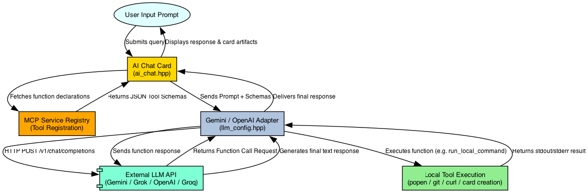

# AI Integration and Model Context Protocol (MCP)

This document details how AI features are integrated into Rouen, how the Model Context Protocol (MCP) is implemented, and how tools are dynamically gathered and presented to the AI Chat.

---

## AI Features in Rouen

Rouen integrates AI capabilities across multiple cards and helpers:

1. **AI Chat Card (`ai_chat`)**: An interactive chat interface supporting conversational history, speech synthesis, local tool execution (function calling), dynamic persona switching, and automated card spawning.
2. **Terminal Card Commands**: Converts natural language prompts into valid shell commands (`Ctrl+Enter`).
3. **Productivity Helpers**:
   - **Email Metadata Analyzer**: Inspects email headers and bodies to suggest categories, priorities, and action items.
   - **Chess Game Analyzer**: Evaluates game PGNs to highlight mistakes, blunders, and strategic advice.
   - **RSS Feed Discovery**: AI-assisted feed discovery based on topics or domain search.

---

## Architecture Flow Diagram



---

## LLM Configuration & Personas

Rouen supports multiple named LLM configurations and persona profiles. This allows you to define different models, API endpoints, and credentials, and bind each AI Persona to its own customized connection.

### Named LLM Configurations

Instead of relying solely on global environment variables, you can create and manage multiple named configurations. One of these configurations is designated as the **default** configuration.

Configurations can be edited via the **Settings** card or directly in `~/Library/Application Support/Rouen/llm_configs.json`:
* **Name**: Unique name for the configuration (e.g., "Gemini Fast", "Grok Search", "Local LLM").
* **Provider**: One of `grok`, `openai`, `groq`, `gemini`, or `custom`.
* **API Key**: The API token or key for that provider (masked in UI).
* **API Base URL**: Customizable base URL (useful for custom OpenAI-compatible proxies, Ollama, MLX, Llama.cpp, etc.).
* **Model Name**: The exact model identifier to request (e.g., `gemini-2.5-flash-lite`, `grok-3-latest`).

*Note: If a configuration's API Key, Base URL, or Model Name is left blank, Rouen will fall back to the corresponding global environment variables (e.g. `GROK_API_KEY`, `OPENAI_API_KEY`) or default settings as a convenience.*

### AI Personas & Bindings

AI Personas define specific system prompts, UI capabilities (allowed MCP commands), and connections. Each Persona can be bound to:
1. **Bound LLM Config**: The named LLM configuration that this persona should use. When you switch to a persona in the AI Chat, Rouen instantly reloads the LLM adapter using the bound configuration.
2. **Enable Web Search**: A toggle inside the persona settings to turn on Google Search grounding (available for Gemini and Grok configurations).

---

## Model Context Protocol (MCP)

Rouen implements a local **Model Context Protocol (MCP)** service to expose application and system-level capabilities to the AI Chat. This allows the AI to act as an agentic assistant that can execute commands, inspect repository statuses, spawn visualization cards, and interact with the local environment.

### MCP Registry Architecture

The central registry [mcp_service](file:///Users/ignaciorodriguez/src/rouen/src/helpers/mcp_service.hpp) maintains the list of registered functions. 

Functions can be registered in two ways:
1. **Built-in System Tools**: Core tools registered globally in the `mcp_service` constructor (e.g., `run_local_command`, `create_card`, `create_number_series_card`).
2. **Dynamic Card Tools**: Exposed by individual active cards. When a card is loaded into the active deck, it registers its functions; when removed/closed, it unregisters them to prevent resource leaks.

---

## Available MCP Functions

### 1. System/Terminal Commands & Card Spawning (Built-in)
* **`run_local_command`**: Runs a shell command on the local OS and returns combined stdout/stderr.
* **`create_card`**: Spawns a new card in the Rouen deck given a URI locator (e.g., `camera:1:1`, `weather:London,uk`).
* **`create_number_series_card`**: Spawns a custom time series or bar/line graph card populated with data points.

### 2. Git Operations (Dynamic)
Exposed dynamically by the [git card](file:///Users/ignaciorodriguez/src/rouen/src/cards/development/git.hpp) when active:
* **`get_repository_status`**: Checks the git status of tracked repositories (e.g., staged, conflict, untracked).
* **`get_repositories_needing_push`**: Lists repositories containing commits ahead of their remotes.
* **`get_modified_repositories`**: Lists repositories with unstaged or modified files.

### 3. Weather Operations (Dynamic)
Exposed dynamically by the [weather card](file:///Users/ignaciorodriguez/src/rouen/src/cards/information/weather.hpp) when active:
* **`create_weather_card`**: Creates a new weather card for a specific city.
* **`get_current_weather`**: Fetches current weather information for a city.
* **`get_weather_forecast`**: Fetches weather forecast for the next 5 periods (typically 3-hour intervals).

---

## Schema Presentation to AI Chat

MCP functions are converted to Gemini-compatible JSON function calling schemas:

```json
{
  "name": "run_local_command",
  "description": "Execute a local shell command and return combined stdout/stderr output...",
  "parameters": {
    "type": "object",
    "properties": {
      "command": { "type": "string", "description": "Shell command to execute locally" },
      "working_directory": { "type": "string", "description": "Optional directory" }
    },
    "required": ["command"]
  }
}
```

This structural format ensures that compatible LLMs can reliably resolve when and how to call the system commands rather than hallucinating outputs.
