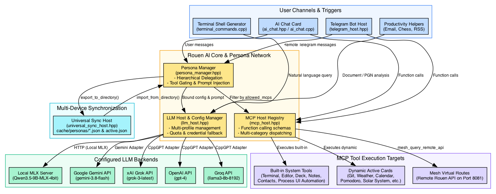
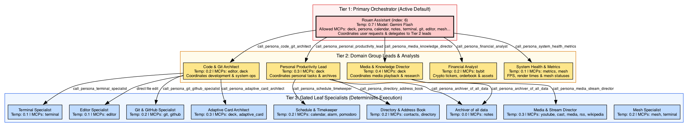

# AI Integration, Hierarchical Personas, and Model Context Protocol (MCP)

This document provides a comprehensive guide to artificial intelligence integration in Rouen. It details how AI capabilities are structured across cards and background daemons, how the **Hierarchical AI Persona System** orchestrates multi-agent delegation, how named LLM configurations and fallbacks function, and how the **Model Context Protocol (MCP)** service exposes host- and card-level tools to conversational agents.

---

## 1. AI Integration Architecture Overview

Rouen embeds AI capabilities throughout its desktop card interface and headless background hosts:



### Core AI Entrypoints in Rouen
1. **AI Chat Card ([`ai_chat`](file:///Users/ignaciorodriguez/src/rouen/src/cards/information/ai_chat.hpp))**:
   - Primary interactive GUI chat card.
   - Supports multi-turn conversational history, thinking indicators, speech synthesis, local tool execution (MCP function calling), dynamic persona switching, temperature tuning, and automated card spawning.
   - Fully asynchronous request dispatching so UI interaction and animations never stutter.
2. **Telegram Bot Host ([`telegram_host`](file:///Users/ignaciorodriguez/src/rouen/src/hosts/telegram_host.hpp))**:
   - Headless background agent connecting to the Telegram Bot API.
   - Exposes conversational AI directly via Telegram chats with persona routing, tool execution, session management, and fallback markdown parsing.
   - Enables operator notifications and mobile task dispatching into the local Rouen instance.
3. **Terminal Natural Language Command Generator ([`terminal_commands.cpp`](file:///Users/ignaciorodriguez/src/rouen/src/cards/system/terminal_commands.cpp))**:
   - Allows users to type natural language requests in terminal cards (e.g., `find all large files modified today`) and generates valid shell commands upon pressing `Ctrl+Enter`.
4. **Productivity Helpers**:
   - **Email Metadata Analyzer ([`email_metadata_analyzer.hpp`](file:///Users/ignaciorodriguez/src/rouen/src/helpers/email_metadata_analyzer.hpp))**: Analyzes email headers, senders, and bodies to extract categories, priority scores, and follow-up items.
   - **Chess Game Analyzer ([`chess_game_analyzer.hpp`](file:///Users/ignaciorodriguez/src/rouen/src/helpers/chess_game_analyzer.hpp))**: Evaluates PGN logs to highlight tactical mistakes, blunders, and strategic advice.
   - **RSS Feed Discovery**: Topic-based feed discovery and RSS diagnostics.
5. **Rouen Mesh Remote AI Routing**:
   - AI agents use virtual route tunnels (`mesh_open_route`) and remote API queries (`mesh_query_remote_api` targeting remote port `8081`) to orchestrate multi-machine queries across peer nodes securely.

---

## 2. LLM Configuration & Connection Management

Rouen decouples model providers, endpoints, and credentials from hardcoded constants via the [`LLMHost`](file:///Users/ignaciorodriguez/src/rouen/src/hosts/llm_host.hpp) and [`LLMConfigManager`](file:///Users/ignaciorodriguez/src/rouen/src/hosts/llm_host.hpp#L70-L100) architecture.

### Supported Providers & Standard Profiles

Configurations are stored in user configuration space (`~/Library/Application Support/Rouen/llm_configs.json` on macOS) and can be configured through the **Settings** card:

| Profile Name | Provider | Default Model | Base URL | Primary Auth Key |
|---|---|---|---|---|
| **Gemini Flash** | `gemini` | `gemini-3.8-flash` | `https://generativelanguage.googleapis.com` | `GEMINI_API_KEY` |
| **Grok Default** | `grok` | `grok-3-latest` | `https://api.x.ai/v1` | `GROK_API_KEY` |
| **OpenAI GPT-4** | `openai` | `gpt-4` | `https://api.openai.com/v1` | `OPENAI_API_KEY` |
| **Groq** | `groq` | `llama3-8b-8192` | `https://api.groq.com/openai/v1` | `GROK_API_KEY` |
| **Local MLX** | `custom` | `mlx-community/Qwen3.5-9B-MLX-4bit` | `http://localhost:8098/v1` | Local token (`mlx-local`) |

> [!NOTE]
> Per Rouen engineering rules, model identifiers are not hardcoded statically when discovering capabilities. Providers query dynamic backend catalog endpoints (e.g. `GET /v1/models` or `GET /v1beta/models`) to inspect active available models.

### Intelligent Credential & Quota Fallback
When an AI persona requests an LLM instance:
1. Rouen checks the profile designated in the persona's `llm_config_name`.
2. If credentials or API keys are missing, Rouen falls back to environment variables (`GEMINI_API_KEY`, `GROK_API_KEY`, `OPENAI_API_KEY`).
3. If still unconfigured, [`LLMHost::create_llm_instance`](file:///Users/ignaciorodriguez/src/rouen/src/hosts/llm_host.cpp#L120-L140) automatically searches across standard active profiles (`Gemini Flash`, `Grok Default`, `OpenAI GPT-4`, `Local MLX`) to maintain conversational continuity.
4. During chat requests, if an active provider (such as Gemini) encounters HTTP 429 quota exhaustion, Rouen activates immediate fallback paths to prevent thread deadlocks.

---

## 3. Hierarchical AI Persona System

Rouen implements a **Hierarchical Persona Network** managed by [`PersonaManager`](file:///Users/ignaciorodriguez/src/rouen/src/helpers/persona_manager.hpp). Rather than forcing a single general-purpose prompt to handle all domain operations, Rouen breaks tasks down into a hierarchy of specialized personas.

### Persona Data Model

Defined in [`rouen::helpers::Persona`](file:///Users/ignaciorodriguez/src/rouen/src/helpers/persona_manager.hpp#L18-L41):

```cpp
struct Persona {
    std::string name;                          // Human-readable persona label
    std::string description;                   // Functional description used for LLM routing
    std::vector<std::string> allowed_mcps;     // Gated tool categories/namespaces
    std::string system_prompt;                 // System prompt instructions and constraints
    std::string llm_config_name;               // Named LLM profile to use
    bool enable_search{false};                 // Grounding / Google Web Search toggle
    std::vector<std::string> allowed_personas; // Sub-personas authorized for delegation
    float temperature{0.7f};                   // Model sampling temperature (0.0 - 1.0)
};
```

### Delegation via Synthesized Sub-Persona Tools

When a persona defines entries in `allowed_personas`, Rouen dynamically constructs function calling schemas and presents them to the model as executable sub-agents:

```json
{
  "name": "call_persona_code_git_architect",
  "description": "Delegates a task or asks a question to the Persona 'Code & Git Architect'. Description: Technical hierarchy group coordinating code editing, terminal commands, Git operations, and UI card building.",
  "parameters": {
    "type": "object",
    "properties": {
      "message": {
        "type": "string",
        "description": "The message, query, or instruction to send to the persona."
      }
    },
    "required": ["message"]
  }
}
```

When the orchestrator decides to call a sub-persona:
1. Function router intercepts calls prefixed with `call_persona_`.
2. Locates the target [`Persona`](file:///Users/ignaciorodriguez/src/rouen/src/helpers/persona_manager.hpp#L18-L41) record.
3. Spins up the target persona with its own bound LLM config, specialized system prompt, temperature, and gated MCP tools.
4. Executes the sub-persona's reasoning loop up to a recursive depth limit (max depth: 5) to prevent cyclic loops.
5. Returns the sub-persona's response directly into the calling orchestrator's context window.

---

## 4. Multi-Tier Hierarchy Example: `personas.json`

The local configuration file (`~/Library/Application Support/Rouen/personas.json`) demonstrates Rouen's standard 3-tier production hierarchy:



### 1. Tier 1: Primary Orchestrator
* **`Rouen Assistant`** (Active default persona, index 6):
  - **Role**: Coordinates top-level user requests.
  - **Temperature**: `0.7` for natural conversational flexibility.
  - **Authorized Sub-Personas**: `Code & Git Architect`, `Personal Productivity Lead`, `Media & Knowledge Director`, `Financial Analyst`, `System Health & Metrics`.
  - **Allowed MCPs**: Deck management, mesh querying, and general utilities.

### 2. Tier 2: Domain Group Leads
* **`Code & Git Architect`**:
  - Focuses on technical operations, code review, file edits, and system command orchestration.
  - Delegates to: `Terminal Specialist`, `Git & GitHub Specialist`, `Adaptive Card Architect`.
* **`Personal Productivity Lead`**:
  - Organizes schedules, contacts, and note archives.
  - Delegates to: `Schedule & Timekeeper`, `Directory & Address Book`, `Archiver of all data`.
* **`Media & Knowledge Director`**:
  - Directs external research, news RSS ingestion, video playback, and Wikipedia summaries.
  - Delegates to: `Media & Stream Director`, `Archiver of all data`.
* **`Financial Analyst`**:
  - Gated to crypto market analysis, orderbook depths, and account balances (`bybit`).
* **`System Health & Metrics`**:
  - Monitors card rendering frame rates, FPS bottlenecks, slow render counts, and mesh node statuses (`metrics`, `mesh`).

### 3. Tier 3: Gated Leaf Specialists
Leaf specialists have empty `allowed_personas` lists and strictly minimal `allowed_mcps`. They run with low temperature (`0.0` to `0.3`) for deterministic, hallucination-free execution:
* **`Terminal Specialist`** (`allowed_mcps: ["terminal"]`, temp: `0.1`): Only allowed to run shell commands.
* **`Editor Specialist`** (`allowed_mcps: ["editor"]`, temp: `0.1`): Dedicated strictly to file inspection and editing.
* **`Git & GitHub Specialist`** (`allowed_mcps: ["git", "github"]`, temp: `0.2`): Manages repositories, branches, and commits.
* **`Adaptive Card Architect`** (`allowed_mcps: ["deck", "adaptive_card"]`, temp: `0.3`): Designs and presents rich JSON Adaptive Cards (flight passes, invoices, dashboards).
* **`Archiver of all data`** (`allowed_mcps: ["notes"]`, temp: `0.0`): Precision librarian persona safeguarding notes across sessions.
* **`Schedule & Timekeeper`** (`allowed_mcps: ["calendar", "alarm", "pomodoro"]`, temp: `0.2`): Event scheduling and timer management.
* **`Directory & Address Book`** (`allowed_mcps: ["contacts", "directory"]`, temp: `0.2`): Address book and contacts integration.
* **`Mesh Specialist`** (`allowed_mcps: ["mesh", "terminal"]`, temp: `0.2`): Peer-to-peer mesh operations and diagnostics.

### Concrete Configuration Snippet from `personas.json`

```json
{
   "active_index": 6,
   "personas": [
      {
         "name": "Rouen Assistant",
         "description": "Primary orchestrator persona for Rouen. Coordinates requests by delegating to specialized per-MCP sub-personas.",
         "allowed_mcps": [
            "deck", "persona", "calendar", "notes", "contacts", "terminal", 
            "git", "editor", "rss", "wikipedia", "youtube", "alarm", "pomodoro", "mesh"
         ],
         "system_prompt": "You are Rouen Assistant, the primary coordinator for Rouen, a card-based desktop application...\nWhen a request requires specialized operations, delegate the task to the appropriate sub-persona tool call.",
         "llm_config_name": "Gemini Flash",
         "enable_search": false,
         "allowed_personas": [
            "Code & Git Architect",
            "Personal Productivity Lead",
            "Media & Knowledge Director",
            "Financial Analyst",
            "System Health & Metrics"
         ],
         "temperature": 0.7
      },
      {
         "name": "Terminal Specialist",
         "description": "Gated per-MCP persona dedicated strictly to running system terminal commands.",
         "allowed_mcps": [
            "terminal"
         ],
         "system_prompt": "You are Terminal Specialist, a minimal, command-line focused utility agent.",
         "llm_config_name": "Gemini Flash",
         "enable_search": false,
         "allowed_personas": [],
         "temperature": 0.1
      }
   ]
}
```

---

## 5. Dynamic Tool Gating & Modular Prompt Injection

Rouen safeguards tool execution by combining **tool gating** with **dynamic prompt enrichment**:

### 1. Tool Visibility Gating
In [`ai_chat.cpp`](file:///Users/ignaciorodriguez/src/rouen/src/cards/information/ai_chat.cpp#L1450-L1490) and [`telegram_host.cpp`](file:///Users/ignaciorodriguez/src/rouen/src/hosts/telegram_host.cpp#L507-L536), every tool registered in [`mcp_host`](file:///Users/ignaciorodriguez/src/rouen/src/hosts/mcp_host.hpp) is categorized. If a tool's category is not present in the active persona's `allowed_mcps`, its schema is completely withheld from the LLM payload.

### 2. Modular Prompt Injection (`get_modular_mcp_instructions`)
Depending on the active persona's `allowed_mcps`, Rouen automatically appends strict behavioral guidelines to the system prompt:

* **Terminal (`terminal`)**:
  - Instructs the AI to execute commands using `run_local_command` rather than instructing the user how to run shell commands manually.
* **Deck & Adaptive Cards (`deck`, `adaptive_card`)**:
  - Enforces a mandatory **two-step workflow**: when asked to create or display a card based on data (e.g. weather, git metrics, notes), the AI *must* call the data retrieval tool first, and only then call `create_adaptive_card` or `create_number_series_card` with real retrieved values. Placeholders are strictly prohibited.
* **Wikipedia (`wikipedia`)**:
  - Instructs the model to use `wikipedia_search` and `wikipedia_get_article` to summarize knowledge directly in the chat, calling `wikipedia_create_card` *only* if the user explicitly asks to "open" or "display" the card on screen.
* **Alarms vs. Pomodoro (`alarm`, `pomodoro`)**:
  - Explicitly separates general timers (`create_alarm`) from Pomodoro focus cycles (`start_pomodoro`), preventing accidental timer mode confusion.
* **Rouen Mesh & Remote Systems (`mesh`)**:
  - **Anti-Hallucination Guardrail**: When listing mesh nodes, reports only verified details specifically requested. Never assumes or hallucinates remote OS or platform details.
  - Requires using `mesh_query_remote_api` or `mesh_open_route` to query the remote node's live API on port `8081` to obtain authoritative system information.

---

## 6. Model Context Protocol (MCP) Tool Catalog

Rouen hosts a centralized tool registry in [`mcp_host`](file:///Users/ignaciorodriguez/src/rouen/src/hosts/mcp_host.cpp). MCP tools are divided into built-in system tools and dynamic card tools.

### Comprehensive Catalog of MCP Functions

```
mcp_host Tool Registry
├── Terminal & Files
│   ├── run_local_command           (Execute shell commands with stdout/stderr capture)
│   └── edit_file                   (Inspect and modify file contents)
├── Deck & Card Lifecycle
│   ├── create_card                 (Open standard cards by URI, e.g. 'weather:London')
│   ├── create_time_series_card     (Spawn line/bar chart visualization cards)
│   ├── create_adaptive_card        (Render interactive native Adaptive Cards)
│   ├── list_adaptive_cards         (List active Adaptive Cards)
│   ├── get_adaptive_card           (Inspect specific Adaptive Card state/JSON)
│   ├── execute_card_action         (Trigger button/submit actions on cards)
│   ├── get_active_card_adaptive    (Retrieve focused card Adaptive Card JSON)
│   ├── list_open_cards             (Inspect current deck contents and card URIs)
│   ├── close_card                  (Close an active card)
│   ├── focus_card                  (Bring a specific card into focus)
│   ├── scroll_deck                 (Smoothly scroll horizontally across sections)
│   └── list_card_schemas           (Expose JSON schemas of all card configurations)
├── Workspace & Display
│   ├── get_window_geometry         (Query window resolution, display scale, width factor)
│   ├── set_window_geometry         (Resize and reposition Rouen window)
│   ├── take_screenshot             (Capture desktop screenshot for visual reasoning)
│   ├── list_themes                 (Enumerate available visual UI themes)
│   └── select_theme                (Apply theme by name)
├── Notes & Archiving
│   ├── notes_list                  (Enumerate saved markdown notes)
│   ├── notes_get                   (Retrieve full markdown note contents)
│   ├── notes_save                  (Create or overwrite a note)
│   ├── notes_append                (Append text or logs to an existing note)
│   └── notes_delete                (Remove a note)
├── Directory & Contacts
│   ├── contacts_list               (Search and list address book entries)
│   ├── contacts_get                (Fetch full contact card metadata)
│   ├── contacts_save               (Create or update a contact)
│   ├── contacts_delete             (Delete a contact)
│   └── contacts_import_macos       (Import macOS system contacts via AddressBook/Contacts)
├── Time & Scheduling
│   ├── get_calendar_events         (Query schedule and calendar events via EventKit)
│   ├── create_calendar_event       (Schedule an appointment or event)
│   └── create_alarm                (Set countdown timers and alarms)
├── Knowledge & Media
│   ├── wikipedia_search            (Search concepts and article titles)
│   ├── wikipedia_get_article       (Fetch full plain text of Wikipedia article)
│   ├── wikipedia_create_card       (Spawn visual Wikipedia reader card)
│   ├── youtube_search              (Search YouTube videos)
│   ├── youtube_play                (Start YouTube playback)
│   ├── youtube_create_card         (Spawn YouTube media player card)
│   ├── get_cast_status             (Inspect ChromeCast / video streaming pipeline)
│   └── control_cast_playback       (Play, pause, seek video feeds)
├── Diagnostics & Audio Engine
│   ├── get_card_metrics            (Inspect card render frame rates, slow render counts)
│   ├── get_rss_diagnostics         (Check RSS feed fetch status and parser errors)
│   ├── get_adlib_status            (Inspect sound synthesis and AdLib sound card emulation)
│   └── control_adlib_engine        (Trigger notes, waveforms, and musical playback)
├── Camera & Vision
│   ├── get_camera_status           (Check camera hardware connection and framerates)
│   ├── take_camera_snapshot        (Capture video frame snapshot)
│   └── set_camera_layout           (Switch between multiview video feed presets)
├── Process Automation & UI Automation
│   ├── list_processes              (Inspect running system processes)
│   ├── save_process_definition     (Save automation definition)
│   ├── delete_process_definition   (Delete process automation definition)
│   ├── start_process               (Launch a monitored application)
│   ├── attach_process              (Attach to running process)
│   ├── kill_process                (Terminate a process)
│   ├── get_process_ui_tree         (Dump accessibility UI automation tree)
│   ├── get_process_ui_values       (Extract UI element values and states)
│   ├── interact_process_ui         (Click buttons, enter text in target GUI applications)
│   └── capture_process_ui_screenshot(Snapshot target process window)
├── Rouen Mesh Networking
│   ├── mesh_list_nodes             (Enumerate paired nodes, peer IDs, and ping latencies)
│   ├── mesh_get_status             (Query cloud relay status and connection health)
│   ├── mesh_open_route             (Open virtual route tunnel to a remote node port)
│   └── mesh_query_remote_api       (Query the REST API on a remote node via mesh tunnel)
├── Persona Management
│   ├── list_personas               (List configured AI personas)
│   ├── enable_persona              (Switch active persona)
│   └── get_active_persona          (Query currently active persona metadata)
└── Notifications
    └── notify_operator_telegram   (Send high-priority alert or message to Telegram operator)
```

### Dynamic Card-Exposed Tools
Cards register dynamic tools when loaded into the active deck and unregister them when removed:
* **Git Card ([`git.hpp`](file:///Users/ignaciorodriguez/src/rouen/src/cards/development/git.hpp))**: `get_repository_status`, `get_repositories_needing_push`, `get_modified_repositories`.
* **Weather Card ([`weather.hpp`](file:///Users/ignaciorodriguez/src/rouen/src/cards/information/weather.hpp))**: `create_weather_card`, `get_current_weather`, `get_weather_forecast`.
* **Pomodoro Card ([`pomodoro.hpp`](file:///Users/ignaciorodriguez/src/rouen/src/cards/productivity/pomodoro.hpp))**: `start_pomodoro`, `pause_pomodoro`, `reset_pomodoro`.
* **Calculator Card ([`calculator.hpp`](file:///Users/ignaciorodriguez/src/rouen/src/cards/productivity/calculator.hpp))**: `evaluate_expression`.
* **Solar System Card ([`solar_system.hpp`](file:///Users/ignaciorodriguez/src/rouen/src/cards/information/solar_system.hpp))**: Planetary ephemeris calculation and view control.

---

## 7. Multi-Device Mesh Synchronization (Universal Sync)

Rouen synchronizes Personas and LLM configurations across laptops, desktops, and remote boxes using the **Universal Sync Host** ([`universal_sync_host.hpp`](file:///Users/ignaciorodriguez/src/rouen/src/hosts/universal_sync_host.hpp)):

```
Local Storage:
  ~/Library/Application Support/Rouen/personas.json
         │
         ▼ (PersonaManager::export_to_directory)
Universal Sync Cache:
  cache/personas/
  ├── rouen-assistant.json
  ├── code-git-architect.json
  ├── terminal-specialist.json
  ├── adaptive-card-architect.json
  └── active.json
         │
         ▼ (Ed25519-Signed P2P Sync over WebSocket / Git)
Peer Rouen Mesh Nodes
```

1. **Granular File Decomposition**:
   - Monolithic `personas.json` is split into individual `cache/personas/<slug>.json` files and an `active.json` pointer via [`PersonaManager::export_to_directory`](file:///Users/ignaciorodriguez/src/rouen/src/helpers/persona_manager.hpp#L190-L238).
   - This eliminates merge conflicts when editing different personas on different machines.
2. **Safe Import & Re-merging**:
   - When receiving updates from a peer, [`PersonaManager::import_from_directory`](file:///Users/ignaciorodriguez/src/rouen/src/helpers/persona_manager.hpp#L241-L349) updates local persona definitions.
   - Core built-in personas (`Rouen Assistant`) are protected from accidental remote deletions.
3. **Real-time Sync Hooks**:
   - Persona mutations trigger granular hooks (`notify_sync("config", "personas.json", ...)`), instantly propagating configuration changes across active mesh connections.

---

## 8. Summary of Architectural Best Practices

* **Precision through Gating**: Never expose all tools to all personas. Keep leaf specialists tightly scoped (`allowed_mcps`) and deterministic (`temperature: 0.0 - 0.2`).
* **Two-Step Visualization**: Always fetch real live data first before invoking `create_adaptive_card` or `create_number_series_card`.
* **Remote System Querying**: Use `mesh_query_remote_api` and virtual tunnels to retrieve authoritative remote node state rather than guessing.
* **Resilient LLM Routing**: Leverage named configurations and automatic fallback to guarantee uninterrupted assistance even during quota exhaustion or network interruptions.
