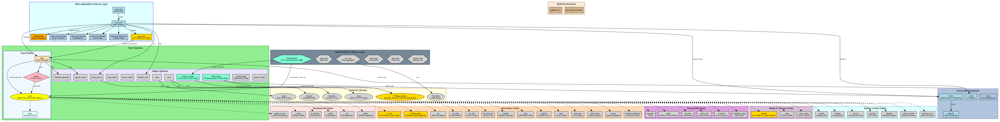
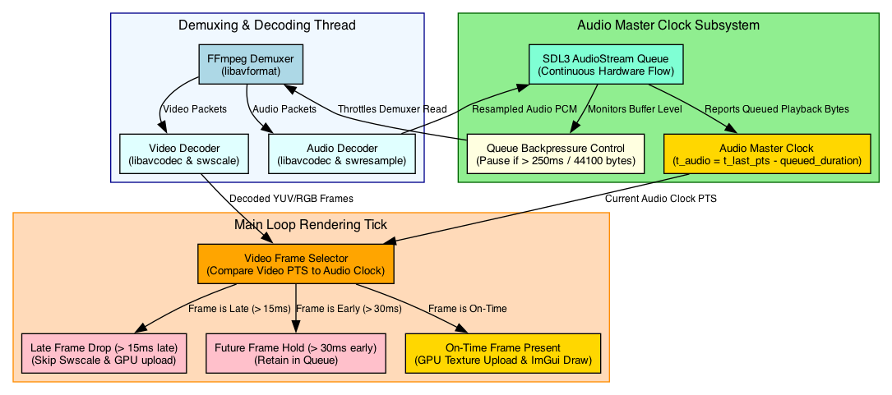

# Architecture Guide

Rouen uses a modular, card-based architecture that promotes separation of concerns, flexibility, and maintainability.

---

## Core Components

### 1. Card System
The primary building block of Rouen's interface is the **Card**. Each card represents an independent, interactive component with its own logic and layout.

* **Card Base Class** ([card.hpp](file:///Users/ignaciorodriguez/src/rouen/src/cards/interface/card.hpp)):
  - Defines the core interface for rendering, focus, sizing, and event handling.
  - Manages card-specific styling, colors, and refresh/fps throttling for rendering efficiency.
  - Provides utility window helpers like `render_window` to standardize wrapper UI frames.
  - Exposes `virtual void render_video_ui()` to allow cards to paint custom vector graphics, telemetry badges, or layout overlays on offscreen video streams.

* **Card Registration and Creation**:
  - Registered dynamic cards are constructed via the **Card Factory** ([factory.hpp](file:///Users/ignaciorodriguez/src/rouen/src/cards/interface/factory.hpp)) using a URI-based scheme (e.g., `camera:1:1`, `number-series:sales`, `git`, `rss`).

---

### 2. Deck Management & Workspace Layout
The **Deck** ([deck.hpp](file:///Users/ignaciorodriguez/src/rouen/src/cards/interface/deck.hpp)) controls collections of active cards:
- **Horizontal Tiling & Workspace Sizing**: Manages card positioning, vertical row stacking, and horizontal workspace width.
- **Width Multipliers & Section Boundaries**:
  - **Width Factor Multiplier ($wf$)**: Configured via the `display` card ([display_card.hpp](file:///Users/ignaciorodriguez/src/rouen/src/cards/system/display_card.hpp)), extending total row width capacity to $\text{row\_max\_width} = \text{size.x} \times wf$ (e.g. 1.0x, 2.0x, 3.0x, 4.0x).
  - **Section Width ($\text{section\_width} = \text{size.x}$)**: Each section represents one full OS window viewport page width.
  - **Last Fitting Window Expansion**: As cards are laid out sequentially into a row, if adding a card would exceed a section boundary ($\text{sec\_boundary} = (k + 1) \times \text{size.x}$), the layout engine expands the width of the last card fitting in section $k$ so its right edge perfectly aligns to $\text{sec\_boundary}$.
  - **Section Navigation**: When focusing a card, Rouen calculates its section index ($\text{section\_idx} = \lfloor\text{abs\_x} / \text{size.x}\rfloor$) and programmatically performs smooth horizontal scrolling to $\text{target\_scroll\_x} = \text{section\_idx} \times \text{size.x}$.
- **Persistent Workspace State**: Saves active card URIs and configurations to `rouen.ini` in user config directory.
- **Global Shortcuts**: Implements shortcuts (`Cmd+W`/`Ctrl+W` to close focused cards, `Cmd+Shift+F`/`Ctrl+Shift+F` fit window width, `Cmd+Shift+S`/`Ctrl+Shift+S` snapshot).

---

### 3. HTTP REST API Server
The **API Server** ([api_server.hpp](file:///Users/ignaciorodriguez/src/rouen/src/helpers/api_server.hpp)) exposes a lightweight embedded Mongoose HTTP server on port `8081`:
- **Card Lifecycle API**: `GET /api/cards`, `POST /api/cards`, `DELETE /api/cards?uri=...`.
- **Camera Layout API**: `GET /api/camera/layout`, `POST /api/camera/layout` (switches between 7 video feed presets dynamically), `GET /api/camera/status`, `POST /api/camera/snapshot`.
- **Video Feed & Cast API**: `POST /api/cast/start`, `POST /api/cast/play`, `GET /api/cast/status`.
- **Schema Discovery API**: `GET /api/schemas` (returns JSON schemas for AI Chat and external integrations).

---

### 4. Helper Libraries
To support application logic, Rouen provides several static/service helper modules in `src/helpers/`:

* **Configuration Service** ([config_service.hpp](file:///Users/ignaciorodriguez/src/rouen/src/helpers/config_service.hpp)):
  - Manages environment variables and local `.env` keys.
* **HTTP Client** ([fetch.hpp](file:///Users/ignaciorodriguez/src/rouen/src/helpers/fetch.hpp)):
  - A thread-safe wrapper around `libcurl` providing SSL/TLS modes (`strict`, `relaxed`, `compatible`, `insecure`).
* **LLM Integration** ([llm_config.hpp](file:///Users/ignaciorodriguez/src/rouen/src/helpers/llm_config.hpp)):
  - Adapter facilitating switches between LLM API providers (Grok, OpenAI, Groq, Gemini, custom endpoints).
* **Media Player** ([media_player.hpp](file:///Users/ignaciorodriguez/src/rouen/src/helpers/media_player.hpp)):
  - Performs native, in-process decoding of multimedia files using FFmpeg (`libavcodec`, `libavformat`, `libswscale`, `libswresample`).
  - Supports local playback with hardware audio output via SDL3 Audio Streams.
* **Stream Encoder** ([stream_encoder.hpp](file:///Users/ignaciorodriguez/src/rouen/src/helpers/stream_encoder.hpp)):
  - In-process H.264 video and AAC stereo audio encoding engine feeding TCP socket streams.
* **Database Access** ([sqlite.hpp](file:///Users/ignaciorodriguez/src/rouen/src/helpers/sqlite.hpp)):
  - Thread-safe key-value store wrapper around SQLite3 for config/state caching.

---

### 5. Host Infrastructure & Multi-Modal Streaming
Hosts in `src/hosts/` manage background data synchronization and caching:
- **Video Cast Host (`VideoFeedHost`)**: Offscreen 1080p ImGui renderer and TCP unicast streaming server (`tcp://127.0.0.1:8889`).
- **RSS Host**: Fetches XML feeds, parses enclosures, extracts podcast watermarks, and caches local feed models.
- **Weather Host**: Fetches meteorological reports and caches forecast results.
- **Trello Host**: Manages board queries, card listings, and CRUD synchronization.

---

## Media Synchronization Model (Audio-Master Clock)

For local playback, Rouen implements an **Audio-Master Clock** model to ensure video and audio alignment:
* **Continuous Audio Flow:** Audio is decoded and written directly to an `SDL_AudioStream` which plays continuously at a fixed hardware sample rate.
* **Rate-limiting via Backpressure:** The demuxer thread pauses reading packets if the audio queue has more than `250ms` of buffered playback (`44100 bytes`).
* **Video Frame Selection & Dropping:** During each ImGui rendering tick, the main thread calculates current audio clock ($t_{\text{audio}} = t_{\text{last\_audio\_pts}} - \text{duration of queued audio}$):
  - Late frames (> **15ms**) are **dropped** (skipping color space conversion, scaling, memory copying, and GPU upload).
  - Early frames (> **30ms**) are held in queue.
  - On-time frames are uploaded and rendered.
* **Zero Pacing Sleeps:** Ensures audio decoding and playback never experience underflow stuttering.
