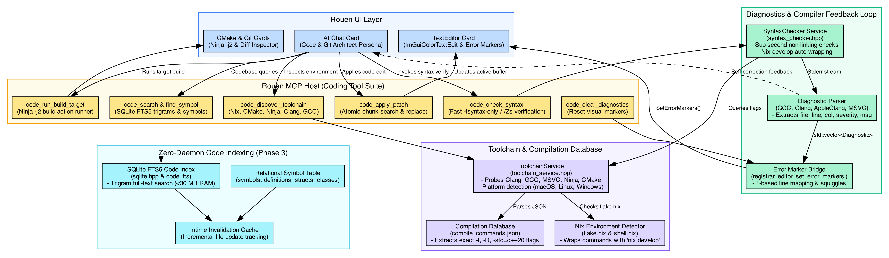
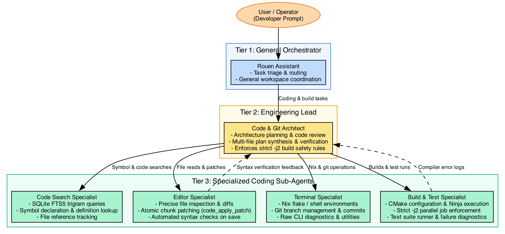
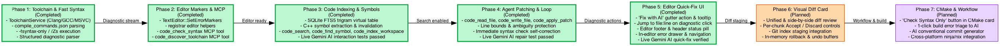

# Coding Capabilities Feasibility Analysis & Implementation Plan for Rouen

This document provides a comprehensive technical feasibility analysis and an incremental, phased implementation roadmap for introducing autonomous and interactive **AI coding capabilities** into Rouen.

---

## 1. Executive Summary & Feasibility Verdict

| Metric | Assessment | Notes |
| :--- | :---: | :--- |
| **Overall Feasibility** | **HIGH (9 / 10)** | Rouen already contains ~75% of the architectural primitives needed for code editing, execution, and diagnostics. |
| **Performance Impact** | **LOW / NEGLIGIBLE** | Zero heavy persistent language servers required; uses embedded SQLite FTS5 and lightweight CLI compilers (`-fsyntax-only`). |
| **Memory Footprint** | **< 30 MB additional** | Completely avoids multi-gigabyte LSP daemon overhead, respecting Rouen's strict 16 GB host memory safety rules. |
| **Host Toolchain Safety** | **STRICT (-j2 aware)** | All build actions strictly enforce max 2 concurrent jobs (`-j2`) to prevent host memory exhaustion. |
| **Target Architecture** | **Modular & Native** | Seamlessly connects Rouen's [TextEditor](file:///Users/ignaciorodriguez/src/rouen/src/editor/text_editor.hpp), [MCP Host](file:///Users/ignaciorodriguez/src/rouen/src/hosts/mcp_host.cpp), [CMake Card](file:///Users/ignaciorodriguez/src/rouen/src/cards/development/cmake.hpp), and [Persona Hierarchy](file:///Users/ignaciorodriguez/src/rouen/docs/AI.md#persona-network-catalog). |

> [!IMPORTANT]
> **Target Technical Scope Focus**:
> - **Languages**: C++ (C++20 and C++23 standards, native modules `.cppm`, and C).
> - **Toolchains & Build Systems**: **Nix** (`flake.nix`, `shell.nix`, `nix develop`), **CMake** (`CMakeLists.txt`, `CMakePresets.json`, `compile_commands.json`), and **Ninja** (`build.ninja`).
> - **Compilers**: Both **Clang** (`clang++` / `clang`) and **GCC** (`g++` / `gcc`), plus **MSVC** (`cl.exe /Zs`) on Windows.
> - **Target Platforms**: **macOS**, **Linux**, and **Windows**.
> - *Stacks outside of C++/Nix/CMake/Ninja are explicitly non-essential and de-prioritized.*

### Why Rouen is Uniquely Positioned for Coding Capabilities
Rouen is not starting from scratch. It already ships with:
1. **Embedded SQLite Engine** ([`sqlite.hpp`](file:///Users/ignaciorodriguez/src/rouen/src/helpers/sqlite.hpp)): Production-grade SQLite3 wrapper with statement binding and transaction support, ready for FTS5 full-text code indexing.
2. **Interactive Gutter & Error Marker System** ([`TextEditor.h`](file:///Users/ignaciorodriguez/src/rouen/external/imguicolortextedit/TextEditor.h#L194)): `::TextEditor::SetErrorMarkers(const ErrorMarkers&)` already implements visual error markers, squiggles, and hover tooltips for 1-based line numbers.
3. **Decoupled MCP Host & Tooling** ([`mcp_host.cpp`](file:///Users/ignaciorodriguez/src/rouen/src/hosts/mcp_host.cpp)): Standardized JSON-RPC tool registration mechanism with process execution ([`ProcessHelper`](file:///Users/ignaciorodriguez/src/rouen/src/helpers/process_helper.hpp)) and editor card triggers.
4. **Three-Tier Persona Network** ([`personas.json`](file:///Users/ignaciorodriguez/Library/Application%20Support/Rouen/personas.json)): Dedicated coding personas already configured in the registry (`Code & Git Architect`, `Editor Specialist`, `Terminal Specialist`).
5. **Nix & CMake Native Cards** ([`cmake.hpp`](file:///Users/ignaciorodriguez/src/rouen/src/cards/development/cmake.hpp), [`git.hpp`](file:///Users/ignaciorodriguez/src/rouen/src/cards/development/git.hpp)): Direct visual controls for configure, build, clean, git diff inspection, and commit management.

---

## 2. Core Architectural Pillars

The proposed coding architecture rests on four core pillars:



---

## 3. Detailed Component Feasibility

### Pillar A: Lightweight Code Indexing & Symbol Search
* **The Problem**: Persistent Language Server Protocol (LSP) daemons like `clangd` or `rust-analyzer` require 1–3 GB of resident memory per workspace, continuous background re-indexing, and complex JSON-RPC socket management that often stalls UI rendering or crashes under memory pressure.
* **The Rouen Solution**: A zero-daemon, embedded SQLite solution:
  1. **SQLite FTS5 Full-Text Content Search**:
     - Leverage Rouen's embedded SQLite ([`src/helpers/sqlite.hpp`](file:///Users/ignaciorodriguez/src/rouen/src/helpers/sqlite.hpp)).
     - Create a workspace table `code_index.db` using the FTS5 trigram tokenizer:
       ```sql
       CREATE VIRTUAL TABLE IF NOT EXISTS code_fts USING fts5(
           filepath,
           content,
           tokenize = 'trigram'
       );
       ```
     - Sub-millisecond substring, symbol, and regex-like lookups across thousands of source files with near-zero memory footprint.
  2. **Relational Symbol Table**:
     - Maintain a lightweight relational table for symbols:
       ```sql
       CREATE TABLE IF NOT EXISTS symbols (
           id INTEGER PRIMARY KEY AUTOINCREMENT,
           name TEXT NOT NULL,
           kind TEXT NOT NULL, /* function, class, struct, enum, variable */
           filepath TEXT NOT NULL,
           line_number INTEGER NOT NULL,
           signature TEXT,
           mtime INTEGER NOT NULL
       );
       CREATE INDEX IF NOT EXISTS idx_symbols_name ON symbols(name);
       ```
     - Extract symbols via a lightweight parser (e.g. Universal Ctags via CLI or a small embedded Tree-Sitter C runtime).
  3. **Incremental Invalidation**:
     - Store file modification timestamps (`mtime`). Only re-index files modified since the last check, completely avoiding repetitive whole-project re-indexing.
* **Feasibility Rating**: **10 / 10** (SQLite already integrated, tables and queries are trivial to implement).

---

### Pillar B: Tooling & Toolchain Auto-Discovery
* **The Problem**: Developers use diverse environments: some use pure Nix flakes, some use Homebrew on macOS, some use Visual Studio on Windows. An AI coding agent cannot assume static tool paths.
* **The Rouen Solution**:
  1. **Nix Environment Awareness**:
     - Check if the repository contains `flake.nix` or `shell.nix`.
     - When present, commands can be transparently executed using `nix develop --command <tool>`.
  2. **CMake Compilation Database (`compile_commands.json`)**:
     - Rouen's [`cmake_card`](file:///Users/ignaciorodriguez/src/rouen/src/cards/development/cmake.hpp) already drives CMake builds.
     - By ensuring `-DCMAKE_EXPORT_COMPILE_COMMANDS=ON` is configured, Rouen obtains `build/compile_commands.json`.
     - This file contains the exact compiler binary, include search directories (`-I`, `-isystem`), and preprocessor macros (`-D`) for every C/C++ file in the project.
  3. **Toolchain Registry (`ToolchainService`)**:
     - Probes `$PATH` and Nix store paths on startup for:
       - Compilers: `clang++`, `g++`, `cl.exe`, `rustc`, `swiftc`.
       - Build tools: `ninja`, `cmake`, `make`, `cargo`.
       - Linters/Formatters: `clang-tidy`, `clang-format`, `ruff`, `eslint`, `prettier`, `shellcheck`.
     - Exposes the discovered toolchain to the AI persona via `code_discover_toolchain`.
* **Feasibility Rating**: **9.5 / 10** (CMake and Nix integration patterns are already established in Rouen).

---

### Pillar C: Fast Syntax Checking & Diagnostic Feedback Loop
* **The Problem**: Running full project builds to detect syntax or type errors is slow (often 30s to several minutes) and wastes battery and CPU. Furthermore, an AI agent needs fast iteration loops to verify its code edits.
* **The Rouen Solution**:
  1. **Fast Syntax-Only Verification (`-fsyntax-only`)**:
     - For C/C++: Invoke `clang++ -fsyntax-only <flags> <file>` or `g++ -fsyntax-only`. This skips code generation, assembly, and linking, validating syntax and type checks in **100–300 milliseconds**.
     - For Python: `python3 -m py_compile <file>` or `ruff check <file>`.
     - For JavaScript/TypeScript: `node --check <file>` or `tsc --noEmit <file>`.
     - For Rust: `cargo check --message-format=json`.
  2. **Standard Diagnostic Parser**:
     - Parse compiler diagnostic messages (e.g. via `-fdiagnostics-format=json` in modern Clang/GCC, or classic regex `^([^:]+):(\d+):(\d+):\s*(error|warning|note):\s*(.*)$`).
     - Map into a simple C++ structure:
       ```cpp
       struct Diagnostic {
           std::string file;
           int line;
           int column;
           std::string severity; // "error", "warning", "note"
           std::string message;
       };
       ```
  3. **Direct GUI Error Markers**:
     - Rouen's [`TextEditor.h`](file:///Users/ignaciorodriguez/src/rouen/external/imguicolortextedit/TextEditor.h#L131) defines:
       ```cpp
       typedef std::map<int, std::string> ErrorMarkers;
       void SetErrorMarkers(const ErrorMarkers& aMarkers);
       ```
     - Converting `std::vector<Diagnostic>` to `ErrorMarkers` (mapping `line -> message`) and calling `SetErrorMarkers` immediately renders red gutter indicators and error tooltips directly in the user's active editor!
  4. **AI Self-Correction Loop**:
     - When the `Code & Git Architect` persona generates or applies a patch to a file, Rouen automatically triggers `check_syntax`.
     - If errors are present, the diagnostic errors and line numbers are immediately fed back to the AI prompt:
       > *"Applying patch introduced syntax error at line 42: 'expected ';' after expression'. Please correct."*
     - The AI self-corrects before handing control back to the user.
* **Feasibility Rating**: **10 / 10** (`TextEditor::SetErrorMarkers` is already built into the engine and line numbers are 1-based, matching compiler outputs directly).

---

### Pillar D: New Coding MCP Tools
To empower Rouen's AI personas without cluttering non-coding agents, we specify a dedicated set of coding tools in [`mcp_host.cpp`](file:///Users/ignaciorodriguez/src/rouen/src/hosts/mcp_host.cpp):

| Tool Name | Parameters | Description |
| :--- | :--- | :--- |
| `code_read_file` | `path: string`, `start_line?: int`, `end_line?: int` | Reads complete file contents or a specific slice of lines. |
| `code_write_file` | `path: string`, `content: string`, `create_parents?: bool` | Writes or overwrites a file on disk and refreshes any open editor card. |
| `code_apply_patch` | `path: string`, `target_content: string`, `replacement_content: string` | Performs atomic search-and-replace on a targeted chunk with collision checks. |
| `code_search` | `query: string`, `file_pattern?: string`, `max_results?: int` | Fast lexical search across indexed codebase via SQLite FTS5. |
| `code_find_symbol` | `name: string`, `kind?: string` | Queries indexed symbol table for definitions, declarations, and structs. |
| `code_check_syntax` | `path: string` | Runs `-fsyntax-only` or file linter, returns structured diagnostics JSON, and updates GUI error markers. |
| `code_get_diagnostics`| `path?: string` | Returns current active compiler/linter diagnostics for a file or entire project. |
| `code_discover_toolchain` | *(none)* | Returns detected compilers, Nix flake capabilities, and CMake targets. |
| `code_run_build_target` | `target: string`, `clean?: bool` | Invokes CMake/Ninja build target with `-j2` concurrency and streams output. |

---

### Pillar E: Persona Hierarchy Evolution
Rouen's existing persona system ([`personas.json`](file:///Users/ignaciorodriguez/Library/Application%20Support/Rouen/personas.json)) can be organized into a specialized coding workflow:



1. **`Code & Git Architect` (Tier 2 Lead)**:
   - High-level reasoning, code reviews, architectural planning, and verifying multi-file changes.
   - Delegates precise file operations to Tier 3 specialists.
2. **`Editor Specialist` (Tier 3 Operator)**:
   - Equipped with `code_read_file`, `code_apply_patch`, `code_write_file`, and `code_check_syntax`.
   - Ensures patches apply cleanly and tests syntax immediately after modification.
3. **`Build & Test Specialist` (Tier 3 Operator)**:
   - Equipped with `code_run_build_target` and test execution tools.
   - Enforces `-j2` build limits and captures compiler outputs.

---

## 4. Phased Implementation Roadmap

We recommend executing this roadmap in **7 modular vertical slices**, ensuring functional utility and interactive verification at each milestone:



### Phase 1: Toolchain Discovery & Fast Syntax Checking Engine (Completed)
* **Objective**: Enable instant CLI syntax checking for C/C++ without linking or full compilation.
* **Tasks**:
  1. Create [`src/helpers/toolchain_service.hpp`](file:///Users/ignaciorodriguez/src/rouen/src/helpers/toolchain_service.hpp):
     - Detect `clang++`, `g++`, `cl.exe`, `cmake`, `ninja`, `nix`.
     - Locate and parse `build/compile_commands.json` to extract compilation arguments for source files.
  2. Implement [`src/helpers/syntax_checker.hpp`](file:///Users/ignaciorodriguez/src/rouen/src/helpers/syntax_checker.hpp):
     - Execute `-fsyntax-only` (Clang/GCC) and `/Zs` (MSVC) asynchronously using `ProcessHelper`.
     - Parse compiler output into `std::vector<Diagnostic>`.
  3. Write unit tests in [`tests/test_syntax_checker.cpp`](file:///Users/ignaciorodriguez/src/rouen/tests/test_syntax_checker.cpp) validating diagnostic parsing on synthetic and live compiler errors.
* **Outcome**: A callable C++ service that returns structured compiler errors for any source file in ~200ms.

---

### Phase 2: Editor Diagnostic Markers & Error Bridge (Completed)
* **Objective**: Visually display syntax errors directly in Rouen's editor card and establish an AI feedback mechanism.
* **Tasks**:
  1. Extend [`src/editor/text_editor.hpp`](file:///Users/ignaciorodriguez/src/rouen/src/editor/text_editor.hpp):
     - Expose `setErrorMarkers(const ::TextEditor::ErrorMarkers& markers)` and `clearErrorMarkers()`.
     - Add visual status pill showing diagnostic count (`3 errors, 1 warning`).
  2. Connect `SyntaxChecker` to `TextEditor`:
     - On file save (`saveFile()`), optionally trigger background syntax check and push markers to `text_editor_`.
  3. Register MCP tool `code_check_syntax` in [`mcp_host.cpp`](file:///Users/ignaciorodriguez/src/rouen/src/hosts/mcp_host.cpp):
     - Takes a file path, runs syntax check, updates open editor card markers, and returns JSON diagnostics to AI caller.
* **Outcome**: Saving a file or asking the AI to check syntax displays red gutter indicators in Rouen's editor card in real time.

---

### Phase 3: SQLite FTS5 Code Indexer & Symbol Table (Completed)
* **Objective**: Provide lightning-fast codebase search and symbol lookups with zero persistent memory overhead (<30 MB RAM) and verify with real AI interactions.
* **Implemented Components**:
  1. [`src/helpers/code_indexer.hpp`](file:///Users/ignaciorodriguez/src/rouen/src/helpers/code_indexer.hpp):
     - **SQLite FTS5 Trigram Virtual Table** (`code_fts`): Sub-millisecond substring, token, and phrase search with quoted escaping for punctuation and operators (`.`, `::`, `->`, etc.).
     - **C++ Symbol Table** (`symbols`): Relational indexing of classes, structs, functions, methods, enums, namespaces, aliases, and macros with 1-based line numbers and signatures.
     - **Incremental Invalidation**: Tracks `mtime` and file size in `indexed_files` to skip unmodified source files during workspace scanning.
  2. **Registered MCP Tools** in [`src/hosts/mcp_host.cpp`](file:///Users/ignaciorodriguez/src/rouen/src/hosts/mcp_host.cpp):
     - `code_search`: Full-text trigram substring search returning matching files, line numbers, and formatted snippets.
     - `code_find_symbol`: Exact or wildcard (`Render*`) symbol lookup across classes, functions, enums, structs, macros, and namespaces.
     - `code_index_workspace`: Full workspace indexer with incremental timestamp checks and force re-index options.
  3. **Verified Unit Tests**:
     - [`tests/test_code_indexer.cpp`](file:///Users/ignaciorodriguez/src/rouen/tests/test_code_indexer.cpp): Validated symbol extraction, FTS5 trigram indexing, incremental caching, exact symbol queries, and wildcard search.
     - [`tests/test_mcp.cpp`](file:///Users/ignaciorodriguez/src/rouen/tests/test_mcp.cpp):
       - `MCPTest.CodeIndexerToolsRegisteredAndCallable`: Validates MCP tool exposure and execution.
       - `MCPTest.RealAICodeSearchAndSymbolFinding`: Validates real end-to-end AI interaction with Google Gemini API dynamically discovering models (`GET /v1beta/models`), passing tool schemas, executing `code_find_symbol`/`code_search`, and synthesizing the final answer.
* **Outcome**: The AI agent can locate symbol definitions and search codebases with zero persistent daemons and sub-millisecond query latency.

---

### Phase 4: Coding MCP Tools & Self-Correction Loop (Completed)
* **Objective**: Complete the autonomous editing loop with safe patch application, automatic syntax verification, and persona tuning.
* **Implemented Components**:
  1. [`src/helpers/code_editor_service.hpp`](file:///Users/ignaciorodriguez/src/rouen/src/helpers/code_editor_service.hpp):
     - **`read_file`**: Line-bounded inspection with 1-based line numbers (clamped to 2000 lines), ensuring the agent never exhausts context on oversized files.
     - **`write_file`**: Full file creation with automatic parent directory creation, overwrite protection, automated post-write syntax checking, and incremental index invalidation.
     - **`apply_patch`**: Surgical chunk-based replacement requiring exact target match, uniqueness validation (`allow_multiple`), optional line range constraints (`start_line`, `end_line`), line-ending tolerance (LF/CRLF), and immediate syntax diagnostics returned in the tool response.
  2. **Registered MCP Tools** in [`src/hosts/mcp_host.cpp`](file:///Users/ignaciorodriguez/src/rouen/src/hosts/mcp_host.cpp):
     - `code_read_file`, `code_write_file`, and `code_apply_patch` registered for both `editor` and `terminal` card contexts.
  3. **Persona System Updates**:
     - Updated `Code & Git Architect` and `Editor Specialist` in [`src/helpers/persona_manager.hpp`](file:///Users/ignaciorodriguez/src/rouen/src/helpers/persona_manager.hpp) and runtime [`personas.json`](file:///Users/ignaciorodriguez/Library/Application%20Support/Rouen/personas.json) with strict autonomous patch workflows, line-bounded reads, and `-j2` build limits.
  4. **Verified Unit Tests**:
     - [`tests/test_code_editor.cpp`](file:///Users/ignaciorodriguez/src/rouen/tests/test_code_editor.cpp): Validated reading, writing, patching, line bounds, error cases, and syntax feedback loop.
     - [`tests/test_mcp.cpp`](file:///Users/ignaciorodriguez/src/rouen/tests/test_mcp.cpp):
       - `MCPTest.CodeEditorToolsRegisteredAndCallable`: Validates MCP execution of read, write, and patch.
       - `MCPTest.RealAICodingSelfCorrectionLoop`: End-to-end live AI interaction test with Google Gemini API inspecting a source file with an intentional syntax error, applying `code_apply_patch`, and receiving compiler verification that the file compiled cleanly.
* **Outcome**: Autonomous coding loop is operational. The AI can read, surgically patch, and verify code with immediate compiler feedback.

---

### Phase 5: Editor Diagnostic Actions & Quick-Fix (Completed)
* **Objective**: Provide seamless in-editor error navigation and one-click AI quick-fix actions directly within Rouen's editor card.
* **Implemented Components**:
  1. **Enhanced Editor Gutter & Hover Tooltips**:
     - Visual red circular badges drawn in the gutter for lines with compiler diagnostics in [`external/imguicolortextedit/TextEditor.cpp`](file:///Users/ignaciorodriguez/src/rouen/external/imguicolortextedit/TextEditor.cpp).
     - Rich hover tooltips with severity icon (`🔴 Error at line X:`), word-wrapped compiler message, and actionable shortcut hint (`💡 Right-click, press Alt+Enter, or click the footer pill to Fix with AI`).
     - Made `ScreenPosToCoordinates` public in [`external/imguicolortextedit/TextEditor.h`](file:///Users/ignaciorodriguez/src/rouen/external/imguicolortextedit/TextEditor.h) to enable exact mouse-coordinate line targeting.
  2. **In-Editor Context Menu & Diagnostics Drawer**:
     - Right-click context menu in [`src/editor/text_editor.hpp`](file:///Users/ignaciorodriguez/src/rouen/src/editor/text_editor.hpp) detecting the clicked line: offers prominent `⚡ Fix with AI (Line X)` action, issue copy option, `Check Syntax Now` (`F7`), `Next Issue` (`F4`), `Previous Issue` (`Shift+F4`), and drawer toggle (`Cmd+E`).
     - Interactive collapsible **Diagnostics Drawer** showing a comprehensive breakdown of all compiler diagnostics with clickable `Ln X:Y` jump buttons and dedicated `⚡ Fix with AI` actions per row.
  3. **Diagnostic Status Pill & Navigation Bar**:
     - Rounded status pills rendered in both the editor footer and top menu bar header (`✓ Clean`, `⟳ Checking...`, `🔴 X err, Y warn`).
     - Quick arrow navigation (`▲` / `▼`) cycling through errors with automatic line jumping and scrolling into view (`jumpToNextDiagnostic`, `jumpToPrevDiagnostic`).
     - Contextual `[ ⚡ Fix with AI ]` status bar action when cursor rests on an error line.
  4. **AI Quick-Fix Dispatch Bridge**:
     - Automatically packages file path, line number, column, severity, exact diagnostic message, and formatted surrounding code window into a prompt.
     - Selects the `Code & Git Architect` persona via `PersonaManager::select_persona_by_name`.
     - Automatically routes prompt to an active `ai_chat` card via `ai_chat_send_message` registrar hook or creates a new card if none is open.
  5. **Verified Unit & Live AI Tests**:
     - [`tests/test_editor_diagnostics.cpp`](file:///Users/ignaciorodriguez/src/rouen/tests/test_editor_diagnostics.cpp): 100% pass on diagnostics storage, cursor clamping, cyclic navigation, surrounding code extraction, prompt formatting, and registrar dispatch.
     - [`tests/test_mcp.cpp`](file:///Users/ignaciorodriguez/src/rouen/tests/test_mcp.cpp) (`MCPTest.RealAIFixWithAIDispatchLoop`): Verified live end-to-end AI repair loop with Google Gemini API receiving an editor quick-fix prompt, executing `code_apply_patch`, and verifying clean compiler syntax (`0 syntax errors`).
* **Outcome**: Full in-editor quick-fix workflow is operational. Developers can pinpoint errors, navigate diagnostics, and invoke AI repairs with one click.

---

### Phase 6: Visual Diff & Staging Card (Planned)
* **Objective**: Deliver a safety review buffer with visual side-by-side / unified diffs and chunk-level staging before code changes touch disk or git.
* **Tasks**:
  1. **Visual Diff Review Card**:
     - Implement unified and side-by-side color-coded diff view comparing proposed modifications against disk or git HEAD.
  2. **Chunk-Level Review Controls**:
     - Provide per-chunk *"Accept Chunk"* and *"Discard Chunk"* buttons, giving developers granular control over AI edits.
  3. **In-Memory Rollback & Undo Buffer**:
     - Maintain an undo history stack for AI-applied patches, allowing one-click rollback of previous edits without requiring git CLI commands.
* **Outcome**: Developers maintain complete visibility and control over AI code changes with chunk-level cherry-picking.

---

### Phase 7: CMake Card & Workflow Integration (Planned)
* **Objective**: Unify the build deck, error triage, and git workflow with autonomous AI assistance.
* **Tasks**:
  1. **CMake Card "Check Syntax Only" Button**:
     - Add a fast syntax validation button to [`cmake_card`](file:///Users/ignaciorodriguez/src/rouen/src/cards/development/cmake.hpp) to verify the active file or translation unit without initiating a full build.
  2. **One-Click Build Error Triage**:
     - Parse compiler and linker errors from Ninja build output in the CMake card or terminal.
     - Display an *"Investigate & Fix"* action next to each failure that dispatches diagnostic context and affected files directly to `Code & Git Architect`.
  3. **AI Conventional Commit Generator**:
     - Inspect git status and staged diffs to automatically synthesize conventional commit messages (`feat(...)`, `fix(...)`, etc.).
     - Provide an interactive review dialog before executing `git commit`.
* **Outcome**: A cohesive, end-to-end C++/CMake developer workflow from syntax check to build triage and commit generation.

---

## 5. Technical Risk Assessment & Mitigations

| Risk | Impact | Mitigation Strategy |
| :--- | :---: | :--- |
| **Compiler Memory Exhaustion** | Critical | Enforce `-j2` on all builds and run syntax checks with `-fsyntax-only` sequentially rather than in parallel. |
| **File Buffer Desynchronization** | Medium | When an AI tool modifies a file on disk, notify the editor registrar to reload the active buffer, or apply modifications directly to the editor's in-memory buffer if open. |
| **Missing Include Flags** | Low | Require or generate `compile_commands.json` via CMake so `clang++ -fsyntax-only` receives full project include paths (`-I`). Fall back to project root include scanning if missing. |
| **Unintended File Overwrites** | High | Prefer chunk-based patch replacement (`code_apply_patch`) requiring unique exact matches over whole-file overwrites (`code_write_file`). Create automatic undo points. |

---

## 6. Summary & Recommended First Action

Adding coding capabilities to Rouen is **highly feasible, low risk, and cleanly aligned** with the existing architecture. Five of the seven vertical phases are now fully implemented and verified with live AI unit tests:

1. **Phase 1**: Toolchain discovery & fast `-fsyntax-only` / `/Zs` compiler execution.
2. **Phase 2**: Editor error markers and MCP syntax checking bridge.
3. **Phase 3**: SQLite FTS5 trigram code indexing and C++ symbol lookups.
4. **Phase 4**: Autonomous code editor tools (`read_file`, `write_file`, `apply_patch`), immediate self-correction loop, and specialized personas.
5. **Phase 5**: Editor diagnostic actions, gutter icons, rich hover tooltips, collapsible diagnostics drawer, status pill, and one-click "Fix with AI" dispatch.

**Recommended Next Step**:
Proceed with **Phase 6: Visual Diff & Staging Card** to build the interactive visual diff viewer with per-chunk Accept/Discard controls and rollback buffers.

