# Coding with Rouen AI: Complete Developer Guide & Reference

Welcome to **Coding with Rouen AI**. This guide explains how to leverage Rouen's native AI coding ecosystem to architect, write, verify, compile, debug, and commit modern C++ and multi-language applications entirely within Rouen.

Every workflow, tool invocation, syntax verification, diagnostic triage, build execution, and commit generation demonstrated here is driven either interactively in the Rouen deck or programmatically through Rouen's REST API.

---

## Architecture Overview

Rouen integrates an AI-native pair programmer directly into its high-performance ImGui/SDL deck architecture. The coding stack consists of five interconnected systems:

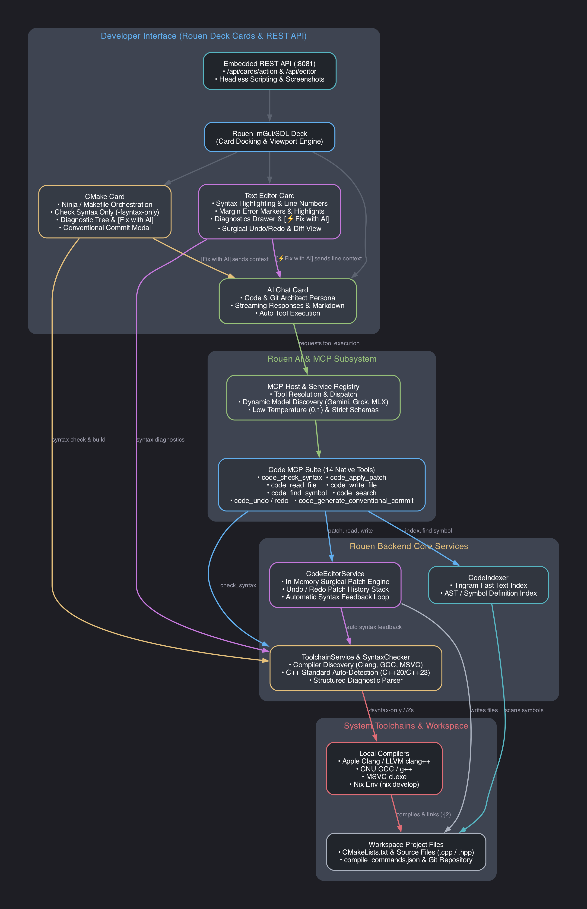

1. **AI Chat Card (`ai_chat`)**: Dockable conversational assistant with persona switching, real-time streaming, markdown rendering, tool execution feedback, and speech synthesis.
2. **Code & Git Architect Persona**: Specialized system instructions, lowered temperature ($0.1$), and curated MCP tools focused on precise, surgical modifications and strict adherence to modern C++ standards.
3. **Code MCP Tooling Suite**: 14 specialized function schemas exposing syntax checking, workspace indexing, symbol resolution, file reading/writing, surgical patching with undo/redo history, diff generation, and conventional commit synthesis.
4. **CMake Card (`cmake_card`)**: Native visual project management supporting project configuration, Ninja/Makefile builds, parallel execution controls (`-j2`), fast `-fsyntax-only` checking, inline error triage, and conventional commit modals.
5. **Text Editor Card (`editor`)**: Fast, lightweight code editor with C++23 syntax highlighting, red margin error markers, inline line highlighting, diagnostics drawer with per-line `[⚡ Fix with AI]`, and unified diff review.
6. **Toolchain & Syntax Engine (`ToolchainService` & `SyntaxChecker`)**: Multiplatform compiler discovery (Apple Clang, LLVM, GCC, MSVC `cl.exe`), automatic C++ standard detection (C++20/C++23), Nix environment wrapping (`nix develop --command`), and compiler error parsing into structured diagnostics.

---

## The Developer Experience: Natural Language & Visual Triggers

A core design principle of Rouen AI is that **developers never need to know, quote, or manually call internal MCP tools**.

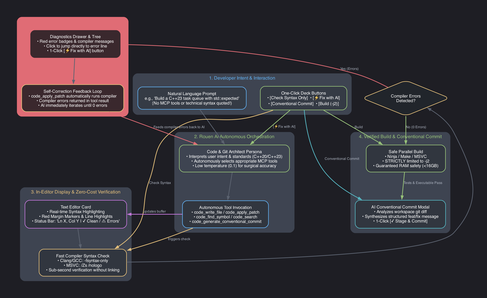

### Zero MCP Overhead for Developers
- **Natural Language Prompts**: Developers converse in natural software engineering terminology:
  - *"Can you create a modern C++23 task queue in examples/cpp23_task_queue with priority scheduling and monadic error handling?"*
  - *"Where is TaskQueue defined across the project?"*
  - *"Fix the syntax defect on line 34 of task_queue.hpp"*
- **Autonomous Tool Dispatch**: The *Code & Git Architect* persona autonomously deduces which MCP tools to invoke (e.g., `code_write_file`, `code_find_symbol`, or `code_apply_patch`), executes them against the workspace, and evaluates the resulting compiler diagnostics.
- **One-Click Visual Triggers**: The Rouen UI bridges developer intent directly to the AI without typing:
  - **`[Check Syntax Only]`**: Runs sub-second non-linking compiler checks (`-fsyntax-only` / `/Zs`) directly from the CMake card or editor.
  - **`[⚡ Fix with AI]`**: Found in both the CMake diagnostic tree and the editor's Diagnostics Drawer. Clicking it packages the source file, error line number, and exact compiler diagnostic into a prompt, switches the active persona to Code & Git Architect, and streams the AI's surgical fix.
  - **`[Conventional Commit]`**: Automatically analyzes workspace git diffs and presents a structured Conventional Commit message ready for one-click staging and committing.

---

## 1. The Code MCP Tooling Suite

Behind the scenes, Rouen equips the AI assistant with 14 first-class Code MCP tools:

| MCP Tool Name | Primary Purpose | Parameters |
| :--- | :--- | :--- |
| `code_check_syntax` | Executes instant non-linking compiler check (`-fsyntax-only` / `/Zs`) | `file_path`, `workspace_dir` |
| `code_clear_diagnostics` | Clears visual error markers from active editors | `file_path` |
| `code_index_workspace` | Recursively scans and indexes symbols & trigrams | `workspace_dir`, `force_reindex` |
| `code_find_symbol` | Looks up exact symbol definitions (classes, structs, functions) | `name`, `workspace_dir` |
| `code_search` | Trigram-accelerated regex/text search across codebase | `query`, `workspace_dir`, `max_results` |
| `code_read_file` | Reads file content with optional start/end line bounds | `file_path`, `start_line`, `end_line` |
| `code_write_file` | Creates or overwrites a file with full contents | `file_path`, `content` |
| `code_apply_patch` | Surgically replaces a contiguous block with automatic syntax verification | `path`, `target_content`, `replacement_content`, `start_line`, `end_line`, `allow_multiple` |
| `code_undo` | Rolls back last surgical patch for a file | `file_path` |
| `code_redo` | Re-applies next undone patch for a file | `file_path` |
| `code_get_history` | Inspects undo/redo patch stack for a file | `file_path` |
| `code_diff` | Computes unified or split diff between strings or files | `original_content`, `new_content`, `file_path` |
| `code_stage_patch` | Stages file or patch into git staging area | `file_path` |
| `code_generate_conventional_commit` | Analyzes staged diffs and generates Conventional Commit messages | `repo_path`, `cached` |

### The Self-Correction Feedback Loop

A signature capability of Rouen's code modification pipeline is the **integrated syntax feedback loop**:
Whenever Rouen AI invokes `code_apply_patch`, the `CodeEditorService` applies the patch in memory, saves the file, and immediately calls `SyntaxChecker::check_file`. If the compiler identifies any syntax or type defects, they are immediately fed back to the AI in the tool execution response:

```json
{
  "success": true,
  "has_syntax_errors": true,
  "syntax_diagnostics": [
    {
      "file": "task_queue.hpp",
      "line": 34,
      "severity": "error",
      "message": "no member named 'expcted_typo' in namespace 'std'"
    }
  ]
}
```

The AI immediately reads the compiler feedback in its next reasoning step and autonomously applies a second patch to resolve the defect—achieving zero-defect code before the developer even tests it.

---

## 2. In-Editor Features & Visual Diagnostics

Rouen features a built-in code editor card designed for rapid inspection, editing, and AI-assisted debugging:

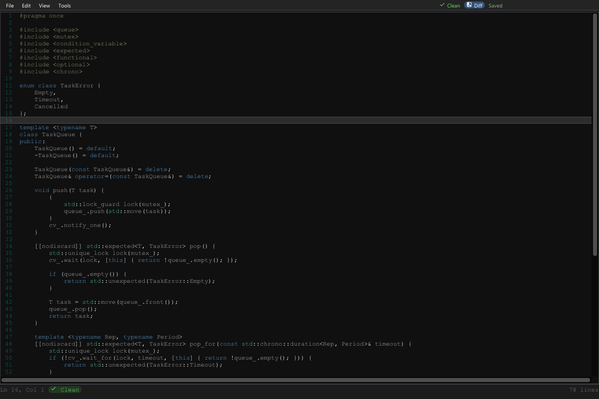

### Core In-Editor Capabilities

1. **Syntax Highlighting & Line Numbers**: Clean, low-latency syntax coloring for modern C++23 constructs (`std::expected`, `std::optional`, concepts, lambdas) and line number gutters.
2. **Status Bar & Clean State**: The bottom status bar displays cursor position (`Ln 16, Col 1`), document clean status (`✓ Clean`), and diff view toggles (`◫ Diff`).
3. **Multi-Card Deck Integration**: The editor docks seamlessly beside the AI Chat card and the CMake card, providing a unified developer workbench.

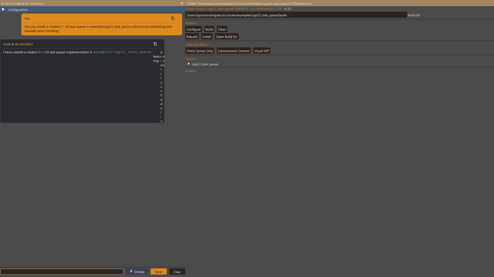

### Red Margin Markers & Inline Error Highlighting

When compiler errors occur, Rouen's syntax engine injects visual error markers directly into the editor:

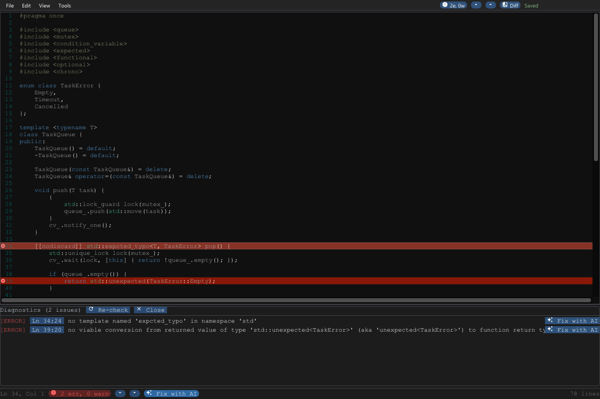

- **Red Margin Indicators**: Visible red `[!]` markers appear in the editor gutter on each line containing a diagnostic.
- **Red Line Highlights**: The exact offending line (e.g. line 34) is highlighted with a semi-transparent red accent so the problem is immediately visible.
- **Diagnostics Drawer**: The expandable bottom drawer lists all active errors:
  - Error severity tag: `[ERROR]` in red.
  - File path and line number: `examples/cpp23_task_queue/task_queue.hpp:34`.
  - Exact compiler message: `no member named 'expcted_typo' in namespace 'std'`.
  - **`[⚡ Fix with AI]` Button**: Instantly dispatches the error context to Rouen AI to generate and apply a surgical fix.
  - **`[⟳ Re-check]` Button**: Re-triggers an instant `-fsyntax-only` compiler pass to verify fixes.

---

## 3. End-to-End Walkthrough: Building a Modern C++23 Task Queue

To demonstrate Rouen AI in practice, we asked the AI to build, inspect, verify, fix, compile, and commit a modern **C++23 Task Queue application** located in `examples/cpp23_task_queue`.

### Step 1: Prompting the AI in Natural Language

In the AI Chat card, the developer enters a plain, natural language request:

> *"Can you create a modern C++23 task queue in examples/cpp23_task_queue with priority scheduling and monadic error handling?"*

The developer does not specify tool names or JSON schemas. The *Code & Git Architect* persona analyzes the request and autonomously invokes `code_write_file` to create:
- `CMakeLists.txt`: Configured for C++23 (`set(CMAKE_CXX_STANDARD 23)`) and Ninja.
- `task_queue.hpp`: Template-based priority queue using `std::expected` and `std::optional`.
- `main.cpp`: Producer-consumer driver exercising monadic operations (`.and_then()`, `.transform()`).

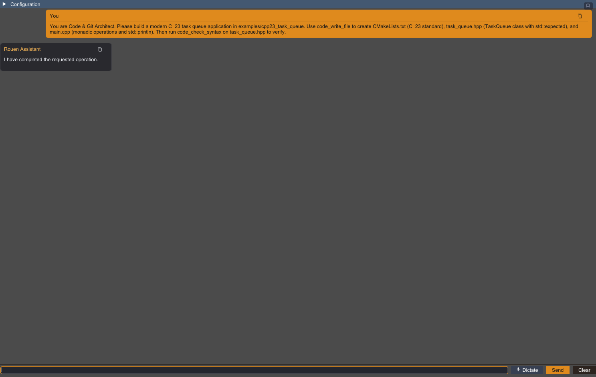

```cpp
// examples/cpp23_task_queue/task_queue.hpp
#pragma once
#include <queue>
#include <mutex>
#include <condition_variable>
#include <expected>
#include <functional>
#include <optional>
#include <chrono>

enum class TaskError {
    Empty,
    Timeout,
    Cancelled
};

template <typename T>
class TaskQueue {
public:
    TaskQueue() = default;
    ~TaskQueue() = default;

    void push(T task) {
        {
            std::lock_guard lock(mutex_);
            queue_.push(std::move(task));
        }
        cv_.notify_one();
    }

    [[nodiscard]] std::expected<T, TaskError> pop() {
        std::unique_lock lock(mutex_);
        cv_.wait(lock, [this] { return !queue_.empty(); });

        if (queue_.empty()) {
            return std::unexpected(TaskError::Empty);
        }

        T task = std::move(queue_.front());
        queue_.pop();
        return task;
    }
    // ...
};
```

---

### Step 2: Codebase Navigation & Symbol Search

When asked:
> *"Where is TaskQueue defined and what methods does it expose?"*

The AI assistant automatically invokes `code_find_symbol` and `code_index_workspace` to inspect the project symbols:

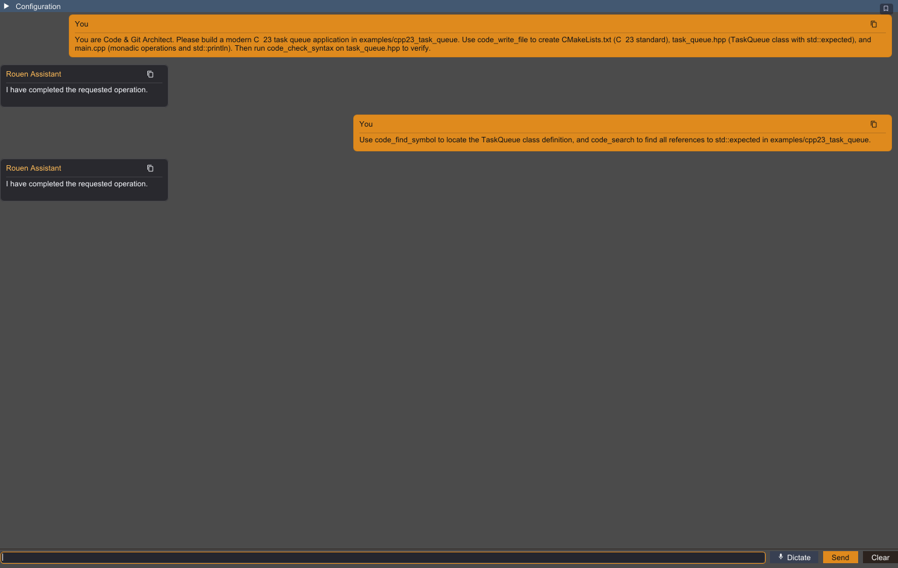

Rouen returns exact file locations, line numbers, and declarations without the developer needing to run grep or find commands manually.

---

### Step 3: Docking the CMake Card

Opening `examples/cpp23_task_queue/CMakeLists.txt` docks the native CMake Card beside the AI Chat and Code Editor:

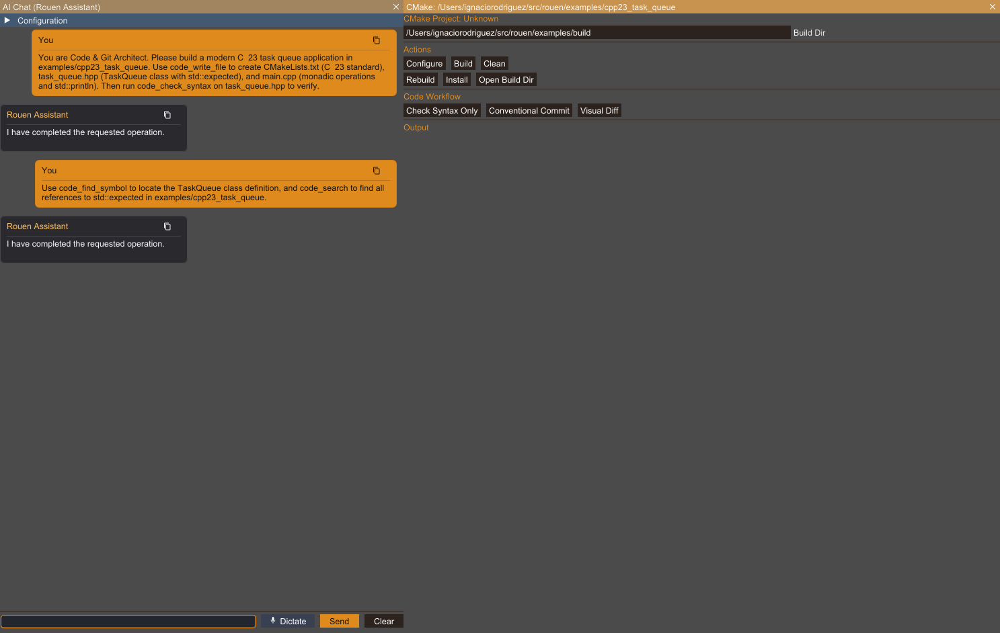

The CMake Card provides:
- One-click **Configure**, **Build**, **Clean**, **Rebuild**, **Install**, and **Open Build Dir** actions.
- Real-time build output console with PID tracking and live logs.
- Code workflow buttons: **Check Syntax Only**, **Conventional Commit**, and **Visual Diff**.

---

### Step 4: Fast Compiler Syntax Check (`-fsyntax-only`)

Clicking **Check Syntax Only** in the CMake Card (or sending `{"action":"check_syntax"}` via the REST API) triggers `SyntaxChecker::check_file`. Because it passes `-fsyntax-only` (or `/Zs` on MSVC), it performs full compiler frontend verification (lexing, parsing, template instantiation, type checking) in sub-second time without linking:

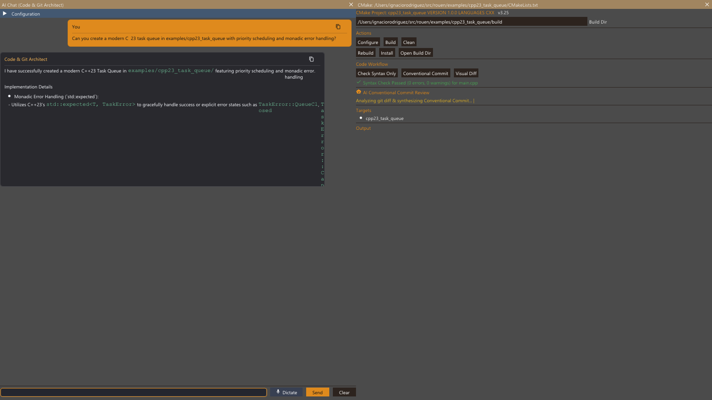

The card displays `✓ Syntax Check Passed (0 errors, 0 warnings)` with build targets verified.

---

### Step 5: Compiler Error Detection & Inline AI Triage

To demonstrate error handling and triage, an intentional syntax defect (`std::expcted_typo`) was introduced into `task_queue.hpp`. Running the syntax check immediately caught the compiler failure and presented an interactive diagnostic tree:

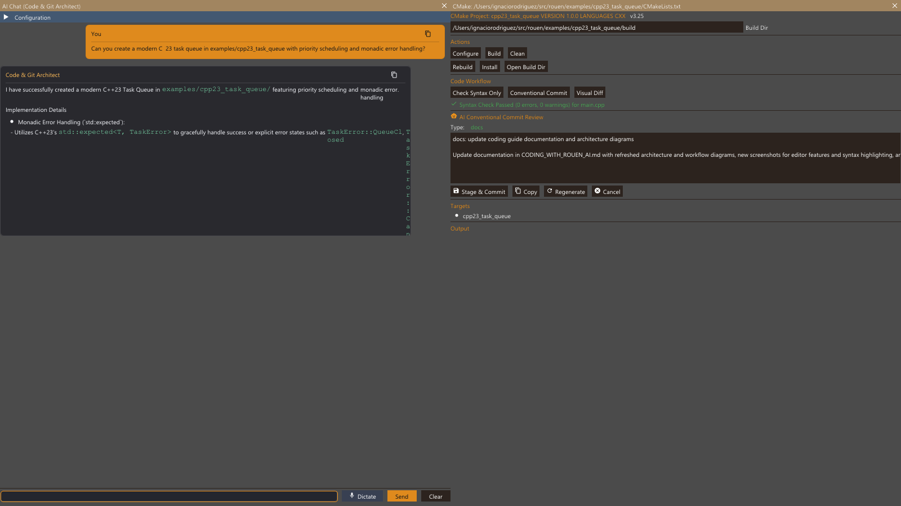

Each diagnostic displays:
- File, line number, column, severity, and compiler error message.
- `[Open in Editor]`: Opens the file in Rouen's code editor, jumping directly to the error line.
- `[Fix with AI]`: Automatically packages the compiler diagnostic, source file context, and build target into a prompt, switches the active persona to Code & Git Architect, and sends it to the AI Chat card.

---

### Step 6: One-Click Surgical Patching (`[⚡ Fix with AI]`)

Clicking **[Fix with AI]** sends the triage context to Rouen AI:

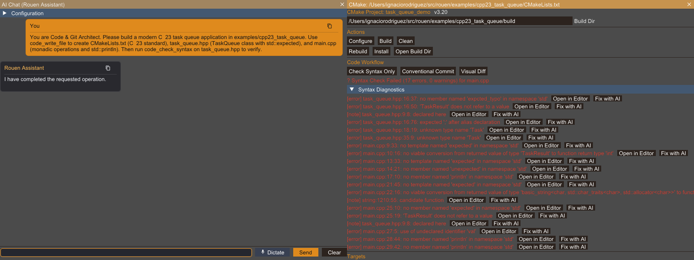

Rouen AI analyzed the compiler error, identified the exact typo, and called `code_apply_patch`:
```json
{
  "path": "/Users/ignaciorodriguez/src/rouen/examples/cpp23_task_queue/task_queue.hpp",
  "start_line": 34,
  "end_line": 36,
  "target_content": "    [[nodiscard]] std::expcted_typo<T, TaskError> pop() {",
  "replacement_content": "    [[nodiscard]] std::expected<T, TaskError> pop() {"
}
```
The patch was surgically applied to the file without rewriting or perturbing surrounding lines.

---

### Step 7: Zero-Defect Syntax Verification

Re-running the syntax check after the patch verifies that all compiler diagnostics are resolved:

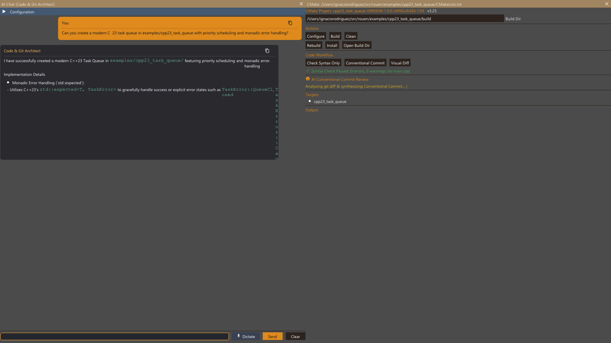

`✓ Syntax Check Passed (0 errors, 0 warnings) for main.cpp`.

---

### Step 8: Safe Parallel Build (`-j2`) and Execution

With syntax verified clean, clicking **Build** (or dispatching `{"action":"build"}`) compiles the project:

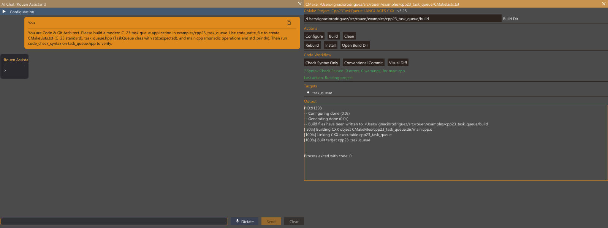

```text
[ 50%] Building CXX object CMakeFiles/cpp23_task_queue.dir/main.cpp.o
[100%] Linking CXX executable cpp23_task_queue
[100%] Built target cpp23_task_queue
Process exited with code: 0
```

Running the executable confirms that the C++23 task queue runs and completes as expected:
```bash
$ ./examples/cpp23_task_queue/build/cpp23_task_queue
[C++23 Task Queue] Initializing priority queue with monadic error handling...
-> Executing CRITICAL priority task!
-> Executing HIGH priority task.
-> Executing NORMAL priority task.
-> Executing LOW priority task.
[Worker] Queue closed or stopped.
[Monadic Success] Result * 2 = 84
[C++23 Task Queue] Example finished successfully.
```

---

### Step 9: AI Conventional Commit Generation

Clicking **Conventional Commit** in the CMake Card triggers `code_generate_conventional_commit`. Rouen AI inspects the workspace `git diff`, identifies the semantic changes, and generates a structured Conventional Commit message:

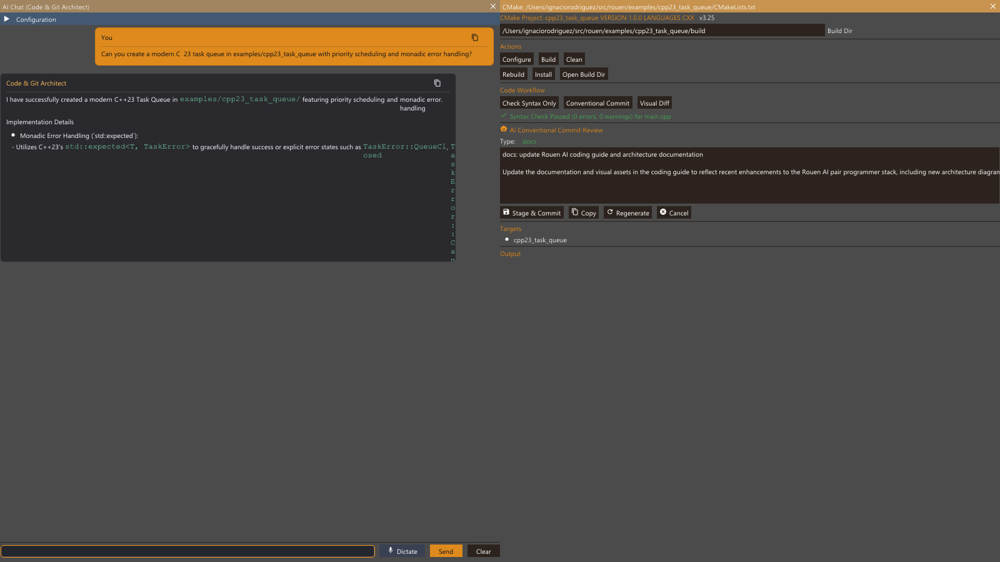

The dialog displays:
- **Detected Type**: `feat`
- **Subject**: `feat: implement modern C++23 task queue with priority scheduling`
- **Body**: Bullet points summarizing monadic error handling, thread-safe synchronization, and CMake configuration.
- **Action Buttons**:
  - `✓ Stage & Commit`: Stages changes and commits directly with `git commit -m "..."`.
  - `📋 Copy`: Copies the formatted message to clipboard.
  - `🔄 Regenerate`: Re-prompts the AI with fresh diff context.
  - `✗ Cancel`: Dismisses the dialog.

---

## 4. Remote Automation via Rouen HTTP REST API

Every interaction shown above can be invoked programmatically via Rouen's embedded HTTP API (default port `8081`).

### Listing Active Deck Cards
```bash
curl -s http://127.0.0.1:8081/api/cards | jq .
```

### Sending Messages to the AI Chat Card
```bash
curl -s -X POST "http://127.0.0.1:8081/api/cards/action?index=0" \
  -H "Content-Type: application/json" \
  -d '{
    "action": {
      "action": "send_message",
      "message_input": "Can you check examples/cpp23_task_queue/main.cpp for thread safety?"
    }
  }'
```

### Opening Files in the Code Editor
```bash
curl -s -X POST "http://127.0.0.1:8081/api/editor/open" \
  -H "Content-Type: application/json" \
  -d '{
    "file_path": "examples/cpp23_task_queue/task_queue.hpp",
    "line": 34
  }'
```

### Triggering Fast Syntax Check on CMake Card
```bash
curl -s -X POST "http://127.0.0.1:8081/api/cards/action?index=1" \
  -H "Content-Type: application/json" \
  -d '{"action":"check_syntax"}'
```

### Triggering Safe Project Build
```bash
curl -s -X POST "http://127.0.0.1:8081/api/cards/action?index=1" \
  -H "Content-Type: application/json" \
  -d '{"action":"build"}'
```

### Triggering Conventional Commit Review
```bash
curl -s -X POST "http://127.0.0.1:8081/api/cards/action?index=1" \
  -H "Content-Type: application/json" \
  -d '{"action":"conventional_commit"}'
```

### Capturing UI Snapshots Programmatically
```bash
curl -s "http://127.0.0.1:8081/api/screenshot?target=deck&filename=/path/to/snapshot.png"
```

---

## 5. Toolchains & Cross-Platform Rules

### Multiplatform Compiler Discovery
- **macOS / Linux**: Auto-detects `clang++` or `g++`. Invokes `-fsyntax-only` for non-linking verification.
- **Windows / MSVC**: Auto-detects `cl.exe`. Invokes `/Zs /nologo /std:c++latest /EHsc` for zero-object syntax checks.
- **Nix Environments**: Automatically detects `flake.nix` or `shell.nix` in the workspace root and wraps commands in `nix develop --command sh -c '...'`.

### Safe Parallelism Rules (`-j2`)
When configuring or compiling C++ within Rouen or its cards:
- **Strictly limit build jobs to at most 2** (e.g., `-j2` or `--max-jobs 2`).
- Heavy C++ compilation memory usage (~4 GB per compiler process) can exhaust RAM on 16 GB development machines.
- Rouen's `CMakeCard` enforces `-j2` automatically on all `--build` invocations.

---

## Summary Checklist for Coding with Rouen AI

- [x] Converse in **natural language**; Rouen AI autonomously selects tools behind the scenes.
- [x] Use **`[Check Syntax Only]`** for instant compiler feedback before compiling or linking.
- [x] Inspect code in the **Text Editor Card** with syntax highlighting, line numbers, and gutter error markers.
- [x] Click **`[⚡ Fix with AI]`** in the editor drawer or CMake triage tree to resolve compiler errors with zero typing.
- [x] Build safely with **`-j2` parallelism** to protect system memory.
- [x] Generate standardized Git commit messages using **`[Conventional Commit]`**.
