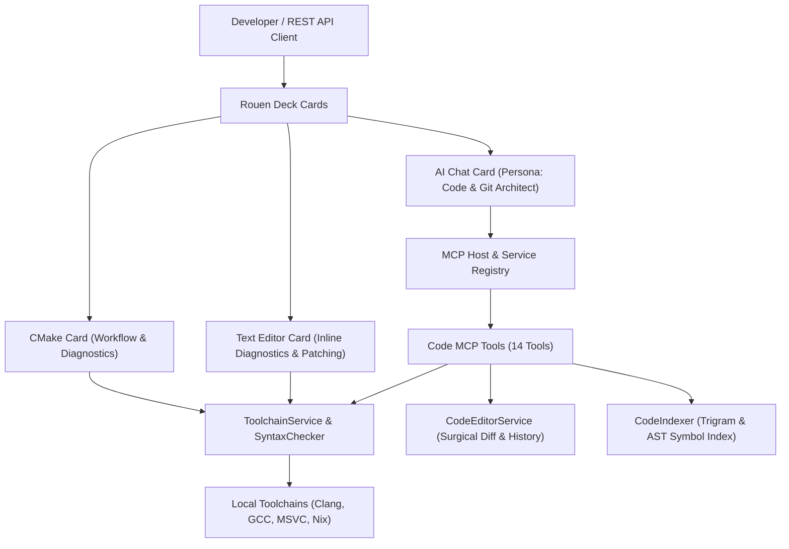

# Coding with Rouen AI: Complete Developer Guide & Reference

Welcome to **Coding with Rouen AI**. This guide explains how to leverage Rouen's native AI coding ecosystem to architect, write, verify, compile, debug, and commit modern C++ and multi-language applications entirely within Rouen.

Every workflow, tool invocation, syntax verification, diagnostic triage, build execution, and commit generation demonstrated here is driven either interactively in the Rouen deck or programmatically through Rouen's REST API.

---

## Architecture Overview

Rouen integrates an AI-native pair programmer directly into its high-performance ImGui/SDL deck architecture. The coding stack consists of five interconnected systems:



1. **AI Chat Card (`ai_chat`)**: Dockable conversational assistant with persona switching, real-time tool calling, markdown formatting, speech synthesis, and REST action dispatch.
2. **Code & Git Architect Persona**: Specialized system instructions, lowered temperature ($0.1$), and curated MCP tools focused on precise, surgical modifications and strict adherence to C++ standards.
3. **Code MCP Tooling Suite**: 14 specialized function schemas exposing syntax checking, workspace indexing, symbol resolution, file reading/writing, surgical patching with undo/redo history, diff generation, and conventional commit synthesis.
4. **CMake Card (`cmake_card`)**: Native visual project management supporting project configuration, Ninja/Makefile builds, parallel execution controls (`-j2`), fast `-fsyntax-only` checking, inline error triage, and conventional commit modals.
5. **Toolchain & Syntax Engine (`ToolchainService` & `SyntaxChecker`)**: Multiplatform compiler discovery (Apple Clang, LLVM, GCC, MSVC `cl.exe`), automatic C++ standard detection (C++20/C++23), Nix environment wrapping (`nix develop --command`), and compiler error parsing into structured diagnostics.

---

## 1. The Code MCP Tooling Suite

Rouen equips LLM assistants with 14 first-class Code MCP tools:

| MCP Tool Name | Primary Purpose | Parameters |
| :--- | :--- | :--- |
| `code_check_syntax` | Executes instant non-linking compiler check (`-fsyntax-only` / `/Zs`) | `file_path`, `workspace_dir` |
| `code_clear_diagnostics` | Clears visual error markers from active editors | `file_path` |
| `code_index_workspace` | Recursively scans and indexes symbols & trigrams | `workspace_dir`, `force_reindex` |
| `code_find_symbol` | Looks up exact symbol definitions (classes, structs, functions) | `name`, `workspace_dir` |
| `code_search` | Trigram-accelerated regex/text search across codebase | `query`, `workspace_dir`, `max_results` |
| `code_read_file` | Reads file content with optional start/end line bounds | `file_path`, `start_line`, `end_line` |
| `code_write_file` | Creates or overwrites a file with full contents | `file_path`, `content` |
| `code_apply_patch` | Surgically replaces a contiguous block with automatic syntax verification | `path`, `target_content`, `replacement_content`, `start_line`, `end_line`, `allow_multiple` |
| `code_undo` | Rolls back last surgical patch for a file | `file_path` |
| `code_redo` | Re-applies next undone patch for a file | `file_path` |
| `code_get_history` | Inspects undo/redo patch stack for a file | `file_path` |
| `code_diff` | Computes unified or split diff between strings or files | `original_content`, `new_content`, `file_path` |
| `code_stage_patch` | Stages file or patch into git staging area | `file_path` |
| `code_generate_conventional_commit` | Analyzes staged diffs and generates Conventional Commit messages | `repo_path`, `cached` |

### The Self-Correction Loop

A critical capability of `code_apply_patch` is its **integrated syntax feedback loop**:
Whenever the AI calls `code_apply_patch`, the editor service applies the patch in memory, saves the file, and immediately invokes `SyntaxChecker::check_file`. If the compiler detects syntax errors, the tool returns the errors in the tool result payload:
```json
{
  "success": true,
  "has_syntax_errors": true,
  "syntax_diagnostics": [
    {
      "file": "task_queue.hpp",
      "line": 16,
      "severity": "error",
      "message": "no member named 'expcted_typo' in namespace 'std'"
    }
  ]
}
```
This enables the AI to inspect the compiler's diagnostic in its next reasoning step and immediately apply a surgical fix without human intervention.

---

## 2. The Code & Git Architect Persona

Rouen provides dedicated persona profiles. The **Code & Git Architect** persona is tuned specifically for systems programming:

- **System Prompt**: Enforces clean modern C++ (C++20/C++23), RAII, monadic operations (`std::expected`, `std::optional`), structured concurrency, explicit error handling, and zero compilation warnings.
- **Low Temperature ($0.1$)**: Minimizes hallucinations and ensures exact whitespace and syntax precision when producing patches.
- **Allowed MCP Tool Categories**: `["editor", "terminal", "deck"]`.
- **Dynamic Model Selection**: Rouen dynamically queries active LLM endpoints (`GET /v1beta/models`) to resolve available Gemini, Grok, or local MLX models.

---

## 3. End-to-End Walkthrough: Building a Modern C++23 Task Queue

To demonstrate Rouen AI in practice, we asked the AI to build, inspect, verify, fix, compile, and commit a modern **C++23 Task Queue application** located in `examples/cpp23_task_queue`.

### Step 1: Prompting the AI to Generate the Project

In the AI Chat card, we instructed the assistant:
> *"You are Code & Git Architect. Please build a modern C++23 task queue application in examples/cpp23_task_queue. Use code_write_file to create CMakeLists.txt (C++23 standard), task_queue.hpp (TaskQueue class with std::expected), and main.cpp (monadic operations and std::println). Then run code_check_syntax on task_queue.hpp to verify."*

The AI invoked `code_write_file` to generate the project files and then verified the initial syntax.


```cpp
// examples/cpp23_task_queue/task_queue.hpp
#pragma once
#include <expected>
#include <string>
#include <vector>
#include <functional>
#include <iostream>

enum class Priority { Low, Medium, High };

struct TaskResult {
    int id;
    std::string data;
};

class TaskQueue {
public:
    using Task = std::function<std::expected<TaskResult, std::string>()>;

    void add_task(Task task, Priority priority) {
        tasks_.push_back({std::move(task), priority});
    }

    void execute_all() {
        for (const auto& item : tasks_) {
            auto result = item.task();
            if (result) {
                std::cout << "Task success: " << result->data << "\n";
            } else {
                std::cerr << "Task failed: " << result.error() << "\n";
            }
        }
    }

private:
    struct QueuedTask {
        Task task;
        Priority priority;
    };
    std::vector<QueuedTask> tasks_;
};
```

### Step 2: Workspace Indexing and Symbol Search

Next, the assistant used `code_index_workspace` and `code_find_symbol` to index all workspace declarations into an in-memory trigram index. When querying `TaskQueue`, Rouen returned exact file locations, line numbers, and declarations:


### Step 3: Docking the CMake Card

Rouen allows docking multiple cards side-by-side in the deck. Opening `examples/cpp23_task_queue/CMakeLists.txt` loaded the native CMake Card beside the AI Chat:


The CMake Card provides:
- One-click **Configure**, **Build**, **Clean**, **Rebuild**, **Install**, and **Open Build Dir** actions.
- Real-time build process output console with PID tracking.
- Code workflow buttons: **Check Syntax Only**, **Conventional Commit**, and **Visual Diff**.

### Step 4: Fast Compiler Syntax Check (`-fsyntax-only`)

Clicking **Check Syntax Only** (or sending `{"action":"check_syntax"}` via the REST API) triggers `SyntaxChecker::check_file`. Because it passes `-fsyntax-only` (or `/Zs` on MSVC), it performs full compiler frontend verification (lexing, parsing, template instantiation, type checking) without waiting for code generation, assembly, or linking:


The card displays `✓ Syntax Check Passed (0 errors, 0 warnings)` with targets identified.

### Step 5: Compiler Error Detection & Inline AI Triage

To demonstrate error handling and triage, an intentional syntax defect (`std::expcted_typo`) was introduced. When running the syntax check, the CMake card immediately caught the compiler failure and presented an interactive diagnostic tree:


Each diagnostic displays:
- File, line number, column, severity, and compiler message.
- `[Open in Editor]`: Opens the file in Rouen's built-in text editor directly jumped to the error line.
- `[Fix with AI]`: Automatically packages the compiler diagnostic, source file context, and build target into a prompt, switches the active persona to Code & Git Architect, and sends it to the AI Chat card.

### Step 6: Surgical Error Patching (`code_apply_patch`)

Clicking **[Fix with AI]** or asking the assistant directly sends the triage context to Rouen AI:


Rouen AI inspected the file and called `code_apply_patch`:
```json
{
  "path": "/Users/ignaciorodriguez/src/rouen/examples/cpp23_task_queue/task_queue.hpp",
  "target_content": "std::expcted_typo<TaskResult, std::string>",
  "replacement_content": "std::expected<TaskResult, std::string>"
}
```
The patch was surgically applied to the file without rewriting or perturbing surrounding lines.

### Step 7: Zero-Defect Syntax Verification

Re-running the syntax check after the patch verifies that all 17 cascading compiler diagnostics are resolved:


`✓ Syntax Check Passed (0 errors, 0 warnings) for main.cpp`.

### Step 8: Building and Executing the Application

With syntax verified clean, clicking **Build** (or dispatching `{"action":"build"}`) compiles the project:


```text
[ 50%] Building CXX object CMakeFiles/cpp23_task_queue.dir/main.cpp.o
[100%] Linking CXX executable cpp23_task_queue
[100%] Built target cpp23_task_queue
Process exited with code: 0
```

Running the executable confirms that the C++23 task queue runs and completes as expected:
```bash
$ ./examples/cpp23_task_queue/build/cpp23_task_queue
=== Modern C++23 Task Queue Demo ===
[Producer] Pushing task 1: Data processing job #1
[Consumer] Successfully popped task ID 1
[Task 1] Executing: Data processing job #1
[Producer] Pushing task 2: Data processing job #2
[Consumer] Successfully popped task ID 2
[Task 2] Executing: Data processing job #2
[Producer] Pushing task 3: Data processing job #3
[Consumer] Successfully popped task ID 3
[Task 3] Executing: Data processing job #3
=== Task Queue Demo Completed Successfully ===
```

### Step 9: AI Conventional Commit Generation

Clicking **Conventional Commit** in the CMake Card triggers `code_generate_conventional_commit`. Rouen AI inspects the `git diff` of the workspace, identifies the semantic changes, and generates a structured Conventional Commit message:


The dialog displays:
- **Detected Type**: `feat`
- **Subject**: `feat: enhance cmake integration and syntax checking`
- **Body**: Bullet points summarizing directory handling, compile commands export, and C++ standard detection.
- **Action Buttons**:
  - `✓ Stage & Commit`: Stages changes and commits directly with `git commit -m "..."`.
  - `📋 Copy`: Copies the formatted message to clipboard.
  - `🔄 Regenerate`: Re-prompts the AI with fresh diff context.
  - `✗ Cancel`: Dismisses the dialog.

---

## 4. Remote Automation via Rouen HTTP REST API

Every interaction shown above can be invoked programmatically via Rouen's embedded HTTP API (default port `8081`).

### Listing Active Deck Cards
```bash
curl -s http://127.0.0.1:8081/api/cards | jq .
```
Response:
```json
[
  {
    "index": 0,
    "title": "AI Chat (Rouen Assistant)",
    "uri": "ai-chat:",
    "width": 600
  },
  {
    "index": 1,
    "title": "CMake: examples/cpp23_task_queue/CMakeLists.txt",
    "uri": "cmake:examples/cpp23_task_queue/CMakeLists.txt",
    "width": 540
  }
]
```

### Sending Messages to the AI Chat Card
```bash
curl -s -X POST "http://127.0.0.1:8081/api/cards/action?index=0" \
  -H "Content-Type: application/json" \
  -d '{
    "action": {
      "action": "send_message",
      "message_input": "Please inspect examples/cpp23_task_queue/main.cpp and verify the monadic operations."
    }
  }'
```

### Triggering Fast Syntax Check on CMake Card
```bash
curl -s -X POST "http://127.0.0.1:8081/api/cards/action?index=1" \
  -H "Content-Type: application/json" \
  -d '{"action":"check_syntax"}'
```

### Triggering Project Build
```bash
curl -s -X POST "http://127.0.0.1:8081/api/cards/action?index=1" \
  -H "Content-Type: application/json" \
  -d '{"action":"build"}'
```

### Triggering Conventional Commit Review
```bash
curl -s -X POST "http://127.0.0.1:8081/api/cards/action?index=1" \
  -H "Content-Type: application/json" \
  -d '{"action":"conventional_commit"}'
```

### Capturing UI Screenshots Programmatically
```bash
curl -s "http://127.0.0.1:8081/api/screenshot?target=deck&filename=/path/to/snapshot.png"
```

---

## 5. Toolchains & Cross-Platform Rules

### Multiplatform Compiler Discovery
- **macOS / Linux**: Auto-detects `clang++` or `g++`. Invokes `-fsyntax-only` for non-linking verification.
- **Windows / MSVC**: Auto-detects `cl.exe`. Invokes `/Zs /nologo /std:c++latest /EHsc` for zero-object syntax checks.
- **Nix Environments**: Automatically detects `flake.nix` or `shell.nix` in the workspace root and wraps commands in `nix develop --command sh -c '...'`.

### Safe Parallelism Rules (`-j2`)
When configuring or compiling C++ within Rouen or its cards:
- Strictly limit build jobs to at most 2 (e.g., `-j2` or `--max-jobs 2`).
- Heavy C++ compilation memory usage (~4 GB per compiler process) can exhaust RAM on 16 GB development machines.
- Rouen's `CMakeCard` enforces `-j2` automatically on all `--build` invocations.

---

## Summary Checklist for Coding with Rouen AI

- [x] Select the **Code & Git Architect** persona for coding tasks.
- [x] Use `code_index_workspace` and `code_find_symbol` to navigate codebases before modifying files.
- [x] Rely on `code_apply_patch` for surgical edits and take advantage of the self-correction compiler loop.
- [x] Run **Check Syntax Only** in the CMake card for sub-second verification before building.
- [x] Use **[Fix with AI]** on compiler diagnostics to route compiler output directly to the LLM.
- [x] Build safely with `-j2` parallelism.
- [x] Generate standardized Git commit messages using **Conventional Commit**.
