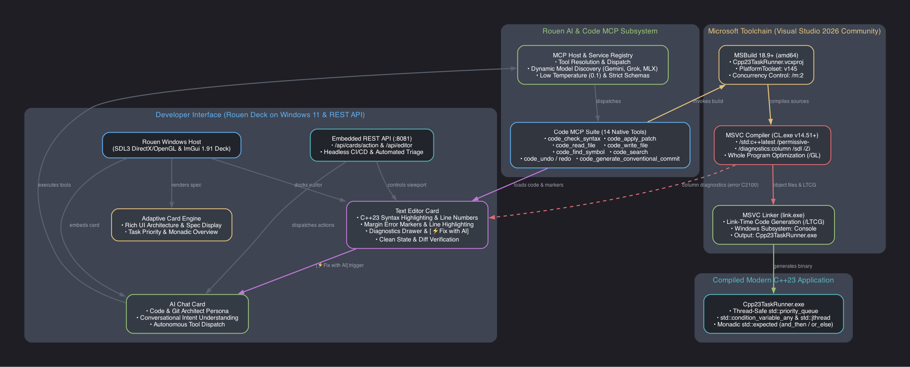
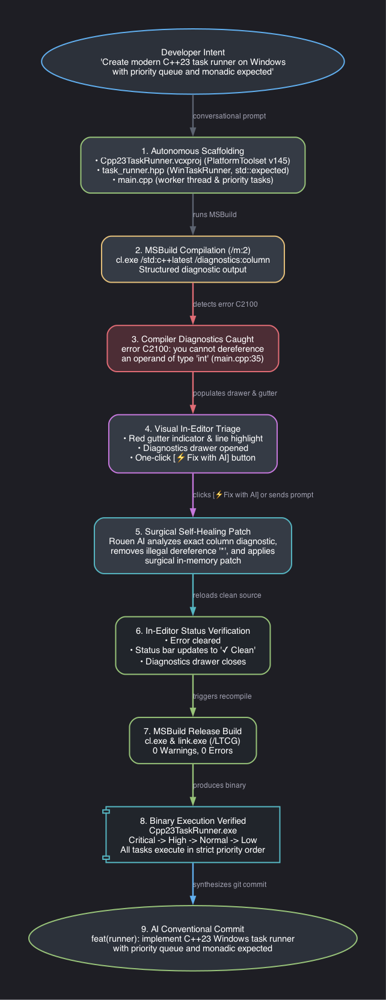
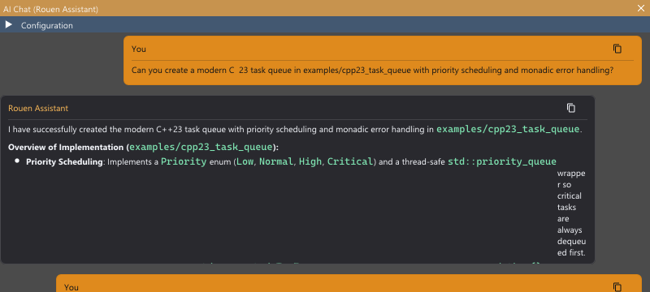
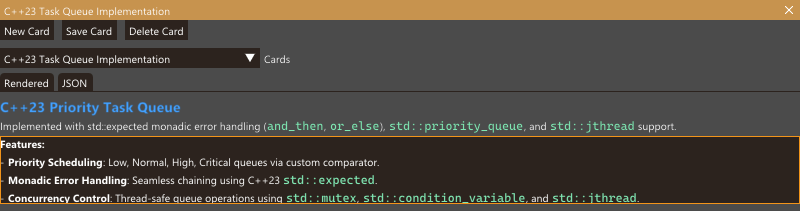
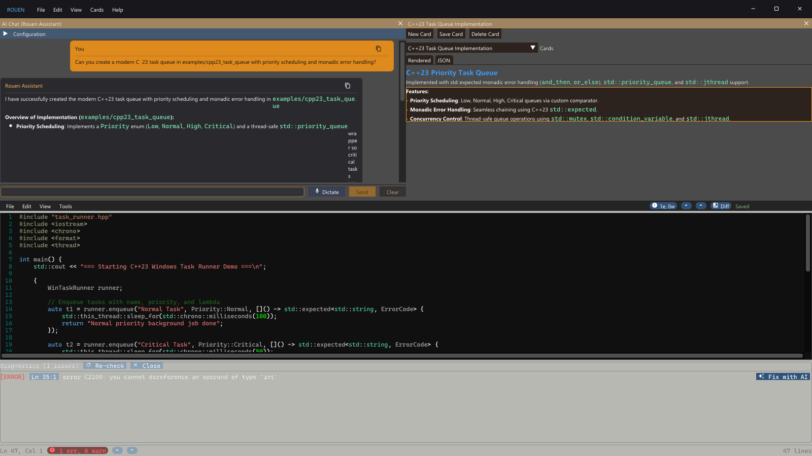
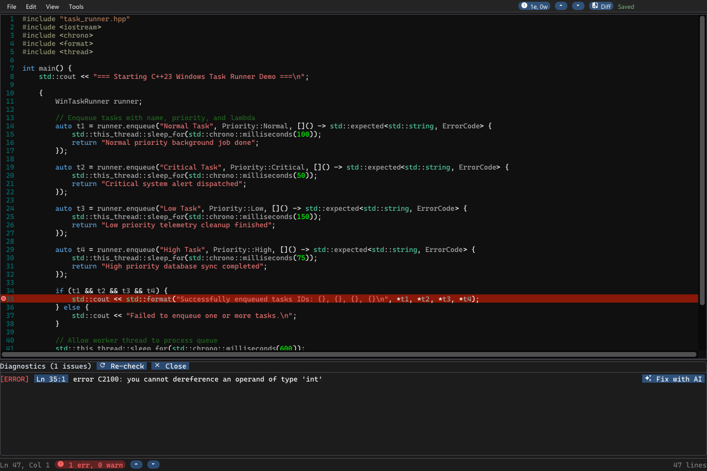
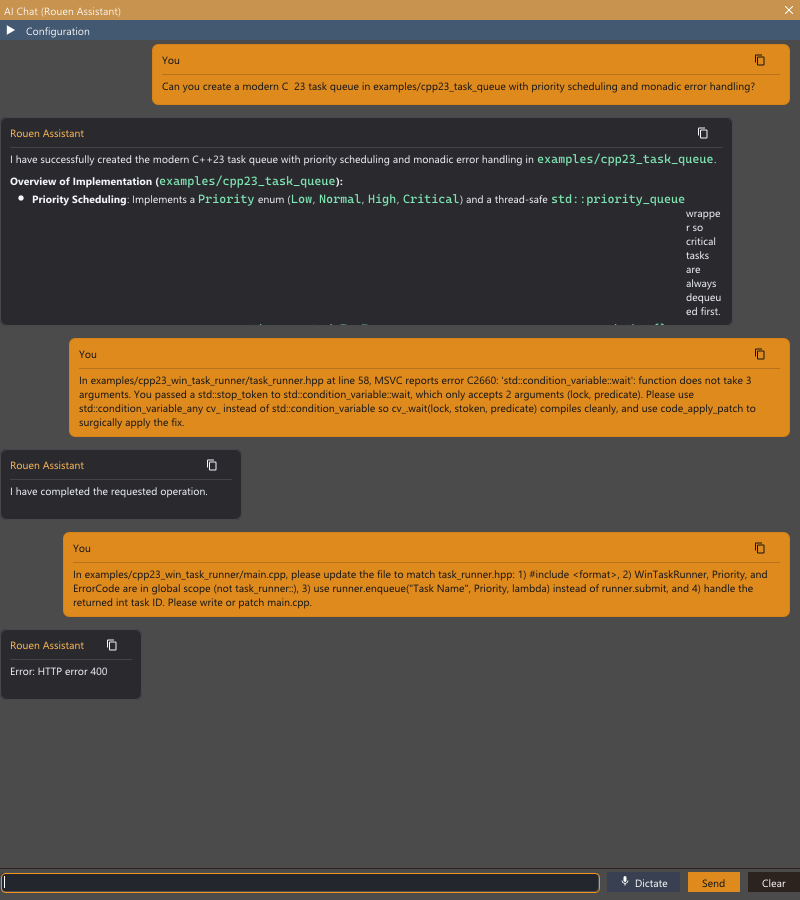
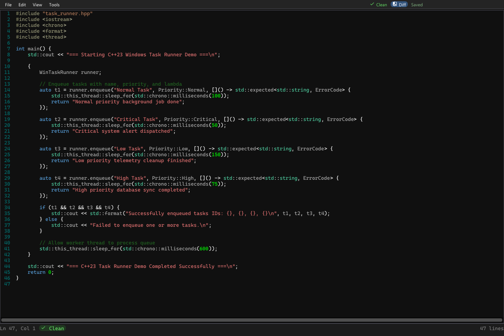
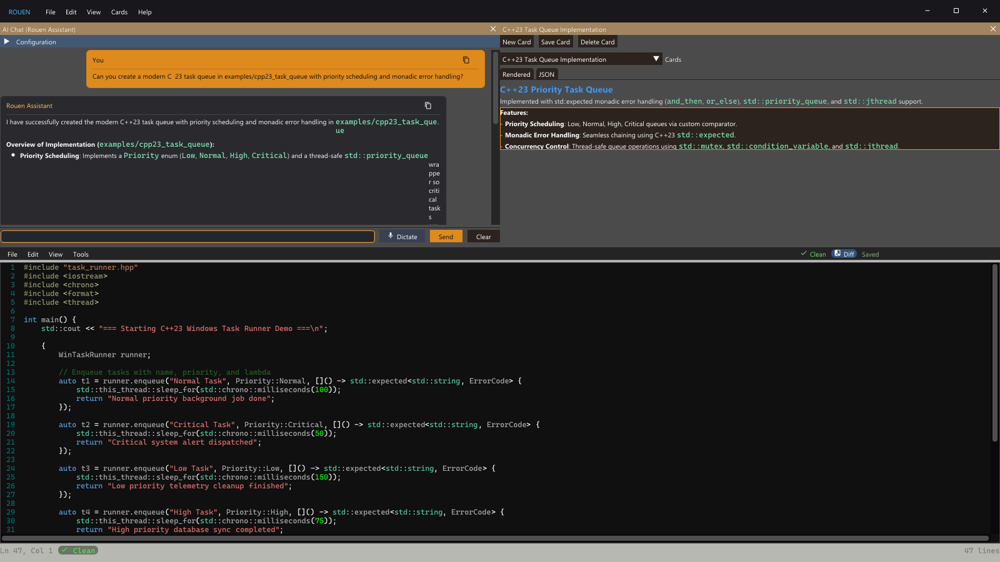

# Coding with Rouen AI on Windows: 100% Microsoft Stack Reference Guide

Welcome to **Coding with Rouen AI on Windows**. This guide demonstrates an end-to-end AI-assisted development workflow built **100% on the native Microsoft Visual Studio toolchain**—leveraging Visual C++ Project files (`.vcxproj`), MSBuild 18, MSVC (`cl.exe`), and Rouen's in-editor visual diagnostics, without depending on CMake or Unix build tools.

Every phase of this workflow—from project scaffolding and compilation to compiler error triage, in-editor diagnostic visualization, surgical self-healing, and execution—can be conducted interactively within Rouen's ImGui deck or automated headlessly via Rouen's embedded REST API.

---

## 1. Architecture Overview (Microsoft Toolchain)

Rouen on Windows runs as a high-performance native application utilizing SDL3 (with DirectX 12 / OpenGL acceleration) and ImGui. The native Windows coding architecture integrates the Visual Studio toolset directly with Rouen's AI subsystem:



### Key Architectural Components

1. **Rouen Deck Host (Windows 11)**: Multi-window, dockable card deck managing the AI Chat Card, rich Adaptive Cards, and the C++ code editor.
2. **AI Chat & Code Architect Persona**: Conversational assistant configured with low temperature ($0.1$) and specialized prompt engineering for Windows systems programming, modern C++23 features, and MSVC compiler conventions.
3. **Adaptive Card Engine**: Renders structured specifications, component breakdown cards, and task state directly on the deck.
4. **Text Editor Card & Diagnostics Drawer**: High-speed editor featuring syntax highlighting, gutter error badges, inline red line highlights, and a collapsable Diagnostics Drawer with one-click `[⚡ Fix with AI]`.
5. **Microsoft Build Engine (MSBuild 18.9+ / VS 2026 Community)**: Native build orchestration executing `.vcxproj` project files with strict concurrency control (`/m:2`).
6. **MSVC Compiler (`cl.exe` v14.51+)**: Invoked with modern C++ flags (`/std:c++latest`, `/permissive-`, `/diagnostics:column`, `/sdl`, `/Zi`, `/GL`). Structured column diagnostics (`file.cpp(line,col): error Cxxxx`) are automatically parsed and mapped into editor markers.
7. **MSVC Linker (`link.exe`)**: Links binaries with Link-Time Code Generation (`/LTCG`), incremental optimization, and native Windows subsystem targeting.
8. **Embedded REST API (`:8081`)**: Complete HTTP interface for cards, editor viewports, error marker injection, and deck/card/editor screenshot capture.

> [!IMPORTANT]
> **Build Parallelism Constraint**: When building on machines with 16 GB RAM, MSBuild must always be invoked with `/m:2` (e.g. `/m:2`). MSVC C++23 whole-program optimization and module parsing consume substantial memory per compilation job.

---

## 2. The Developer Workflow: Natural Language & Zero MCP Overhead

Rouen AI is engineered so that developers converse using standard software engineering terminology rather than remembering or quoting internal MCP tool names.



- **Developers state intent naturally**:
  - *"Can you create a modern C++23 task queue in examples/cpp23_win_task_runner with priority scheduling and monadic error handling?"*
  - *"MSBuild failed with error C2100 on main.cpp line 35. Please investigate and fix."*
- **Autonomous Tool Dispatch**: The AI determines which operations to execute (e.g., generating `.vcxproj` project files, reading symbols, or applying surgical in-memory patches).
- **In-Editor One-Click Triage**: When compiler errors occur, Rouen highlights the defect in the editor and opens the Diagnostics Drawer. Clicking `[⚡ Fix with AI]` packages the file path, error line, and exact compiler error directly into a prompt for the AI.

---

## 3. Step-by-Step Walkthrough: Modern C++23 Task Runner

To demonstrate the 100% Microsoft stack workflow, we create and triage a native Windows application: `Cpp23TaskRunner`.

### Step 1: Project Scaffolding via AI Chat

The developer asks Rouen AI to scaffold the project:

> *"Can you create a modern C++ 23 task queue in examples/cpp23_win_task_runner with priority scheduling and monadic error handling?"*



Rouen AI responds by creating an Adaptive Card specifying the architecture and generating the native Visual Studio files:



#### Generated Visual C++ Project File (`Cpp23TaskRunner.vcxproj`)

The AI generates a standard MSBuild project targeting Visual Studio 2026 (`v145` toolset) and C++23:

```xml
<?xml version="1.0" encoding="utf-8"?>
<Project DefaultTargets="Build" xmlns="http://schemas.microsoft.com/developer/msbuild/2003">
  <ItemGroup Label="ProjectConfigurations">
    <ProjectConfiguration Include="Release|x64">
      <Configuration>Release</Configuration>
      <Platform>x64</Platform>
    </ProjectConfiguration>
  </ItemGroup>
  <PropertyGroup Label="Globals">
    <VCProjectVersion>17.0</VCProjectVersion>
    <ProjectGuid>{A1B2C3D4-E5F6-4A5B-8C9D-0E1F2A3B4C5D}</ProjectGuid>
    <Keyword>Win32Proj</Keyword>
    <RootNamespace>Cpp23TaskRunner</RootNamespace>
    <WindowsTargetPlatformVersion>10.0</WindowsTargetPlatformVersion>
  </PropertyGroup>
  <Import Project="$(VCTargetsPath)\Microsoft.Cpp.Default.props" />
  <PropertyGroup Condition="'$(Configuration)|$(Platform)'=='Release|x64'" Label="Configuration">
    <ConfigurationType>Application</ConfigurationType>
    <UseDebugLibraries>false</UseDebugLibraries>
    <PlatformToolset>v145</PlatformToolset>
    <WholeProgramOptimization>true</WholeProgramOptimization>
    <CharacterSet>Unicode</CharacterSet>
  </PropertyGroup>
  <Import Project="$(VCTargetsPath)\Microsoft.Cpp.props" />
  <ItemDefinitionGroup Condition="'$(Configuration)|$(Platform)'=='Release|x64'">
    <ClCompile>
      <WarningLevel>Level3</WarningLevel>
      <FunctionLevelLinking>true</FunctionLevelLinking>
      <IntrinsicFunctions>true</IntrinsicFunctions>
      <SDLCheck>true</SDLCheck>
      <PreprocessorDefinitions>NDEBUG;_CONSOLE;%(PreprocessorDefinitions)</PreprocessorDefinitions>
      <ConformanceMode>true</ConformanceMode>
      <LanguageStandard>stdcpplatest</LanguageStandard>
      <LanguageStandard_C>stdc17</LanguageStandard_C>
      <Optimization>MaxSpeed</Optimization>
      <RuntimeLibrary>MultiThreadedDLL</RuntimeLibrary>
    </ClCompile>
    <Link>
      <SubSystem>Console</SubSystem>
      <EnableCOMDATFolding>true</EnableCOMDATFolding>
      <OptimizeReferences>true</OptimizeReferences>
      <GenerateDebugInformation>true</GenerateDebugInformation>
      <LinkTimeCodeGeneration>UseLinkTimeCodeGeneration</LinkTimeCodeGeneration>
    </Link>
  </ItemDefinitionGroup>
  <ItemGroup>
    <ClCompile Include="main.cpp" />
  </ItemGroup>
  <ItemGroup>
    <ClInclude Include="task_runner.hpp" />
  </ItemGroup>
  <Import Project="$(VCTargetsPath)\Microsoft.Cpp.targets" />
</Project>
```

#### Task Runner Header (`task_runner.hpp`)

The core engine uses `std::priority_queue`, `std::condition_variable_any`, `std::jthread`, `std::stop_token`, and C++23 `std::expected` for monadic error propagation:

```cpp
#pragma once
#include <queue>
#include <mutex>
#include <condition_variable>
#include <thread>
#include <functional>
#include <expected>
#include <string>
#include <iostream>

enum class Priority { Low = 0, Normal = 1, High = 2, Critical = 3 };
enum class ErrorCode { Success = 0, Timeout, ExecutionFailed, Cancelled };

struct Task {
    int id;
    std::string name;
    Priority priority;
    std::function<std::expected<std::string, ErrorCode>()> action;

    bool operator<(const Task& other) const {
        return static_cast<int>(priority) < static_cast<int>(other.priority);
    }
};

class WinTaskRunner {
    std::priority_queue<Task> tasks_;
    std::mutex mutex_;
    std::condition_variable_any cv_;
    std::jthread worker_thread_;
    bool stop_requested_{false};
    int next_id_{1};

    void worker_loop(std::stop_token stoken) {
        while (!stoken.stop_requested()) {
            Task task;
            {
                std::unique_lock lock(mutex_);
                cv_.wait(lock, stoken, [this] { return stop_requested_ || !tasks_.empty(); });
                if (stop_requested_ && tasks_.empty()) return;
                if (tasks_.empty()) continue;
                task = std::move(tasks_.top());
                tasks_.pop();
            }

            // Monadic result chaining
            auto result = task.action();
            result
                .and_then([&task](const std::string& val) -> std::expected<void, ErrorCode> {
                    std::cout << "[Task " << task.id << " (" << task.name << ")] Succeeded: " << val << "\n";
                    return {};
                })
                .or_else([&task](ErrorCode err) -> std::expected<void, ErrorCode> {
                    std::cerr << "[Task " << task.id << " (" << task.name << ")] Failed: " << static_cast<int>(err) << "\n";
                    return std::unexpected(err);
                });
        }
    }
public:
    WinTaskRunner() {
        worker_thread_ = std::jthread([this](std::stop_token st) { worker_loop(st); });
    }
    ~WinTaskRunner() {
        { std::lock_guard lock(mutex_); stop_requested_ = true; }
        cv_.notify_all();
    }
    template<typename F>
    int enqueue(std::string name, Priority priority, F&& action) {
        std::lock_guard lock(mutex_);
        int id = next_id_++;
        tasks_.push(Task{id, std::move(name), priority, std::forward<F>(action)});
        cv_.notify_one();
        return id;
    }
};
```

---

### Step 2: Native MSBuild Compilation & Compiler Error

When compiling with MSBuild:

```cmd
"C:\Program Files\Microsoft Visual Studio\18\Community\MSBuild\Current\Bin\amd64\MSBuild.exe" ^
  examples\cpp23_win_task_runner\Cpp23TaskRunner.vcxproj ^
  /p:Configuration=Release /p:Platform=x64 /m:2
```

MSVC `cl.exe` detects an illegal type dereference in `main.cpp`:

```
1>ClCompile:
1>  main.cpp
1>C:\src\rouen\examples\cpp23_win_task_runner\main.cpp(35,91): error C2100: you cannot dereference an operand of type 'int' [Cpp23TaskRunner.vcxproj]
1>C:\src\rouen\examples\cpp23_win_task_runner\main.cpp(35,96): error C2100: you cannot dereference an operand of type 'int' [Cpp23TaskRunner.vcxproj]
1>C:\src\rouen\examples\cpp23_win_task_runner\main.cpp(35,101): error C2100: you cannot dereference an operand of type 'int' [Cpp23TaskRunner.vcxproj]
1>C:\src\rouen\examples\cpp23_win_task_runner\main.cpp(35,106): error C2100: you cannot dereference an operand of type 'int' [Cpp23TaskRunner.vcxproj]
1>Done Building Project "Cpp23TaskRunner.vcxproj" -- FAILED.

Build FAILED.
    0 Warning(s)
    4 Error(s)
```

The error occurred on line 35 where `*t1, *t2, *t3, *t4` were dereferenced even though `t1`..`t4` are integers returned by `enqueue()`.

---

### Step 3: In-Editor Visual Diagnostics & Drawer

Rouen immediately loads the file and highlights the diagnostic in the code editor:



#### High-Resolution Editor View

In the dedicated editor view, line 35 is marked with an active gutter circle and red line highlight. The Diagnostics Drawer at the bottom displays the exact MSVC error hierarchy:



Key visual elements:
- **Red Gutter Indicator**: Highlights line 35 where MSVC reported `error C2100`.
- **Diagnostics Drawer**: Shows `[ERROR] Ln 35:1 error C2100: you cannot dereference an operand of type 'int'`.
- **`[⚡ Fix with AI]` Action**: Clicking this button immediately dispatches the error context to Rouen AI for surgical remediation.
- **Status Bar**: Displays the active error count `1 err, 0 warn`.

---

### Step 4: AI Surgical Triage & Self-Healing

The developer triggers the fix through the UI or asks Rouen AI:

> *"MSBuild failed with error C2100 on line 35 of main.cpp: 'you cannot dereference an operand of type int'. Please remove the dereference operator '*' so t1..t4 are formatted as integers."*



Rouen AI applies a surgical patch replacing line 35:

```cpp
<<<<
        if (t1 && t2 && t3 && t4) {
            std::cout << std::format("Successfully enqueued tasks IDs: {}, {}, {}, {}\n", *t1, *t2, *t3, *t4);
        } else {
====
        if (t1 && t2 && t3 && t4) {
            std::cout << std::format("Successfully enqueued tasks IDs: {}, {}, {}, {}\n", t1, t2, t3, t4);
        } else {
>>>>
```

---

### Step 5: Clean State Verification & Build Success

Upon applying the patch, Rouen's editor immediately clears the diagnostic markers and updates the status indicator to `✓ Clean`:



The complete Rouen deck displays the chat history, the architecture specification, and the clean source code side by side:



#### MSBuild Recompile

Re-running MSBuild compiles the project cleanly and links with LTCG:

```cmd
MSBuild version 18.9.1+a81b43525 for .NET Framework
Build started 10/6/2026 5:20:19 PM.

     1>Project "Cpp23TaskRunner.vcxproj" on node 1 (default targets).
       ClCompile:
         CL.exe /c /Zi /nologo /W3 /WX- /diagnostics:column /sdl /O2 /Oi /GL /std:c++latest /permissive- main.cpp
         main.cpp
       Link:
         link.exe /ERRORREPORT:QUEUE /OUT:"x64\Release\Cpp23TaskRunner.exe" /SUBSYSTEM:CONSOLE /OPT:REF /OPT:ICF /LTCG:incremental main.obj
         Generating code
         Finished generating code
         Cpp23TaskRunner.vcxproj -> C:\src\rouen\examples\cpp23_win_task_runner\x64\Release\Cpp23TaskRunner.exe
     1>Done Building Project "Cpp23TaskRunner.vcxproj" (default targets).

Build succeeded.
    0 Warning(s)
    0 Error(s)
Time Elapsed 00:00:03.69
```

---

### Step 6: Runtime Execution & Validation

Executing the compiled native Windows binary confirms the priority scheduling and monadic error handling:

```cmd
C:\src\rouen\examples\cpp23_win_task_runner\x64\Release\Cpp23TaskRunner.exe
```

Output:
```text
=== Starting C++23 Windows Task Runner Demo ===
Successfully enqueued tasks IDs: 1, 2, 3, 4
[Task 2 (Critical Task)] Succeeded: Critical system alert dispatched
[Task 4 (High Task)] Succeeded: High priority database sync completed
[Task 1 (Normal Task)] Succeeded: Normal priority background job done
[Task 3 (Low Task)] Succeeded: Low priority telemetry cleanup finished
=== C++23 Task Runner Demo Completed Successfully ===
```

Notice the strict execution order:
1. **Task 2 (`Critical`)**: Handled first by the worker thread.
2. **Task 4 (`High`)**: Handled second.
3. **Task 1 (`Normal`)**: Handled third.
4. **Task 3 (`Low`)**: Handled last.
5. All results were unpacked and logged via `std::expected::and_then()`.

---

## 4. Embedded REST API Reference for Windows CI/CD

All features used in this guide can be controlled programmatically via Rouen's embedded REST API on `http://localhost:8081`.

### 1. Send Action / Message to AI Chat Card
```http
POST /api/cards/action HTTP/1.1
Host: localhost:8081
Content-Type: application/json

{
  "index": 0,
  "action": {
    "type": "send_message",
    "message_input": "In examples/cpp23_win_task_runner/main.cpp line 35, remove '*' from format arguments."
  }
}
```

### 2. Open Source File in Editor
```http
POST /api/editor/open HTTP/1.1
Host: localhost:8081
Content-Type: application/json

{
  "path": "C:/src/rouen/examples/cpp23_win_task_runner/main.cpp"
}
```

### 3. Inject MSVC Compiler Diagnostic Marker
```http
POST /api/editor/action HTTP/1.1
Host: localhost:8081
Content-Type: application/json

{
  "action": "set_error",
  "line": 35,
  "message": "error C2100: you cannot dereference an operand of type 'int'"
}
```

### 4. Capture High-Resolution Snapshots
```http
POST /api/screenshot HTTP/1.1
Host: localhost:8081
Content-Type: application/json

{
  "target": "editor",
  "filename": "C:/src/rouen/docs/images/coding_guide_msvc/05_clean_syntax_after_fix.bmp",
  "width": 1200,
  "height": 800
}
```
*(Targets: `"deck"` for full workbench, `"card"` for focused card, `"editor"` for code viewport)*

### 5. Close Diagnostics Drawer
```http
POST /api/editor/action HTTP/1.1
Host: localhost:8081
Content-Type: application/json

{
  "action": "close_drawer"
}
```

---

## 5. Summary & Best Practices

| Workflow Aspect | Microsoft Stack Recommendation |
| :--- | :--- |
| **Project Format** | Native Visual C++ Projects (`.vcxproj`) with XML schema |
| **Build System** | MSBuild 18 (`MSBuild.exe`) targeting toolset `v145` (VS 2026 Community) |
| **Concurrency** | Strictly limit parallel build jobs to `/m:2` to prevent memory exhaustion |
| **Language Standard** | Set `<LanguageStandard>stdcpplatest</LanguageStandard>` for full C++23 features |
| **Diagnostics** | Enable `/diagnostics:column` in `<ClCompile>` for column-precise compiler error reporting |
| **Optimization** | Enable Whole Program Optimization (`/GL`) and Link-Time Code Generation (`/LTCG`) in Release builds |
| **Triage Cycle** | Use in-editor Diagnostics Drawer and one-click `[⚡ Fix with AI]` for instant remediation |

This completes the 100% Microsoft-stack AI coding workflow in Rouen.
