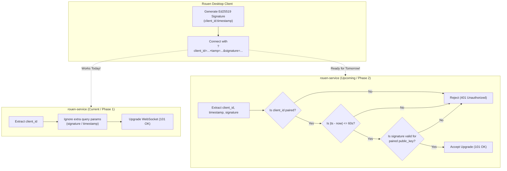

# Rouen Mesh - Cryptographic Handshake Challenge Specification

## 1. Overview & Architectural Motivation

Rouen Mesh connects client nodes (such as the Rouen desktop application) to `rouen-service` (the companion server daemon) over TLS 1.3 WebSockets (`wss://rouen.inz.dev/ws/connect`). 

To eliminate reliance on static pre-shared bearer tokens while guaranteeing that **only legitimately paired devices** can establish a connection and route network traffic through the mesh, Rouen uses **asymmetric Ed25519 cryptographic handshake challenges**.

### Core Principles
1. **Device-Bound Identity**: Authentication is strictly bound to the client's local Ed25519 private key generated upon device creation and paired via the 6-digit one-time pairing code (`/api/v1/pair`).
2. **Zero Extra Round-Trips**: The cryptographic challenge is carried directly within the HTTP `GET` WebSocket upgrade request query parameters. No extra in-band handshake round-trip is required before the socket begins streaming frames.
3. **Dual-Compatibility & Safe Transition**: The client can implement and transmit the challenge immediately. The current server will accept the connection without challenge (ignoring extra query parameters), and the upcoming server will transparently verify the signature without requiring further client modifications.

---

## 2. Wire Protocol Specification

### Connection Endpoint
```http
GET /ws/connect?client_id={CLIENT_ID}&timestamp={TIMESTAMP_MS}&signature={ED25519_HEX_SIG} HTTP/1.1
Host: rouen.inz.dev
Upgrade: websocket
Connection: Upgrade
Sec-WebSocket-Version: 13
Sec-WebSocket-Key: {BASE64_KEY}
```

### Query Parameter Schema

| Parameter | Type | Required | Description | Example |
|---|---|---|---|---|
| `client_id` | String | **Yes** | The client's unique node identifier registered during pairing. | `rouen-macbook-pro` |
| `timestamp` | UInt64 (String) | **Yes** | Current UTC Unix epoch timestamp in **milliseconds**. | `1726162800123` |
| `signature` | Hex String (128 chars) | **Yes** | Hex-encoded Ed25519 signature of the canonical message. | `a8f3...c91e` |
| `token` | String | Optional | Optional pre-shared token fallback for non-paired legacy nodes. | `rouen-client-secret` |

---

## 3. Cryptographic Signature Rules

### A. Canonical Message Construction
The message to be signed is UTF-8 encoded with the format:
```text
"{client_id}:{timestamp}"
```

* **No trailing newline**, null terminator, or extra whitespace.
* Example:
  - `client_id`: `"rouen-mac"`
  - `timestamp`: `"1726162800123"`
  - Canonical String: `"rouen-mac:1726162800123"`

### B. Ed25519 Signature Computation
* **Algorithm**: Pure Ed25519 (RFC 8032 / Edwards-curve Digital Signature Algorithm over Curve25519 with SHA-512).
* **Key Material**: 32-byte raw Ed25519 private seed (`ROUEN_MESH_PRIVATE_KEY` stored in `.env`).
* **Output Signature**: 64 raw bytes, formatted as a **128-character lowercase hexadecimal string**.

### C. Timestamp Validity & Replay Protection
* **Allowed Clock Skew**: The server permits $|T_{\text{server}} - T_{\text{client}}| \le 60\,000\text{ ms}$ (60 seconds).
  - If the client timestamp differs from the server clock by more than 60 seconds, the handshake is rejected.
* **Replay Protection**: The server maintains an in-memory sliding-window cache of seen `(client_id, timestamp)` pairs for 120 seconds. An identical signature within the valid window will be rejected.

---

## 4. Client Implementation Guide (Rouen Desktop)

### Step 1: OpenSSL 3.x Ed25519 Signing Implementation
In `src/hosts/rouen_mesh_host.cpp`, implement real Ed25519 signature generation using OpenSSL's `EVP_DigestSign` API:

```cpp
#include <openssl/evp.h>
#include <iomanip>
#include <sstream>

std::string rouen_mesh_host::generate_handshake_signature(const std::string& client_id, uint64_t timestamp_ms) const {
    if (config_.private_key.empty()) {
        return "";
    }

    // 1. Construct canonical message payload
    std::string message = client_id + ":" + std::to_string(timestamp_ms);

    // 2. Decode 64-character hex private key (32 bytes)
    std::vector<unsigned char> priv_bytes;
    priv_bytes.reserve(32);
    for (size_t i = 0; i + 1 < config_.private_key.size() && priv_bytes.size() < 32; i += 2) {
        std::string byte_str = config_.private_key.substr(i, 2);
        priv_bytes.push_back(static_cast<unsigned char>(std::stoul(byte_str, nullptr, 16)));
    }

    if (priv_bytes.size() != 32) {
        MESH_ERROR("[MeshAuth] Private key length invalid, expected 32 bytes.");
        return "";
    }

    // 3. Load OpenSSL Ed25519 Private Key
    EVP_PKEY* pkey = EVP_PKEY_new_raw_private_key(
        EVP_PKEY_ED25519,
        nullptr,
        priv_bytes.data(),
        priv_bytes.size()
    );
    if (!pkey) {
        MESH_ERROR("[MeshAuth] Failed to load Ed25519 private key.");
        return "";
    }

    // 4. Sign canonical message
    EVP_MD_CTX* md_ctx = EVP_MD_CTX_new();
    std::string sig_hex;

    if (md_ctx && EVP_DigestSignInit(md_ctx, nullptr, nullptr, nullptr, pkey) == 1) {
        size_t sig_len = 0;
        // Query signature buffer size (always 64 bytes for Ed25519)
        if (EVP_DigestSign(md_ctx, nullptr, &sig_len, reinterpret_cast<const unsigned char*>(message.data()), message.size()) == 1) {
            std::vector<unsigned char> sig_buf(sig_len);
            if (EVP_DigestSign(md_ctx, sig_buf.data(), &sig_len, reinterpret_cast<const unsigned char*>(message.data()), message.size()) == 1) {
                std::ostringstream ss;
                for (size_t i = 0; i < sig_len; ++i) {
                    ss << std::hex << std::setw(2) << std::setfill('0') << static_cast<int>(sig_buf[i]);
                }
                sig_hex = ss.str();
            }
        }
    }

    if (md_ctx) EVP_MD_CTX_free(md_ctx);
    EVP_PKEY_free(pkey);

    return sig_hex;
}
```

### Step 2: Target URL Construction in Connection Loop
In `rouen_mesh_host::worker_loop()`, attach the timestamp and signature when initiating `mg_ws_connect`:

```cpp
std::string target_url = config_.server_url;
if (target_url.find("client_id=") == std::string::npos) {
    target_url += (target_url.find('?') == std::string::npos ? "?" : "&");
    target_url += "client_id=" + config_.client_id;
}

// Generate cryptographic handshake challenge if private key is present
if (!config_.private_key.empty()) {
    auto now_sys = std::chrono::system_clock::now();
    uint64_t ts_ms = static_cast<uint64_t>(
        std::chrono::duration_cast<std::chrono::milliseconds>(now_sys.time_since_epoch()).count()
    );
    std::string sig = generate_handshake_signature(config_.client_id, ts_ms);
    if (!sig.empty()) {
        target_url += "&timestamp=" + std::to_string(ts_ms);
        target_url += "&signature=" + sig;
    }
}
```

---

## 5. Compatibility & Phased Rollout Matrix



### Why this design is 100% backwards-compatible:
1. **Current Server Behavior**: Cesanta Mongoose extracts `client_id` via `mg_http_get_var(&hm->query, "client_id", ...)` and ignores any additional unrecognized parameters. Sending `timestamp` and `signature` will succeed without error against the running cluster right now.
2. **Graceful Server Rollout**: When `rouen-service` is updated with verification logic, it can run with `ROUEN_ENFORCE_HANDSHAKE=0` in "log/permissive mode" to confirm signatures are valid before switching to `ROUEN_ENFORCE_HANDSHAKE=1` ("strict mode").

---

## 6. Server Verification Reference (For `rouen-service`)

When implementing the verification unit in `rouen-service/src/server.cpp`:

```cpp
bool Server::verify_client_handshake(struct mg_http_message* hm, const std::string& client_id) {
    std::lock_guard<std::mutex> lock(pairing_mutex_);
    auto it = paired_client_public_keys_.find(client_id);
    if (it == paired_client_public_keys_.end()) {
        std::cerr << "[Auth] Unpaired client_id: " << client_id << std::endl;
        return false;
    }
    const std::string& pub_hex = it->second;

    char ts_buf[64] = {0};
    char sig_buf[256] = {0};
    if (mg_http_get_var(&hm->query, "timestamp", ts_buf, sizeof(ts_buf)) <= 0 ||
        mg_http_get_var(&hm->query, "signature", sig_buf, sizeof(sig_buf)) <= 0) {
        return false;
    }

    uint64_t ts_ms = 0;
    try { ts_ms = std::stoull(ts_buf); } catch (...) { return false; }

    auto now_ms = static_cast<uint64_t>(
        std::chrono::duration_cast<std::chrono::milliseconds>(std::chrono::system_clock::now().time_since_epoch()).count()
    );
    int64_t diff = static_cast<int64_t>(now_ms) - static_cast<int64_t>(ts_ms);
    if (std::abs(diff) > 60000) {
        std::cerr << "[Auth] Expired handshake timestamp. Skew: " << diff << " ms" << std::endl;
        return false;
    }

    std::string canonical_message = client_id + ":" + ts_buf;
    return ed25519_verify_signature(canonical_message, sig_buf, pub_hex);
}
```

---

## 7. Error Responses

If verification fails when strict mode is active:

| Scenario | HTTP Status | Body |
|---|---|---|
| Client ID not registered in paired keys | `401 Unauthorized` | `{"error": "Unauthorized - Device is not paired with this service"}` |
| Timestamp missing or skewed > 60s | `401 Unauthorized` | `{"error": "Unauthorized - Handshake timestamp expired or clock skew > 60s"}` |
| Signature invalid or corrupt | `401 Unauthorized` | `{"error": "Unauthorized - Invalid Ed25519 cryptographic handshake signature"}` |
| Replayed signature within validity window | `401 Unauthorized` | `{"error": "Unauthorized - Handshake challenge replay detected"}` |
