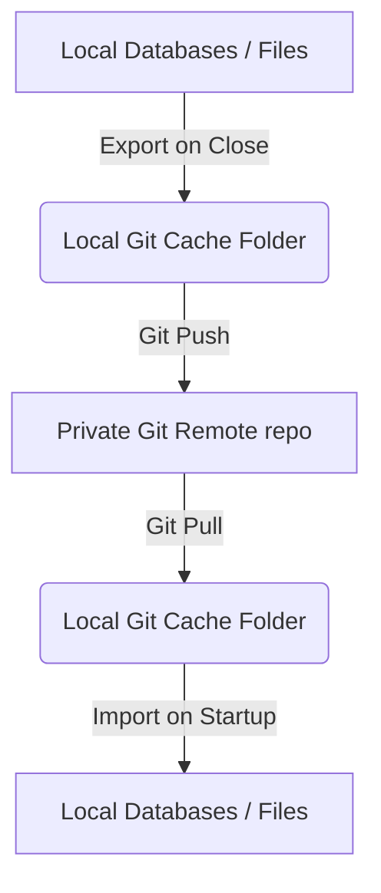

# Git-Based Synchronization Guide

Rouen includes a native, Git-based synchronization engine. This allows you to synchronize your layout, configurations, objectives, personal notes, RSS subscriptions, and travel plans across multiple computers using a private Git repository (such as GitHub, GitLab, or a self-hosted Git remote) without relying on third-party cloud services like Dropbox.

---

## How It Works

Rouen avoids committing raw binary SQLite databases (which are prone to corruption, cannot be merged line-by-line, and cause merge conflicts). Instead, the synchronization engine acts as a serialization gateway:



1. **On Startup**: If auto-sync is enabled, Rouen performs a full Two-Way Sync (pulling and merging remote changes, importing them, and then exporting and pushing any local offline edits to the remote) to ensure local and remote are fully synchronized.
2. **On Shutdown**: If auto-sync is enabled, Rouen performs a full Two-Way Sync (pulling and merging concurrent remote edits, importing them, and then exporting and pushing the merged local databases to the remote) to ensure no updates are lost.

---

## What Gets Synchronized

| Category | Local Source | Git Cache Target | Format |
|---|---|---|---|
| **Markdown Notes** | `notes.db` | `notes/*.md` | Standard Markdown + Frontmatter |
| **Travel Plans** | `travel.db` | `travel/plan_*.json` | Prettified JSON (Slugified filenames) |
| **RSS Feeds** | `rss.db` | `rss/feeds.json` | Prettified JSON (URL sorted) |
| **Objectives** | `objectives/` | `objectives/objectives.json`, `ledger.json` | Prettified JSON |
| **Sovereign KPIs** | `kpis.json` | `kpis.json` | Prettified JSON |
| **Window Layout** | `rouen.ini` | `config/rouen.ini` | INI Text |
| **Theme Customizations**| `themes.json` | `config/themes.json` | Prettified JSON |

---

## Configuration

The sync engine uses the following environment variables. You can specify these in your `.env` file (located in the executable's directory) or define them globally in `~/.secrets`:

```env
# Git Remote Repository URL (HTTPS recommended)
ROUEN_SYNC_GIT_URL=https://github.com/your-username/your-sync-repo

# GitHub Personal Access Token (PAT)
ROUEN_SYNC_TOKEN=ghp_yourpersonalaccesstokenhere

# Local Directory where Git will clone and manage the repository cache
ROUEN_SYNC_CACHE_PATH=/Users/username/Library/Application Support/Rouen/rouen-sync

# Automation Toggles (1 = Enabled, 0 = Disabled)
ROUEN_SYNC_AUTO_ON_STARTUP=1
ROUEN_SYNC_AUTO_ON_SHUTDOWN=1
```

> [!IMPORTANT]
> **Authentication**: Rouen uses Git's native credential manager (`git credential approve`) to pass your token securely when communicating with HTTPS remotes. The Personal Access Token is never hardcoded into the remote URL.

---

## Using the Universal Sync Card

To view your sync configuration, check status logs, or execute manual actions, open the **Universal Sync Card**:

1. Open the Rouen Launcher (press `Cmd+F` or `Ctrl+F` and type `menu`).
2. Search for **"Universal Sync"** under the **System** category (or type `sync` directly in the command search box).
3. The Card displays:
   * **Configuration Panel**: Modify the remote URL, token, and cache paths, and toggle auto-sync settings.
   * **Manual Operations**:
     * *Initialize & Clone Repository*: Creates the cache folder and clones your remote.
     * *Sync In (Pull)*: Pulls remote edits and imports them into your local databases.
     * *Sync Out (Push)*: Exports local data and pushes to the remote.
     * *Two-Way Sync*: Runs a Pull (Sync In) immediately followed by a Push (Sync Out).
   * **Engine Status**: Real-time status of current background operations.
   * **Console Logs**: Scrollable debug log of all Git actions, exit codes, and sync transfers.

---

## Conflict Resolution

To make conflict resolution seamless, the engine implements these strategies:
* **Unique Filenames**: Travel plans are written to individual files named after a slugified version of their title (e.g. `travel/plan_summer_trip_2026.json`). Editing separate plans on different computers will never cause Git merge conflicts.
* **Prettified and Sorted JSON**: The list of RSS subscriptions (`rss/feeds.json`) is sorted alphabetically by URL and formatted as pretty-printed JSON. This ensures that any Git diff matches line-by-line, and standard Git branch merges can automatically resolve additions or deletions.
* **Rebase Pulls**: Pulling changes uses `--rebase` to keep the git tree linear and clean.
