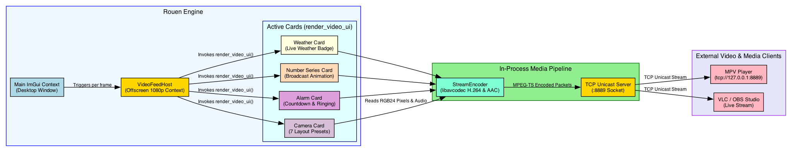

# Rouen Multi-Modal UI & Video Streaming Architecture

## Overview
Rouen's **Multi-Modal UI** bridges the native desktop interface, host background services, and external media endpoints by providing a real-time, low-latency 1080p @ 24fps H.264 video and AAC stereo audio stream over TCP unicast sockets.

External video clients (such as `mpv`, VLC, OBS Studio, or custom network players) can connect to `tcp://127.0.0.1:8889` to receive a live visual stream rendered with the full richness of Rouen's ImGui interface.

---

## Architectural Diagram



---

## 1. Offscreen ImGuiContext & StreamEncoder (`src/hosts/video_feed_host.hpp` & `src/helpers/stream_encoder.hpp`)

`VideoFeedHost` uses a dedicated secondary `ImGuiContext` (`video_imgui_ctx_`) bound to an offscreen target texture (`1920x1080`):

* **Context Switching**: Saves the main desktop context via `ImGui::GetCurrentContext()`, switches to `video_imgui_ctx_`, sets `DisplaySize = (1920, 1080)`, and executes an offscreen ImGui frame.
* **In-Process Hardware Encoding**: Employs `StreamEncoder` (`stream_encoder.hpp`) utilizing native FFmpeg libraries (`libavcodec`, `libswscale`, `libswresample`) for zero-subprocess overhead:
  - **Video Stream**: Encodes raw RGB24 frames into H.264 (`AV_CODEC_ID_H264`) at 1080p resolution with low-latency tuning.
  - **Audio Stream**: Encodes PCM audio samples into AAC (`AV_CODEC_ID_AAC`) in stereo at 44.1 kHz.
* **TCP Unicast Server**: Listens on `tcp://127.0.0.1:8889` to stream MPEG-TS packets directly to connected network clients.
* **Thread Safety**: Offscreen rendering runs safely on the main thread during `main_wnd::run()` after `SDL_RenderPresent()`.
* **Pixel Transfer**: Reads rendered 1080p frames back using `SDL_RenderReadPixels` and transfers RGB24 buffers to `StreamEncoder`.

---

## 2. Card Offscreen Video UI Interface

Rouen cards can render custom ImGui widgets, progress bars, vector charts, rounded panels, and camera overlays directly onto the stream surface:

```cpp
virtual void render_video_ui() {}
```

During each video frame render, `VideoFeedHost` queries `"get_active_cards"` from `registrar` and invokes `render_video_ui()` for each active card.

---

## 3. Supported Card Overlays & Specializations

### A. Camera Card & 7 Video Feed Layout Presets (`src/cards/media/camera.hpp`)
The **Camera Card** captures live video streams (UVC USB cameras, iPhone Continuity Cameras) and paints them onto the live video feed stream according to 7 user-selectable layout presets:

1. **Full Screen**: Standard full-screen presentation.
2. **Bottom-Right PiP (Rounded)**: Picture-in-picture overlay in the lower-right corner with 22px rounded corners, drop shadow, and primary accent border.
3. **Bottom-Left PiP (Rounded)**: Lower-left picture-in-picture overlay.
4. **Top-Right PiP (Rounded)**: Upper-right picture-in-picture overlay.
5. **Top-Left PiP (Rounded)**: Upper-left picture-in-picture overlay.
6. **Centered Circle (Avatar)**: Circular presenter badge centered on the video feed.
7. **Right Side Bar**: Vertical sidebar occupying the right 28% of the stream.

### B. Number Series Card Broadcast Animation (`src/cards/information/number_series.hpp`)
The **Number Series Card** renders time-series graphs, bar charts, and line charts with continuous live broadcast animation:
* **Automated Data Tour**: Cycles smoothly through each data point at 1.2 seconds per point.
* **Illuminated Node & Vertical Guide Line**: Highlights the active node with glowing accent colors and a vertical guide line.
* **Floating Popover Tooltip Box**: Reuses the interactive GUI tooltip popover logic to display exact values over the active node.
* **Telemetry Badge Sync**: Dynamically updates the top-right metric counter badge as points cycle.

### C. Alarm Card Countdown & Ringing (`src/cards/productivity/alarm.hpp`)
* **Active Countdown**: Displays countdown timer (`HH:MM:SS`) and progress bar.
* **Ringing State**: Flashes red background with yellow border and displays `"🚨 ALARM RINGING!"`.

### D. Weather Card Live Badge (`src/cards/information/weather.hpp`)
* Renders weather condition badge, local temperature, humidity, and dynamic accent styling.

---

## 4. REST API Control Endpoints (`src/helpers/api_server.cpp`)

Rouen exposes HTTP REST API endpoints on port `8081` to control video streaming and camera layout options programmatically:

| Endpoint | Method | Payload | Description |
| :--- | :--- | :--- | :--- |
| `/api/cast/start` | `POST` | `{"url": "camera:1:1"}` | Starts video feed server on `tcp://127.0.0.1:8889` |
| `/api/cast/status` | `GET` | N/A | Returns current casting status, playing URL, and telemetry |
| `/api/camera/layout` | `GET` | N/A | Queries active camera layout preset name and index |
| `/api/camera/layout` | `POST` | `{"preset": 1}` | Changes camera video feed layout preset dynamically |
| `/api/camera/status` | `GET` | N/A | Returns camera device name, resolution, and active status |

---

## 5. Client Script & Low-Latency Options

A convenience script is provided in `scripts/play_videofeed.sh`:

```bash
./scripts/play_videofeed.sh
```

This launches `mpv` with low-latency profile settings:
```bash
mpv --profile=low-latency --no-cache --framedrop=vo tcp://127.0.0.1:8889
```
