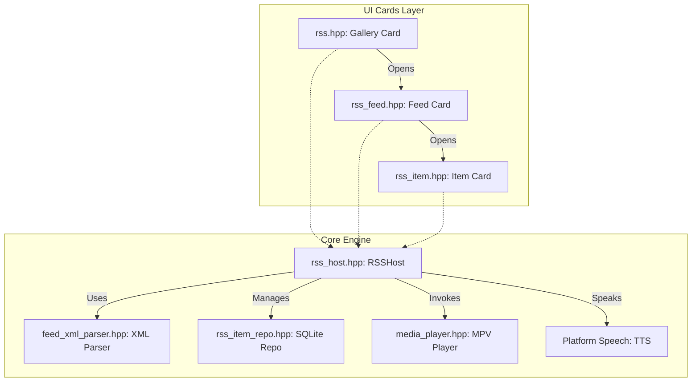

# Rouen RSS Reader Guide

Rouen includes a highly modular, card-based RSS reader subsystem. It features offline caching, automated media extraction (such as RT.com mp4 video parsing), local text-to-speech narration, AI-powered feed discovery, and native synchronization support.

---

## 🏛️ Subsystem Architecture

The RSS subsystem is structured into two main layers: the **data/processing module** and the **UI card interface**.



### 1. File Structure & Core Components
- **[rss.hpp](file:///Users/ignaciorodriguez/src/rouen/src/cards/information/rss.hpp)**: Defines the main [rss](file:///Users/ignaciorodriguez/src/rouen/src/cards/information/rss.hpp#L35) card, which acts as the feeds dashboard and search portal (RSS Gallery).
- **[rss_feed.hpp](file:///Users/ignaciorodriguez/src/rouen/src/cards/information/rss_feed.hpp)**: Defines the [rss_feed](file:///Users/ignaciorodriguez/src/rouen/src/cards/information/rss_feed.hpp#L31) card, showing articles from a specific feed.
- **[rss_item.hpp](file:///Users/ignaciorodriguez/src/rouen/src/cards/information/rss_item.hpp)**: Defines the [rss_item](file:///Users/ignaciorodriguez/src/rouen/src/cards/information/rss_item.hpp#L24) card, rendering a single article with content, text-to-speech, and media controls.
- **[rss_host.hpp](file:///Users/ignaciorodriguez/src/rouen/src/hosts/rss_host.hpp)**: The central controller [RSSHost](file:///Users/ignaciorodriguez/src/rouen/src/hosts/rss_host.hpp) representing the business logic, scheduling auto-refreshes, fetching XML, and querying the database.
- **[feed.hpp](file:///Users/ignaciorodriguez/src/rouen/src/models/rss/feed.hpp)** / **[feed_xml_parser.hpp](file:///Users/ignaciorodriguez/src/rouen/src/models/rss/feed_xml_parser.hpp)**: Parses XML feeds (RSS 2.0 / Atom) utilizing TinyXML2.
- **[rss_item_repo.hpp](file:///Users/ignaciorodriguez/src/rouen/src/models/rss/rss_item_repo.hpp)**: Implements database operations on top of SQLite (`sqliterepo.hpp`) for storing subscriptions, feed cache, downloaded images, and tags.

### 2. Media Extraction Pipeline
Rouen parses standard enclosures (e.g. podcast MP3s), but also performs **HTML-based media extraction** on article bodies. For example, for RT.com and similar news feeds:
- Rich HTML contents under `content:encoded` tags are parsed.
- A media pipeline scans iframe tags via regex targeting direct `.mp4` video links (e.g. `https://mf.b37mrtl.ru/.../*.mp4`).
- Feeds typically containing static thumbnail images in their default enclosures are filtered, separating raw playback streams from thumbnails.
- Extracted URLs are prioritized by quality/format and classified into video/audio types.

### 3. Text-to-Speech (TTS) Engine
For articles without audio/video streams, Rouen offers a "Read Article" option.
- Invokes native platform speech via [Platform Speech Utils](file:///Users/ignaciorodriguez/src/rouen/src/helpers/platform_utils.hpp).
- Statically strips HTML tags and normalizes special characters/entities (`&nbsp;`, `&quot;`, etc.).
- Auto-detects the article language using text indicators to dynamically select appropriate speech voices (e.g. English, Spanish, French, German).

### 4. AI-Powered Feed Discovery
Users can type a topic (e.g. "Space news") and run an **AI Search**:
- Integrates with the global [LLMConfig](file:///Users/ignaciorodriguez/src/rouen/src/helpers/llm_config.hpp) system.
- Leverages configured providers (such as Grok with internet search enabled) using structured prompts.
- Parses LLM text responses into addable titles, descriptions, and RSS feed URLs.

---

## 🎨 UI Cards Specification

Rouen's RSS interface is built with Dear ImGui, utilizing specialized themes, responsive layouts, and thread-safe loading.

### 1. RSS Gallery Card (Main Dashboard)
Class: `rouen::cards::rss` in **[rss.hpp](file:///Users/ignaciorodriguez/src/rouen/src/cards/information/rss.hpp)**

The main card is styled with a **Red/Rose/Gold** curated theme (`colors[0] = {0.8f, 0.3f, 0.3f, 1.0f}`).

#### Key Visual Components:
- **Auto-Refresh Progress Line**: A thin bar at the very top showing time elapsed since the last feed update.
  - Hovering displays a tooltip indicating the next automatic refresh time.
  - Double-clicking forces a manual refresh of all subscriptions immediately.
- **Tag Filter Pills**: Pill-shaped filter chips with wrapping logic (prevents horizontal overflow).
  - Highlights the **top 4 freshest tags** (tags with the most recent articles) using a warm rose/gold tone.
  - Non-fresh tags display as dark translucent pills.
- **Search Bar**: A debounced input box for finding content.
  - Search queries are checked against feed titles, subscription URLs, and article contents (deep search).
  - Pressing `ESC` clears the query.
  - Features a small `×` clear button.
- **Grid Layout**: Displays subscriptions as cards with rounded borders (`8.0f` scale).
  - Cards show the feed cover image, title, and a **freshness status indicator dot**:
    - 🟢 **Fresh** (last article updated < 1 hour ago)
    - 🟢🟡 **Recent** (updated < 1 day ago)
    - 🟠 **Stale** (updated < 3 days ago)
    - ⚪ **Old/Empty** (updated > 3 days ago, or no items)
  - Cover images are rendered in **grayscale** when idle, and transition to **color** upon hovering or focus, accompanied by a bright theme-colored border.
  - Includes a direct play button (`▶`) on the card to open and play the freshest item automatically.
- **AI Search Input**: Renders at the bottom, offering a topic query box and an "AI Search" button. Results appear in a list below it where feeds can be added individually.
- **Connection Settings Accordion**: Collapsible header containing a timeout slider (5s to 180s) and an auto-increase checkbox for slow internet connections.

---

### 2. Feed Card (Feed Browser)
Class: `rouen::cards::rss_feed` in **[rss_feed.hpp](file:///Users/ignaciorodriguez/src/rouen/src/cards/information/rss_feed.hpp)**

Designed with a **Blue** theme (`colors[0] = {0.3f, 0.5f, 0.8f, 1.0f}`) representing a navigation container.

#### Key Visual Components:
- **Search & Refresh Header**: Contains a search bar to filter local feed items, a clear button, and a rotation refresh icon button (`ICON_MD_REFRESH`) to update the active feed.
- **Banner Layout**: Displays the feed's logo or a placeholder box containing `ICON_MD_RSS_FEED`.
- **View vs. Edit Toggle**:
  - Toggled via a small **Gear Settings icon** (`ICON_MD_SETTINGS`) in the top-right corner.
  - **View Mode (Default)**: Displays only currently assigned tags as flat, non-interactive pills. Shows item counts.
  - **Edit Mode**:
    - **Language Selector**: Dropdown to override and hardcode the language translation/voice (Auto, English, Spanish, etc.).
    - **Tag Checklist**: Checkboxes for all available project tags to categorize the feed.
    - **Delete Feed Button**: A prominent red button that triggers a confirmation modal popup to prevent accidental deletion.
- **Article Scroll Area**: Scrollable list of feed items.
  - Displays article title (clickable to launch the item), a styled date string (e.g. `16 Jul 2026 (3h ago)`), and a short summary snippet.
  - **Grayscale Hover Thumbnails**: Thumbnails display on the right side of the entry. Like the gallery, they render as grayscale and change to color when the specific row is hovered.
  - **Play / Read controls**: Renders the inline MPV media controller if a media stream is found. Otherwise, renders a "Read Article" speaker button that triggers Text-to-Speech.
  - **Lazy Loading**: Monitors the scrollbar position and automatically appends 20 more items when the user approaches the bottom.

---

### 3. Item Card (Article Reader)
Class: `rouen::cards::rss_item` in **[rss_item.hpp](file:///Users/ignaciorodriguez/src/rouen/src/cards/information/rss_item.hpp)**

Styled with a **Green** theme (`colors[0] = {0.3f, 0.7f, 0.5f, 1.0f}`) matching the final content consumer stage.

#### Key Visual Components:
- **Navigation Header**:
  - "Open in Browser" button: Launches the system web browser using platform utilities.
  - "Open Feed" button: Opens the parent Feed Card.
- **Media Controller**:
  - Dynamically mounts the MPV engine controls if the article contains enclosures or parsed media URLs.
  - Displays volume sliders, play/pause toggles, and interactive seek progress bars.
  - Supports **YouTube, Vimeo, and mp4 video streams**.
  - Respects **watermark offsets** (`item.watermark`) to automatically seek past intro advertisements or sections.
- **Scrollable Content Window**:
  - Large top banner displaying the article cover image (hidden if active video playback is occurring).
  - Main text area formatting the article body with HTML stripped, entities cleaned, and standard word wrap enabled.

---

## 🔄 Caching & Sync

- **Image Caching**: Cover and article thumbnails are processed by [ImageCache](file:///Users/ignaciorodriguez/src/rouen/src/helpers/image_cache.hpp). Downloaded images are stored in a dedicated folder (`cache/rss_images`) and managed in a SQLite database (`rss_images.db`), expiring after 30 days.
- **Synchronization**: Subscriptions are synchronized across machines via native Git repository mechanisms. Feed sources, tags, and languages are compiled into `rss/feeds.json` (prettified and alphabetically sorted to prevent merge conflicts) and synced automatically on startup/shutdown. Details are available in the **[Git-Based Synchronization Guide](GIT_SYNC.md)**.

---

## 🧪 Testing RSS Features

Rouen contains dedicated Google Test suites for verifying RSS modules:
- **[test_rt_media.cpp](file:///Users/ignaciorodriguez/src/rouen/tests/test_rt_media.cpp)**: Exercises the regex media extraction pipeline against live RT.com feed data.
- **[test_rss_media_extraction.cpp](file:///Users/ignaciorodriguez/src/rouen/tests/test_rss_media_extraction.cpp)**: Verifies content extraction, URL filters, and categorization rules.
- **[test_rss_watermark.cpp](file:///Users/ignaciorodriguez/src/rouen/tests/test_rss_watermark.cpp)**: Validates seeking and playback offset configurations.

To build and run tests:
```bash
cmake -S . -B build -DROUEN_BUILD_TESTS=ON
cmake --build build --parallel 4
./build/tests/test_rt_media
```
