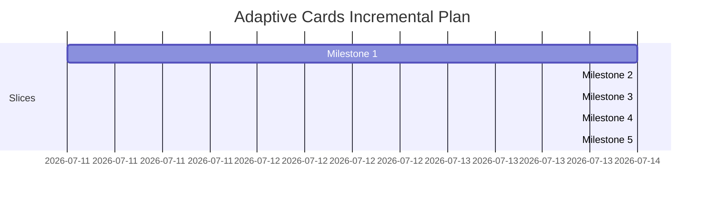

# Adaptive Cards Integration Plan for Rouen (Incremental Vertical Slices)

This document outlines an incremental, **vertical-slice implementation plan** for adding an Adaptive Cards Renderer and Templating Engine to Rouen. Instead of building subsystems (parser, templater, renderer) in isolation, each milestone delivers a fully functioning slice of the entire pipeline. This ensures you see visual, interactive results early and can continuously refine the abstractions.

---

## 🏛️ Decoupled Architecture

To ensure the components remain swapable and maintainable, we define clear C++ interface boundaries:

- `parser_interface` ([parser.hpp](file:///Users/ignaciorodriguez/src/rouen/src/helpers/adaptive_cards/parser.hpp)): Deserializes JSON cards into an AST.
- `templater_interface` ([templater.hpp](file:///Users/ignaciorodriguez/src/rouen/src/helpers/adaptive_cards/templater.hpp)): Binds data variables into the AST.
- `renderer_interface` ([renderer.hpp](file:///Users/ignaciorodriguez/src/rouen/src/helpers/adaptive_cards/renderer.hpp)): Draws AST elements using ImGui.

---

## 📅 Incremental Milestones (Vertical Slices)



### Milestone 1: Minimal Vertical Slice (Static Text & Simple Binding)
**Goal:** Deliver a working end-to-end pipeline using the simplest possible card schema.

- **Parser:** Support a single `TextBlock` element with `text` and `id` properties.
- **Templating:** Support flat string substitutions (e.g., replacing `${title}` with a flat string value).
- **Renderer:** Draw the `TextBlock` using standard `ImGui::TextWrapped`.
- **Integration:** Register a basic `adaptive-card` type in the card factory that accepts a path to a card JSON file and context JSON file.

> [!TIP]
> **Outcome 1:** You can load a JSON card like `{"type": "AdaptiveCard", "body": [{"type": "TextBlock", "text": "Hello ${name}"}]}` with data `{"name": "Rouen"}` and see it successfully render **"Hello Rouen"** in a card window.

---

### Milestone 2: Rich Text & Layouts (Containers & Nested Data)
**Goal:** Support complex structural presentation and nested template contexts.

- **Parser:** Add support for:
  - `Container`, `ColumnSet`, `Column`, and `FactSet`.
  - Rich formatting properties (sizes, colors, weights).
- **Templating:** Support nested dot-notation access paths (e.g., `${user.profile.name}`).
- **Renderer:** 
  - Arrange elements side-by-side using ImGui columns or cursor placement helper APIs.
  - Apply Rouen's active visual themes to container background frames and text colors.
  - Implement a key-value tabular layout for `FactSet`.

> [!TIP]
> **Outcome 2:** You can render multi-column dashboards containing headers, formatted descriptors, and labeled status grids, fully bound to deep data structures.

---

### Milestone 3: Interactive Inputs & Basic Actions
**Goal:** Support two-way communication and user interactions.

- **Parser:** Add support for input components and simple hyperlinks:
  - `Input.Text` and `Input.Toggle` (checkboxes).
  - `Action.OpenUrl`.
- **Templating:** Support expression binding within action URLs (e.g., `https://github.com/${repo_owner}`).
- **Renderer:**
  - Render native ImGui input text widgets and checkboxes.
  - Store the values of these widgets in a temporary card-state map keyed by the input element's `id`.
  - Draw action buttons that trigger `rouen::platform::open_file` when clicked.

> [!TIP]
> **Outcome 3:** You can render forms that accept user input and action links that dynamically open external browser pages with parameterized URLs.

---

### Milestone 4: Lists, Repeating Loops, & Advanced Actions
**Goal:** Support dynamic lists of elements and state-modifying actions.

- **Parser:** Add support for repeating schema attributes (`$data`) and action routing:
  - `Action.Submit` and `Action.ShowCard`.
  - List repeat/loop markers.
- **Templating:** Support repeating templates over arrays (e.g., expanding a single row layout for each item in an array context).
- **Renderer:**
  - Build the submission handler: collect all form states from the inputs map and dispatch the payload (as a JSON string) to the card's action handler.
  - Implement collapsible sub-cards for `Action.ShowCard`.

> [!TIP]
> **Outcome 4:** You can display variable-length feeds (like an RSS or GitHub notifications list) where clicking items opens inline details or submits forms back to the host system.

---

### Milestone 5: Basic Markdown Text Support
**Goal:** Support common inline Markdown formatting in text-bearing card elements.

- **Parser:** Preserve markdown-capable text content in `TextBlock` and related text fields without stripping markdown markers.
- **Templating:** Keep `${...}` binding compatible with markdown text so substitutions can appear inside formatted spans.
- **Renderer:** Add basic markdown rendering for:
  - bold (`**text**`)
  - italics (`*text*` and `_text_`)
  - inline code (`` `text` ``)
  - links (`[label](url)`)
  - escaped markdown characters for literal display

> [!TIP]
> **Outcome 5:** You can author card content with lightweight markdown emphasis and links, and see it render with readable formatting instead of raw markdown syntax.

---

## 🛠️ Verification Strategy

1. **Google Test Suite**: Set up tests that run at each milestone to verify the parser AST and templating output against expected outputs.
2. **Visual Showcases**: Create a test card registry containing sample JSON cards from each milestone category to quickly test layout behavior.

---

## ✅ Round 1 Execution Notes (Implemented)

Round 1 is wired end-to-end with:

- `parser_interface` implementation for top-level `AdaptiveCard` + `TextBlock`.
- `templater_interface` implementation for flat `${key}` replacements.
- `renderer_interface` implementation that renders `TextBlock` text through ImGui.
- `adaptive-card` card registration in the card factory.
- Unit tests in `tests/test_adaptive_cards.cpp`.

### UI Test Procedure in Rouen

1. Launch Rouen.
2. Open the **Application Menu** card.
3. Go to **Information** and click **Adaptive Card**.
4. Confirm the card renders `Hello Rouen`.
5. Open the **JSON** tab to inspect the card JSON, context JSON, and bound JSON currently used by the card.

### UI Test with External JSON Files

Use the URI format:

`adaptive-card:<card_json_path>|<context_json_path>`

Example files:

**Card JSON**
```json
{
  "type": "AdaptiveCard",
  "body": [
    { "type": "TextBlock", "id": "greeting", "text": "Hello ${name}" }
  ]
}
```

**Context JSON**
```json
{
  "name": "Rouen"
}
```

---

## ✅ Round 2 Execution Notes (Implemented)

Round 2 extends the same pipeline with:

- Parser support for `Container`, `ColumnSet`, `Column`, and `FactSet`.
- Parsing of rich formatting properties on text (`size`, `color`, `weight`).
- Templating support for nested dot-notation expressions like `${user.profile.name}`.
- Renderer support for:
  - Nested container rendering.
  - Side-by-side columns for `ColumnSet`.
  - Key-value table rendering for `FactSet`.

### Round 2 UI Test Example

Use URI format:

`adaptive-card:<card_json_path>|<context_json_path>`

**Card JSON**
```json
{
  "type": "AdaptiveCard",
  "body": [
    {
      "type": "Container",
      "items": [
        { "type": "TextBlock", "text": "Hello ${user.profile.name}", "size": "Large", "weight": "Bolder", "color": "Accent" },
        {
          "type": "ColumnSet",
          "columns": [
            { "type": "Column", "items": [{ "type": "TextBlock", "text": "Build: ${build.status}" }] },
            { "type": "Column", "items": [{ "type": "TextBlock", "text": "Owner: ${user.team.name}" }] }
          ]
        },
        {
          "type": "FactSet",
          "facts": [
            { "title": "Status", "value": "${user.status}" },
            { "title": "Region", "value": "${user.profile.region}" }
          ]
        }
      ]
    }
  ]
}
```

**Context JSON**
```json
{
  "user": {
    "profile": { "name": "Rouen", "region": "LATAM" },
    "team": { "name": "Platform" },
    "status": "online"
  },
  "build": { "status": "green" }
}
```

---

## ✅ Round 3 Execution Notes (Implemented)

Round 3 extends Round 2 with:

- Parser support for `Input.Text`, `Input.Toggle`, and top-level `Action.OpenUrl`.
- Templating support for expressions in action URLs (e.g. `https://github.com/${repo_owner}/${repo_name}`).
- Renderer support for:
  - Text input widgets and toggle checkboxes.
  - Open URL action buttons.
  - Card-local input state tracking.

### Round 3 UI Test Procedure in Rouen

1. Launch Rouen.
2. Open **Application Menu** → **Information** → **Adaptive Card**.
3. Open the card using URI format:  
   `adaptive-card:<card_json_path>|<context_json_path>`
4. In **Rendered** tab:
   - Type in the `Input.Text` field.
   - Toggle the `Input.Toggle` checkbox.
   - Click the `Action.OpenUrl` button.
5. Confirm:
   - Browser opens the templated URL.
   - The card shows the **Last opened URL** line.
   - In **JSON** tab, **Input State JSON** reflects your latest input values.

### Round 3 UI Test Example

**Card JSON**
```json
{
  "type": "AdaptiveCard",
  "body": [
    { "type": "TextBlock", "text": "Repo launcher for ${repo_owner}" },
    { "type": "Input.Text", "id": "repoPath", "title": "Repository", "value": "${repo_owner}/${repo_name}", "placeholder": "owner/repo" },
    { "type": "Input.Toggle", "id": "openInBrowser", "title": "Open in browser", "value": "true" }
  ],
  "actions": [
    { "type": "Action.OpenUrl", "title": "Open Repository", "url": "https://github.com/${repo_owner}/${repo_name}" }
  ]
}
```

**Context JSON**
```json
{
  "repo_owner": "ignacionr",
  "repo_name": "rouen"
}
```

---

## ✅ Round 4 Execution Notes (Implemented)

Round 4 extends Round 3 with:

- Parser support for repeating templates using `$data`.
- Parser support for advanced actions:
  - `Action.Submit`
  - `Action.ShowCard`
- Templating support for expanding repeated elements over array contexts.
- Renderer support for:
  - Repeated list rendering.
  - Submit payload generation from card input state.
  - Inline expandable cards for `Action.ShowCard`.

### Round 4 UI Test Procedure in Rouen

1. Launch Rouen.
2. Open **Application Menu** → **Information** → **Adaptive Card**.
3. In the **Adaptive Card Test Set** dropdown, choose **Round 4 - Repeat + Submit + ShowCard**.
4. In **Rendered** tab:
   - Verify repeated notifications are rendered as a list.
   - Click **Show Details** and verify inline detail content appears.
   - Type a value in `Comment` and toggle `Acknowledge all`.
   - Click **Submit Inputs**.
5. Confirm:
   - The card shows **Last submit payload** in Rendered tab.
   - **Input State JSON** and **Last Submit JSON** are visible in the JSON tab.

### Round 4 UI Test with External JSON Files

Use URI format:

`adaptive-card:<card_json_path>|<context_json_path>`

**Card JSON**
```json
{
  "type": "AdaptiveCard",
  "body": [
    { "type": "TextBlock", "text": "Notifications for ${user}" },
    {
      "type": "Container",
      "$data": "${notifications}",
      "items": [
        { "type": "TextBlock", "text": "- ${title} (${severity})" }
      ]
    },
    { "type": "Input.Text", "id": "comment", "title": "Comment", "placeholder": "Write a comment" },
    { "type": "Input.Toggle", "id": "acknowledged", "title": "Acknowledge all", "value": "false" }
  ],
  "actions": [
    {
      "type": "Action.ShowCard",
      "title": "Show Details",
      "card": {
        "type": "AdaptiveCard",
        "body": [
          {
            "type": "FactSet",
            "facts": [
              { "title": "Total", "value": "${summary.total}" },
              { "title": "Critical", "value": "${summary.critical}" }
            ]
          }
        ]
      }
    },
    { "type": "Action.Submit", "title": "Submit Inputs" }
  ]
}
```

**Context JSON**
```json
{
  "user": "Rouen",
  "notifications": [
    { "title": "Build Failed", "severity": "critical" },
    { "title": "Dependency Update", "severity": "warning" },
    { "title": "Review Requested", "severity": "info" }
  ],
  "summary": { "total": 3, "critical": 1 }
}
```
