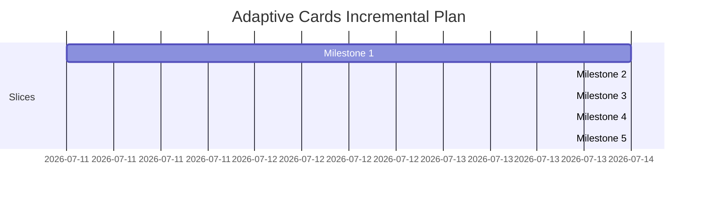

# Adaptive Cards Integration Plan for Rouen (Incremental Vertical Slices)

This document outlines an incremental, **vertical-slice implementation plan** for adding an Adaptive Cards Renderer and Templating Engine to Rouen. Instead of building subsystems (parser, templater, renderer) in isolation, each milestone delivers a fully functioning slice of the entire pipeline. This ensures you see visual, interactive results early and can continuously refine the abstractions.

---

## 🏛️ Decoupled Architecture

To ensure the components remain swapable and maintainable, we define clear C++ interface boundaries:

- `parser_interface` ([parser.hpp](file:///Users/ignaciorodriguez/src/rouen/src/helpers/adaptive_cards/parser.hpp)): Deserializes JSON cards into an AST.
- `templater_interface` ([templater.hpp](file:///Users/ignaciorodriguez/src/rouen/src/helpers/adaptive_cards/templater.hpp)): Binds data variables into the AST.
- `renderer_interface` ([renderer.hpp](file:///Users/ignaciorodriguez/src/rouen/src/helpers/adaptive_cards/renderer.hpp)): Draws AST elements using ImGui.

---

## 📅 Incremental Milestones (Vertical Slices)



### Milestone 1: Minimal Vertical Slice (Static Text & Simple Binding)
**Goal:** Deliver a working end-to-end pipeline using the simplest possible card schema.

- **Parser:** Support a single `TextBlock` element with `text` and `id` properties.
- **Templating:** Support flat string substitutions (e.g., replacing `${title}` with a flat string value).
- **Renderer:** Draw the `TextBlock` using standard `ImGui::TextWrapped`.
- **Integration:** Register a basic `adaptive-card` type in the card factory that accepts a path to a card JSON file and context JSON file.

> [!TIP]
> **Outcome 1:** You can load a JSON card like `{"type": "AdaptiveCard", "body": [{"type": "TextBlock", "text": "Hello ${name}"}]}` with data `{"name": "Rouen"}` and see it successfully render **"Hello Rouen"** in a card window.

---

### Milestone 2: Rich Text & Layouts (Containers & Nested Data)
**Goal:** Support complex structural presentation and nested template contexts.

- **Parser:** Add support for:
  - `Container`, `ColumnSet`, `Column`, and `FactSet`.
  - Rich formatting properties (sizes, colors, weights).
- **Templating:** Support nested dot-notation access paths (e.g., `${user.profile.name}`).
- **Renderer:** 
  - Arrange elements side-by-side using ImGui columns or cursor placement helper APIs.
  - Apply Rouen's active visual themes to container background frames and text colors.
  - Implement a key-value tabular layout for `FactSet`.

> [!TIP]
> **Outcome 2:** You can render multi-column dashboards containing headers, formatted descriptors, and labeled status grids, fully bound to deep data structures.

---

### Milestone 3: Interactive Inputs & Basic Actions
**Goal:** Support two-way communication and user interactions.

- **Parser:** Add support for input components and simple hyperlinks:
  - `Input.Text` and `Input.Toggle` (checkboxes).
  - `Action.OpenUrl`.
- **Templating:** Support expression binding within action URLs (e.g., `https://github.com/${repo_owner}`).
- **Renderer:**
  - Render native ImGui input text widgets and checkboxes.
  - Store the values of these widgets in a temporary card-state map keyed by the input element's `id`.
  - Draw action buttons that trigger `rouen::platform::open_file` when clicked.

> [!TIP]
> **Outcome 3:** You can render forms that accept user input and action links that dynamically open external browser pages with parameterized URLs.

---

### Milestone 4: Lists, Repeating Loops, & Advanced Actions
**Goal:** Support dynamic lists of elements and state-modifying actions.

- **Parser:** Add support for repeating schema attributes (`$data`) and action routing:
  - `Action.Submit` and `Action.ShowCard`.
  - List repeat/loop markers.
- **Templating:** Support repeating templates over arrays (e.g., expanding a single row layout for each item in an array context).
- **Renderer:**
  - Build the submission handler: collect all form states from the inputs map and dispatch the payload (as a JSON string) to the card's action handler.
  - Implement collapsible sub-cards for `Action.ShowCard`.

> [!TIP]
> **Outcome 4:** You can display variable-length feeds (like an RSS or GitHub notifications list) where clicking items opens inline details or submits forms back to the host system.

---

### Milestone 5: Basic Markdown Text Support
**Goal:** Support common inline Markdown formatting in text-bearing card elements.

- **Parser:** Preserve markdown-capable text content in `TextBlock` and related text fields without stripping markdown markers.
- **Templating:** Keep `${...}` binding compatible with markdown text so substitutions can appear inside formatted spans.
- **Renderer:** Add basic markdown rendering for:
  - bold (`**text**`)
  - italics (`*text*` and `_text_`)
  - inline code (`` `text` ``)
  - links (`[label](url)`)
  - escaped markdown characters for literal display

> [!TIP]
> **Outcome 5:** You can author card content with lightweight markdown emphasis and links, and see it render with readable formatting instead of raw markdown syntax.

---

## 🛠️ Verification Strategy

1. **Google Test Suite**: Set up tests that run at each milestone to verify the parser AST and templating output against expected outputs.
2. **Visual Showcases**: Create a test card registry containing sample JSON cards from each milestone category to quickly test layout behavior.

---

## ✅ Round 1 Execution Notes (Implemented)

Round 1 is wired end-to-end with:

- `parser_interface` implementation for top-level `AdaptiveCard` + `TextBlock`.
- `templater_interface` implementation for flat `${key}` replacements.
- `renderer_interface` implementation that renders `TextBlock` text through ImGui.
- `adaptive-card` card registration in the card factory.
- Unit tests in `tests/test_adaptive_cards.cpp`.

### UI Test Procedure in Rouen

1. Launch Rouen.
2. Open the **Application Menu** card.
3. Go to **Information** and click **Adaptive Card**.
4. Confirm the card renders `Hello Rouen`.
5. Open the **JSON** tab to inspect the card JSON, context JSON, and bound JSON currently used by the card.

### UI Test with External JSON Files

Use the URI format:

`adaptive-card:<card_json_path>|<context_json_path>`

Example files:

**Card JSON**
```json
{
  "type": "AdaptiveCard",
  "body": [
    { "type": "TextBlock", "id": "greeting", "text": "Hello ${name}" }
  ]
}
```

**Context JSON**
```json
{
  "name": "Rouen"
}
```

---

## ✅ Round 2 Execution Notes (Implemented)

Round 2 extends the same pipeline with:

- Parser support for `Container`, `ColumnSet`, `Column`, and `FactSet`.
- Parsing of rich formatting properties on text (`size`, `color`, `weight`).
- Templating support for nested dot-notation expressions like `${user.profile.name}`.
- Renderer support for:
  - Nested container rendering.
  - Side-by-side columns for `ColumnSet`.
  - Key-value table rendering for `FactSet`.

### Round 2 UI Test Example

Use URI format:

`adaptive-card:<card_json_path>|<context_json_path>`

**Card JSON**
```json
{
  "type": "AdaptiveCard",
  "body": [
    {
      "type": "Container",
      "items": [
        { "type": "TextBlock", "text": "Hello ${user.profile.name}", "size": "Large", "weight": "Bolder", "color": "Accent" },
        {
          "type": "ColumnSet",
          "columns": [
            { "type": "Column", "items": [{ "type": "TextBlock", "text": "Build: ${build.status}" }] },
            { "type": "Column", "items": [{ "type": "TextBlock", "text": "Owner: ${user.team.name}" }] }
          ]
        },
        {
          "type": "FactSet",
          "facts": [
            { "title": "Status", "value": "${user.status}" },
            { "title": "Region", "value": "${user.profile.region}" }
          ]
        }
      ]
    }
  ]
}
```

**Context JSON**
```json
{
  "user": {
    "profile": { "name": "Rouen", "region": "LATAM" },
    "team": { "name": "Platform" },
    "status": "online"
  },
  "build": { "status": "green" }
}
```

---

## ✅ Round 3 Execution Notes (Implemented)

Round 3 extends Round 2 with:

- Parser support for `Input.Text`, `Input.Toggle`, and top-level `Action.OpenUrl`.
- Templating support for expressions in action URLs (e.g. `https://github.com/${repo_owner}/${repo_name}`).
- Renderer support for:
  - Text input widgets and toggle checkboxes.
  - Open URL action buttons.
  - Card-local input state tracking.

### Round 3 UI Test Procedure in Rouen

1. Launch Rouen.
2. Open **Application Menu** → **Information** → **Adaptive Card**.
3. Open the card using URI format:  
   `adaptive-card:<card_json_path>|<context_json_path>`
4. In **Rendered** tab:
   - Type in the `Input.Text` field.
   - Toggle the `Input.Toggle` checkbox.
   - Click the `Action.OpenUrl` button.
5. Confirm:
   - Browser opens the templated URL.
   - The card shows the **Last opened URL** line.
   - In **JSON** tab, **Input State JSON** reflects your latest input values.

### Round 3 UI Test Example

**Card JSON**
```json
{
  "type": "AdaptiveCard",
  "body": [
    { "type": "TextBlock", "text": "Repo launcher for ${repo_owner}" },
    { "type": "Input.Text", "id": "repoPath", "title": "Repository", "value": "${repo_owner}/${repo_name}", "placeholder": "owner/repo" },
    { "type": "Input.Toggle", "id": "openInBrowser", "title": "Open in browser", "value": "true" }
  ],
  "actions": [
    { "type": "Action.OpenUrl", "title": "Open Repository", "url": "https://github.com/${repo_owner}/${repo_name}" }
  ]
}
```

**Context JSON**
```json
{
  "repo_owner": "ignacionr",
  "repo_name": "rouen"
}
```

---

## ✅ Round 4 Execution Notes (Implemented)

Round 4 extends Round 3 with:

- Parser support for repeating templates using `$data`.
- Parser support for advanced actions:
  - `Action.Submit`
  - `Action.ShowCard`
- Templating support for expanding repeated elements over array contexts.
- Renderer support for:
  - Repeated list rendering.
  - Submit payload generation from card input state.
  - Inline expandable cards for `Action.ShowCard`.

### Round 4 UI Test Procedure in Rouen

1. Launch Rouen.
2. Open **Application Menu** → **Information** → **Adaptive Card**.
3. In the **Adaptive Card Test Set** dropdown, choose **Round 4 - Repeat + Submit + ShowCard**.
4. In **Rendered** tab:
   - Verify repeated notifications are rendered as a list.
   - Click **Show Details** and verify inline detail content appears.
   - Type a value in `Comment` and toggle `Acknowledge all`.
   - Click **Submit Inputs**.
5. Confirm:
   - The card shows **Last submit payload** in Rendered tab.
   - **Input State JSON** and **Last Submit JSON** are visible in the JSON tab.

### Round 4 UI Test with External JSON Files

Use URI format:

`adaptive-card:<card_json_path>|<context_json_path>`

**Card JSON**
```json
{
  "type": "AdaptiveCard",
  "body": [
    { "type": "TextBlock", "text": "Notifications for ${user}" },
    {
      "type": "Container",
      "$data": "${notifications}",
      "items": [
        { "type": "TextBlock", "text": "- ${title} (${severity})" }
      ]
    },
    { "type": "Input.Text", "id": "comment", "title": "Comment", "placeholder": "Write a comment" },
    { "type": "Input.Toggle", "id": "acknowledged", "title": "Acknowledge all", "value": "false" }
  ],
  "actions": [
    {
      "type": "Action.ShowCard",
      "title": "Show Details",
      "card": {
        "type": "AdaptiveCard",
        "body": [
          {
            "type": "FactSet",
            "facts": [
              { "title": "Total", "value": "${summary.total}" },
              { "title": "Critical", "value": "${summary.critical}" }
            ]
          }
        ]
      }
    },
    { "type": "Action.Submit", "title": "Submit Inputs" }
  ]
}
```

**Context JSON**
```json
{
  "user": "Rouen",
  "notifications": [
    { "title": "Build Failed", "severity": "critical" },
    { "title": "Dependency Update", "severity": "warning" },
    { "title": "Review Requested", "severity": "info" }
  ],
  "summary": { "total": 3, "critical": 1 }
}
```

---

## ✅ Round 5 Execution Notes (Implemented)

Round 5 extends Round 4 with basic inline Markdown rendering inside `TextBlock` elements:

- New `markdown.hpp` helper with `parse_inline_markdown()` and `strip_markdown()`.
- Supported inline markers:
  - `**text**` → **bold** (brighter text color)
  - `*text*` and `_text_` → *italic* (lavender tint)
  - `` `text` `` → inline code (green tint)
  - `[label](url)` → clickable link (blue, tooltip shows URL, opens via `Action.OpenUrl` callback)
  - `\char` → escaped literal character
- Plain text `TextBlock` elements continue to use `ImGui::TextWrapped` (no overhead).
- Formatted text blocks render spans inline using `ImGui::SameLine(0, 0)`.
- Large/ExtraLarge headers render as `ImGui::SeparatorText` with markdown stripped.
- `renderer::collect_lines()` now strips markdown markers from `TextBlock` text.
- `Input.Text` buffer size increased from 512 to 1024 characters.
- `Action.ShowCard` body elements now receive link-click callbacks.

### Round 5 UI Test Procedure in Rouen

1. Launch Rouen.
2. Open **Application Menu** → **Information** → **Adaptive Card**.
3. In the **Adaptive Card Test Set** dropdown, choose **Round 5 - Markdown Text**.
4. In the **Rendered** tab verify:
   - Header shows as a separator with plain text (markdown stripped).
   - Author line renders in italic tint, date in code (green) tint.
   - Severity/status line has a bold prefix and italic status.
   - Release notes line shows a blue clickable link; hovering shows the resolved URL tooltip.

### Round 5 UI Test with External JSON Files

Use URI format:

`adaptive-card:<card_json_path>|<context_json_path>`

**Card JSON** (`round5_card.json`)
```json
{
  "type": "AdaptiveCard",
  "body": [
    { "type": "TextBlock", "text": "**Status Update** for ${project}", "size": "Large" },
    { "type": "TextBlock", "text": "Reported by _${author}_ on `${date}`" },
    { "type": "TextBlock", "text": "**Severity:** ${severity} — *${status}*" },
    { "type": "TextBlock", "text": "See [release notes](${release_url}) for full details." },
    {
      "type": "FactSet",
      "facts": [
        { "title": "Build", "value": "${build}" },
        { "title": "Region", "value": "${region}" }
      ]
    }
  ]
}
```

**Context JSON** (`round5_context.json`)
```json
{
  "project": "Rouen",
  "author": "ignacionr",
  "date": "2026-07-17",
  "severity": "low",
  "status": "in progress",
  "release_url": "https://github.com/ignacionr/rouen/releases",
  "build": "abc1234",
  "region": "LATAM"
}
```

---

## ✅ AI Chat Markdown Integration (Implemented)

The `render_markdown_block()` function from `markdown_renderer.hpp` is now used to render assistant message bubbles in the **AI Chat** card (`ai_chat.hpp`).

### What Changed

- **Assistant bubbles** now render full block-level Markdown:
  - `# H1`, `## H2`, `### H3` headings with visual hierarchy
  - ```` ``` ```` code fences with monospace font and green tint
  - `---` / `***` / `___` horizontal separators
  - `- ` / `* ` unordered bullet lists
  - `1. ` ordered numbered lists
  - `> ` blockquotes (indented, dimmed)
  - Inline: `**bold**`, `*italic*`, `` `code` ``, `[link](url)`
- **User bubbles** remain plain `ImGui::TextWrapped` (no Markdown) since they contain raw user input.
- **Fonts:** Bold, Italic, and Mono fonts from `fonts.hpp` are used via `markdown_render_config`.
- **Links:** Clicking a Markdown link in an assistant bubble opens the URL via `platform::open_url`.
- **Layout:** Bubble height calculation now accounts for extra vertical space from Markdown block elements (headings, separators, code fences, bullets, blockquotes).

### Files Modified

| File | Change |
|------|--------|
| `src/cards/information/ai_chat.hpp` | Added `markdown_renderer.hpp` and `fonts.hpp` includes; replaced `TextWrapped` with `render_markdown_block` for assistant bubbles; added MD-aware height estimation |
| `tests/test_markdown_renderer.cpp` | **New:** 18 Google Test cases covering inline parsing for block content, AI response patterns, block-level prefix classification, ordered-list detection, escape handling |
| `tests/CMakeLists.txt` | Registered `test_markdown_renderer` binary and added it to `run_all_tests`, `run_gtest_only`, `run_ctest` targets |
| `docs/adaptive_cards_plan.md` | This section |

### Test Coverage

The new `test_markdown_renderer.cpp` covers:

1. **Heading content parsing** — inline Markdown inside heading lines
2. **Bullet and numbered list content** — inline parsing of list item bodies
3. **Blockquote content** — inline parsing within blockquotes
4. **Code fence toggle detection** — ``` prefix matching
5. **Horizontal rule variants** — `---`, `***`, `___`
6. **Ordered list prefix parsing** — digit-dot-space heuristic
7. **Escaped characters** — `\*`, `\_` survival through inline parser
8. **Edge cases** — empty input, whitespace-only input
9. **Real-world AI response patterns** — mixed bold/code/link spans typical of LLM output
10. **Block-level line prefix classification** — all supported prefixes

### UI Test Procedure

1. Launch Rouen.
2. Open the **AI Chat** card.
3. Send a message that will elicit a Markdown-formatted response (e.g., "List the top 3 programming languages and explain why in a bulleted list with bold headers").
4. Verify the assistant's reply renders with:
   - Bold text for `**emphasis**`
   - Code spans in green monospace for `` `inline code` ``
   - Code blocks in green monospace for fenced code
   - Bullet points for list items
   - Clickable blue links for `[text](url)`

---

## ✅ ActionSet Support (Implemented)

Full support for the Adaptive Cards `ActionSet` element has been implemented across the parser, templater, and renderer subsystems.

### Capabilities

- **Parser (`parser.hpp`)**:
  - `ActionSet` element type recognized in schema validator.
  - `actions` array deserialized into nested `std::vector<action>`.
  - Validation runs recursively for all contained actions (`Action.OpenUrl`, `Action.Submit`, `Action.Execute`, `Action.ToggleVisibility`, `Action.ShowCard`).
- **Templater (`templater.hpp`)**:
  - Templating expressions (`${...}`) are bound inside action `title`, `url`, and sub-card bodies (`ShowCard`).
  - Compatible with `$data` loops to generate dynamic repeating action sets across array collections.
- **Renderer (`renderer.hpp`)**:
  - Renders action buttons horizontally inline without top-level card separators.
  - Uniquely scoped IDs (`<scope>-act-<idx>`) ensuring distinct state keys for nested and inline `ShowCard` actions.
  - Supports `Action.OpenUrl` URL extraction in `collect_action_urls()` and text extraction in `collect_lines()`.

### Example Card JSON

```json
{
  "type": "AdaptiveCard",
  "body": [
    { "type": "TextBlock", "text": "Inline Actions Example" },
    {
      "type": "ActionSet",
      "actions": [
        { "type": "Action.OpenUrl", "title": "Visit Docs", "url": "https://adaptivecards.io" },
        { "type": "Action.Submit", "title": "Submit Response", "data": { "key": "val" } },
        {
          "type": "Action.ShowCard",
          "title": "More Info",
          "card": {
            "type": "AdaptiveCard",
            "body": [
              { "type": "TextBlock", "text": "Sub-card content rendered inline" }
            ]
          }
        }
      ]
    }
  ]
}
```

---

## 📊 Table Column Width & Stretch Support (Implemented)

Adaptive Cards `Table` elements support explicit column configurations via the `columns` array (`TableColumnDefinition`):

- **Supported Column Width Values**:
  - `"stretch"` (or `"Stretch"`): Column expands to fill available width with standard stretch weight (`1.0`).
  - Proportional Numbers (e.g. `1`, `2`, `3` or `"1"`, `"2"`): Stretch columns with proportional weighting (e.g. column with `2` is allocated twice the remaining width of column with `1`).
  - `"auto"` (or `"Auto"`): Sized according to cell contents.
  - Pixel Widths (e.g. `"100px"`, `"50px"`): Fixed pixel-width columns.
- **Templating**: Column width values dynamically support binding expressions (e.g. `"width": "${col.width}"`).
- **Rendering**: ImGui Table column setup (`ImGui::TableSetupColumn`) configures `ImGuiTableColumnFlags_WidthStretch` with appropriate weight or `ImGuiTableColumnFlags_WidthFixed` for pixel/auto columns under `ImGuiTableFlags_SizingStretchProp`.

### Example Card JSON

```json
{
  "type": "AdaptiveCard",
  "body": [
    {
      "type": "Table",
      "columns": [
        { "type": "TableColumnDefinition", "width": "stretch" },
        { "type": "TableColumnDefinition", "width": 2 },
        { "type": "TableColumnDefinition", "width": "auto" },
        { "type": "TableColumnDefinition", "width": "120px" }
      ],
      "rows": [
        {
          "type": "TableRow",
          "cells": [
            { "type": "TableCell", "items": [ { "type": "TextBlock", "text": "Stretch (1x)" } ] },
            { "type": "TableCell", "items": [ { "type": "TextBlock", "text": "Proportional Stretch (2x)" } ] },
            { "type": "TableCell", "items": [ { "type": "TextBlock", "text": "Auto" } ] },
            { "type": "TableCell", "items": [ { "type": "TextBlock", "text": "120px Fixed" } ] }
          ]
        }
      ]
    }
  ]
}
```
