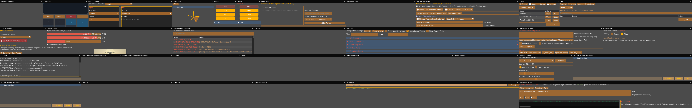
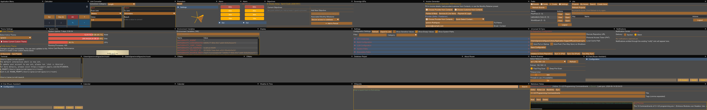

# Rouen Card Documentation: Information & Intelligence

> [!NOTE]
> Technical overview, REST API creation URI, and live UI snapshots for all supported **Information & Intelligence** cards running on Rouen.

## Overview Table

| Card Title | URI Schema | Description |
| :--- | :--- | :--- |
| **AI Assistant Chat Card** | `uri: "ai_chat"` | Conversational AI card with LLM tool calling, memory context, and interactive card generation. |
| **Calendar Card** | `uri: "calendar"` | Schedule viewer supporting iCal feeds, WebDAV calendar sync, and event reminders. |
| **Weather Forecast Card** | `uri: "weather:Montevideo"` | Global weather forecast display with hourly temperature graphs, precipitation probability, and wind metrics. |
| **Wikipedia Card** | `uri: "wikipedia"` | Encyclopedia article browser featuring clean typography, table of contents, and cross-reference links. |
| **Markdown Notes Card** | `uri: "notes"` | Rich Markdown notebook supporting live side-by-side rendering, task lists, and syntax highlighted code blocks. |
| **Contacts Directory Card** | `uri: "contacts"` | Address book and contact management card supporting gravatar icons and search. |
| **Adaptive Card Renderer** | `uri: "adaptive-card"` | Microsoft Adaptive Cards JSON layout engine rendering dynamic schema-driven user interface components. |
| **Number Series Visualization Card** | `uri: "number-series"` | Data series plotter rendering bar charts, line graphs, and comparative metric visualizations. |
| **Travel Planner Card** | `uri: "travel"` | Flight, hotel, and itinerary management card for organizing travel bookings. |
| **RSS News Reader Gallery Card** | `uri: "rss"` | Newsfeed gallery reader aggregating RSS/Atom feeds with smart filtering, media preview, and article extraction. |
| **RSS Feed Channel Card** | `uri: "rss-feed:35547"` | Dedicated RSS channel feed reader displaying recent news headlines, publication dates, and item previews. |
| **RSS Feed Item Reader Card** | `uri: "rss-item:35547_0"` | Detailed RSS article reader rendering extracted full-text content, header images, and metadata. |

---

## AI Assistant Chat Card

- **URI Schema**: `ai_chat`
- **Category**: Information & Intelligence

### Description & Features
Conversational AI card with LLM tool calling, memory context, and interactive card generation.

### REST API Interaction
```bash
# Create card
curl -X POST http://127.0.0.1:8081/api/cards -H "Content-Type: application/json" -d '{"uri":"ai_chat"}'

# Focus card
curl -X POST http://127.0.0.1:8081/api/cards/focus -H "Content-Type: application/json" -d '{"uri":"ai_chat"}'

# Capture card snapshot
curl -X POST http://127.0.0.1:8081/api/screenshot -H "Content-Type: application/json" -d '{"target":"ai_chat","filename":"/tmp/snapshot_ai_chat.png"}'
```


---

## Calendar Card

- **URI Schema**: `calendar`
- **Category**: Information & Intelligence

### Description & Features
Schedule viewer supporting iCal feeds, WebDAV calendar sync, and event reminders.

### REST API Interaction
```bash
# Create card
curl -X POST http://127.0.0.1:8081/api/cards -H "Content-Type: application/json" -d '{"uri":"calendar"}'

# Focus card
curl -X POST http://127.0.0.1:8081/api/cards/focus -H "Content-Type: application/json" -d '{"uri":"calendar"}'

# Capture card snapshot
curl -X POST http://127.0.0.1:8081/api/screenshot -H "Content-Type: application/json" -d '{"target":"calendar","filename":"/tmp/snapshot_calendar.png"}'
```


---

## Weather Forecast Card

- **URI Schema**: `weather:Montevideo`
- **Category**: Information & Intelligence

### Description & Features
Global weather forecast display with hourly temperature graphs, precipitation probability, and wind metrics.

### REST API Interaction
```bash
# Create card
curl -X POST http://127.0.0.1:8081/api/cards -H "Content-Type: application/json" -d '{"uri":"weather:Montevideo"}'

# Focus card
curl -X POST http://127.0.0.1:8081/api/cards/focus -H "Content-Type: application/json" -d '{"uri":"weather:Montevideo"}'

# Capture card snapshot
curl -X POST http://127.0.0.1:8081/api/screenshot -H "Content-Type: application/json" -d '{"target":"weather","filename":"/tmp/snapshot_weather.png"}'
```


---

## Wikipedia Card

- **URI Schema**: `wikipedia`
- **Category**: Information & Intelligence

### Description & Features
Encyclopedia article browser featuring clean typography, table of contents, and cross-reference links.

### REST API Interaction
```bash
# Create card
curl -X POST http://127.0.0.1:8081/api/cards -H "Content-Type: application/json" -d '{"uri":"wikipedia"}'

# Focus card
curl -X POST http://127.0.0.1:8081/api/cards/focus -H "Content-Type: application/json" -d '{"uri":"wikipedia"}'

# Capture card snapshot
curl -X POST http://127.0.0.1:8081/api/screenshot -H "Content-Type: application/json" -d '{"target":"wikipedia","filename":"/tmp/snapshot_wikipedia.png"}'
```


---

## Markdown Notes Card

- **URI Schema**: `notes`
- **Category**: Information & Intelligence

### Description & Features
Rich Markdown notebook supporting live side-by-side rendering, task lists, and syntax highlighted code blocks.

### REST API Interaction
```bash
# Create card
curl -X POST http://127.0.0.1:8081/api/cards -H "Content-Type: application/json" -d '{"uri":"notes"}'

# Focus card
curl -X POST http://127.0.0.1:8081/api/cards/focus -H "Content-Type: application/json" -d '{"uri":"notes"}'

# Capture card snapshot
curl -X POST http://127.0.0.1:8081/api/screenshot -H "Content-Type: application/json" -d '{"target":"notes","filename":"/tmp/snapshot_notes.png"}'
```


---

## Contacts Directory Card

- **URI Schema**: `contacts`
- **Category**: Information & Intelligence

### Description & Features
Address book and contact management card supporting gravatar icons and search.

### REST API Interaction
```bash
# Create card
curl -X POST http://127.0.0.1:8081/api/cards -H "Content-Type: application/json" -d '{"uri":"contacts"}'

# Focus card
curl -X POST http://127.0.0.1:8081/api/cards/focus -H "Content-Type: application/json" -d '{"uri":"contacts"}'

# Capture card snapshot
curl -X POST http://127.0.0.1:8081/api/screenshot -H "Content-Type: application/json" -d '{"target":"contacts","filename":"/tmp/snapshot_contacts.png"}'
```


---

## Adaptive Card Renderer

- **URI Schema**: `adaptive-card`
- **Category**: Information & Intelligence

### Description & Features
Microsoft Adaptive Cards JSON layout engine rendering dynamic schema-driven user interface components.

### REST API Interaction
```bash
# Create card
curl -X POST http://127.0.0.1:8081/api/cards -H "Content-Type: application/json" -d '{"uri":"adaptive-card"}'

# Focus card
curl -X POST http://127.0.0.1:8081/api/cards/focus -H "Content-Type: application/json" -d '{"uri":"adaptive-card"}'

# Capture card snapshot
curl -X POST http://127.0.0.1:8081/api/screenshot -H "Content-Type: application/json" -d '{"target":"adaptive-card","filename":"/tmp/snapshot_adaptive-card.png"}'
```


---

## Number Series Visualization Card

- **URI Schema**: `number-series`
- **Category**: Information & Intelligence

### Description & Features
Data series plotter rendering bar charts, line graphs, and comparative metric visualizations.

### REST API Interaction
```bash
# Create card
curl -X POST http://127.0.0.1:8081/api/cards -H "Content-Type: application/json" -d '{"uri":"number-series"}'

# Focus card
curl -X POST http://127.0.0.1:8081/api/cards/focus -H "Content-Type: application/json" -d '{"uri":"number-series"}'

# Capture card snapshot
curl -X POST http://127.0.0.1:8081/api/screenshot -H "Content-Type: application/json" -d '{"target":"number-series","filename":"/tmp/snapshot_number-series.png"}'
```


---

## Travel Planner Card

- **URI Schema**: `travel`
- **Category**: Information & Intelligence

### Description & Features
Flight, hotel, and itinerary management card for organizing travel bookings.

### REST API Interaction
```bash
# Create card
curl -X POST http://127.0.0.1:8081/api/cards -H "Content-Type: application/json" -d '{"uri":"travel"}'

# Focus card
curl -X POST http://127.0.0.1:8081/api/cards/focus -H "Content-Type: application/json" -d '{"uri":"travel"}'

# Capture card snapshot
curl -X POST http://127.0.0.1:8081/api/screenshot -H "Content-Type: application/json" -d '{"target":"travel","filename":"/tmp/snapshot_travel.png"}'
```


---

## RSS News Reader Gallery Card

- **URI Schema**: `rss`
- **Category**: Information & Intelligence

### Description & Features
Newsfeed gallery reader aggregating RSS/Atom feeds with smart filtering, media preview, and article extraction.

### REST API Interaction
```bash
# Create card
curl -X POST http://127.0.0.1:8081/api/cards -H "Content-Type: application/json" -d '{"uri":"rss"}'

# Focus card
curl -X POST http://127.0.0.1:8081/api/cards/focus -H "Content-Type: application/json" -d '{"uri":"rss"}'

# Capture card snapshot
curl -X POST http://127.0.0.1:8081/api/screenshot -H "Content-Type: application/json" -d '{"target":"rss","filename":"/tmp/snapshot_rss.png"}'
```


---

## RSS Feed Channel Card

- **URI Schema**: `rss-feed:35547`
- **Category**: Information & Intelligence

### Description & Features
Dedicated RSS channel feed reader displaying recent news headlines, publication dates, and item previews.

### REST API Interaction
```bash
# Create card
curl -X POST http://127.0.0.1:8081/api/cards -H "Content-Type: application/json" -d '{"uri":"rss-feed:35547"}'

# Focus card
curl -X POST http://127.0.0.1:8081/api/cards/focus -H "Content-Type: application/json" -d '{"uri":"rss-feed:35547"}'

# Capture card snapshot
curl -X POST http://127.0.0.1:8081/api/screenshot -H "Content-Type: application/json" -d '{"target":"rss-feed","filename":"/tmp/snapshot_rss-feed.png"}'
```



---

## RSS Feed Item Reader Card

- **URI Schema**: `rss-item:35547_0`
- **Category**: Information & Intelligence

### Description & Features
Detailed RSS article reader rendering extracted full-text content, header images, and metadata.

### REST API Interaction
```bash
# Create card
curl -X POST http://127.0.0.1:8081/api/cards -H "Content-Type: application/json" -d '{"uri":"rss-item:35547_0"}'

# Focus card
curl -X POST http://127.0.0.1:8081/api/cards/focus -H "Content-Type: application/json" -d '{"uri":"rss-item:35547_0"}'

# Capture card snapshot
curl -X POST http://127.0.0.1:8081/api/screenshot -H "Content-Type: application/json" -d '{"target":"rss-item","filename":"/tmp/snapshot_rss-item.png"}'
```



---

