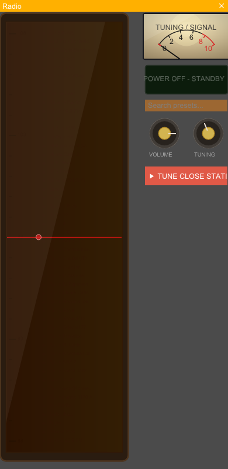
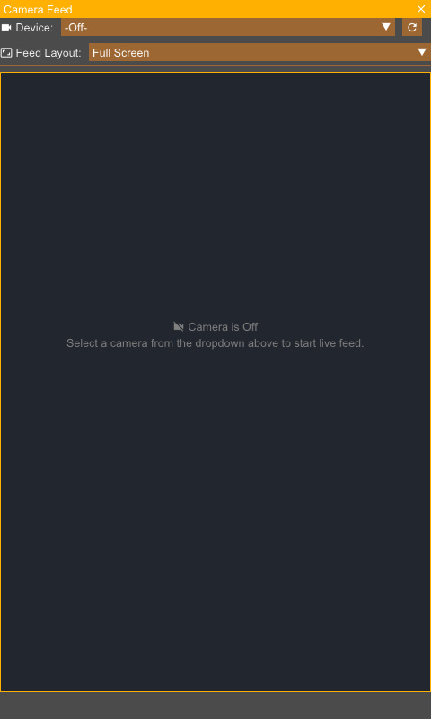
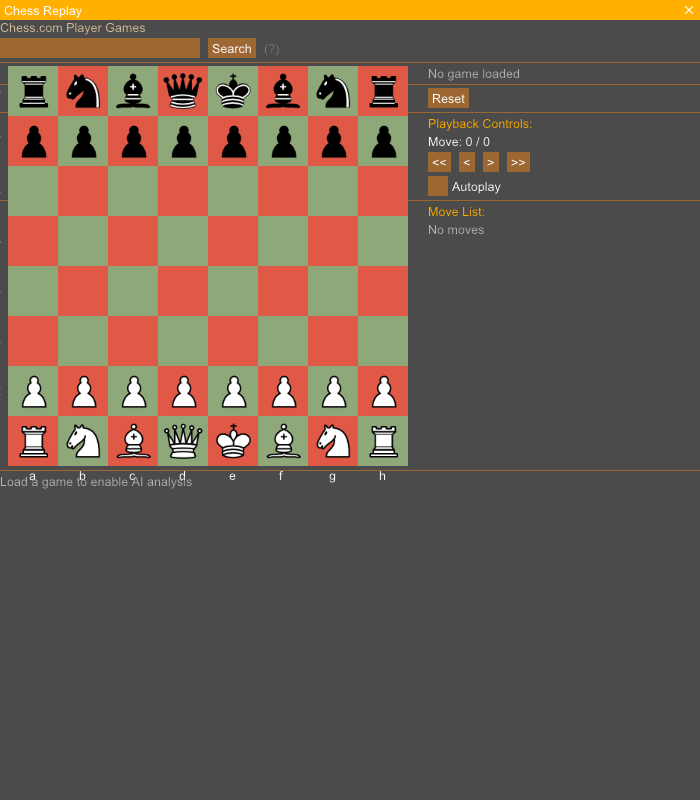

# Rouen Card Documentation: Media & Entertainment

> [!NOTE]
> Technical overview, REST API creation URI, and live UI snapshots for all supported **Media & Entertainment** cards running on Rouen.

## Overview Table

| Card Title | URI Schema | Description |
| :--- | :--- | :--- |
| **Radio Streamer Card** | `uri: "radio"` | Live internet radio player featuring streaming audio decoding, VU meters, and station presets. |
| **YouTube Search & Player Card** | `uri: "youtube"` | YouTube video search interface and embedded media player with background playback support. |
| **Camera Capture Card** | `uri: "camera"` | System webcam video feed capture card with low-latency GPU texture uploading. |
| **Media Companion Card** | `uri: "media-companion"` | Media playback manager controlling detached audio/video presentation windows. |
| **Chess Replay Card** | `uri: "chess"` | PGN chess game parser and interactive chessboard visualization card with move history replay. |

---

## Radio Streamer Card

- **URI Schema**: `radio`
- **Category**: Media & Entertainment

### Description & Features
Live internet radio player featuring streaming audio decoding, VU meters, and station presets.

### REST API Interaction
```bash
# Create card
curl -X POST http://127.0.0.1:8081/api/cards -H "Content-Type: application/json" -d '{"uri":"radio"}'

# Focus card
curl -X POST http://127.0.0.1:8081/api/cards/focus -H "Content-Type: application/json" -d '{"uri":"radio"}'

# Capture card snapshot
curl -X POST http://127.0.0.1:8081/api/screenshot -H "Content-Type: application/json" -d '{"target":"radio","filename":"/tmp/snapshot_radio.png"}'
```



---

## YouTube Search & Player Card

- **URI Schema**: `youtube`
- **Category**: Media & Entertainment

### Description & Features
YouTube video search interface and embedded media player with background playback support.

### REST API Interaction
```bash
# Create card
curl -X POST http://127.0.0.1:8081/api/cards -H "Content-Type: application/json" -d '{"uri":"youtube"}'

# Focus card
curl -X POST http://127.0.0.1:8081/api/cards/focus -H "Content-Type: application/json" -d '{"uri":"youtube"}'

# Capture card snapshot
curl -X POST http://127.0.0.1:8081/api/screenshot -H "Content-Type: application/json" -d '{"target":"youtube","filename":"/tmp/snapshot_youtube.png"}'
```


---

## Camera Capture Card

- **URI Schema**: `camera`
- **Category**: Media & Entertainment

### Description & Features
System webcam video feed capture card with low-latency GPU texture uploading.

### REST API Interaction
```bash
# Create card
curl -X POST http://127.0.0.1:8081/api/cards -H "Content-Type: application/json" -d '{"uri":"camera"}'

# Focus card
curl -X POST http://127.0.0.1:8081/api/cards/focus -H "Content-Type: application/json" -d '{"uri":"camera"}'

# Capture card snapshot
curl -X POST http://127.0.0.1:8081/api/screenshot -H "Content-Type: application/json" -d '{"target":"camera","filename":"/tmp/snapshot_camera.png"}'
```



---

## Media Companion Card

- **URI Schema**: `media-companion`
- **Category**: Media & Entertainment

### Description & Features
Media playback manager controlling detached audio/video presentation windows.

### REST API Interaction
```bash
# Create card
curl -X POST http://127.0.0.1:8081/api/cards -H "Content-Type: application/json" -d '{"uri":"media-companion"}'

# Focus card
curl -X POST http://127.0.0.1:8081/api/cards/focus -H "Content-Type: application/json" -d '{"uri":"media-companion"}'

# Capture card snapshot
curl -X POST http://127.0.0.1:8081/api/screenshot -H "Content-Type: application/json" -d '{"target":"media-companion","filename":"/tmp/snapshot_media-companion.png"}'
```


---

## Chess Replay Card

- **URI Schema**: `chess`
- **Category**: Media & Entertainment

### Description & Features
PGN chess game parser and interactive chessboard visualization card with move history replay.

### REST API Interaction
```bash
# Create card
curl -X POST http://127.0.0.1:8081/api/cards -H "Content-Type: application/json" -d '{"uri":"chess"}'

# Focus card
curl -X POST http://127.0.0.1:8081/api/cards/focus -H "Content-Type: application/json" -d '{"uri":"chess"}'

# Capture card snapshot
curl -X POST http://127.0.0.1:8081/api/screenshot -H "Content-Type: application/json" -d '{"target":"chess","filename":"/tmp/snapshot_chess.png"}'
```



---

