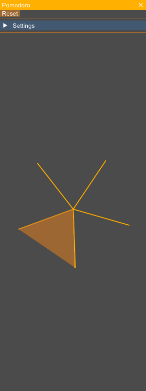
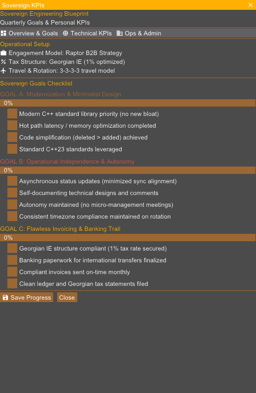
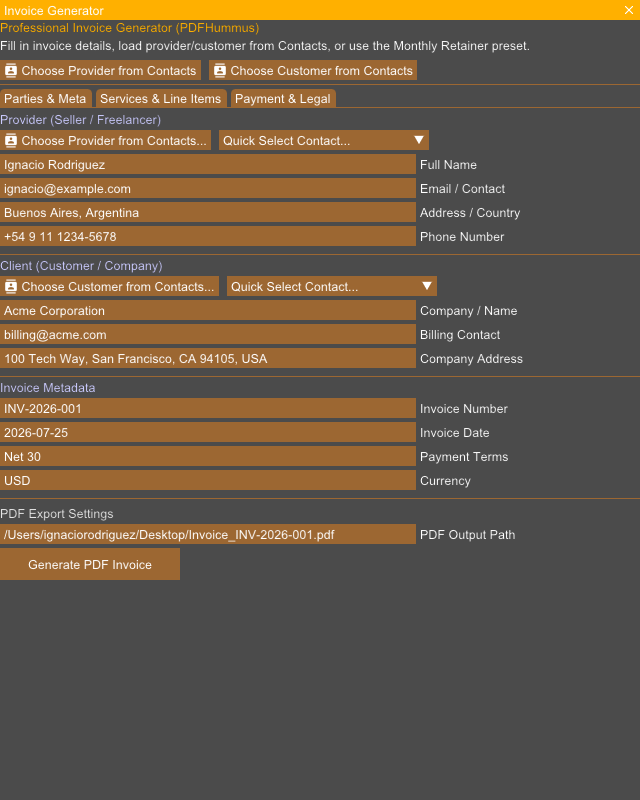
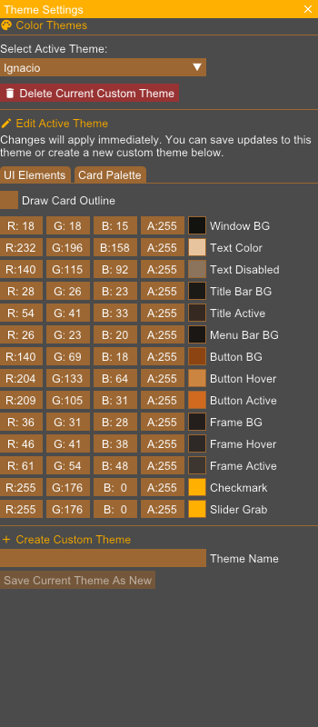

# Rouen Card Documentation: Productivity & Utilities

> [!NOTE]
> Technical overview, REST API creation URI, and live UI snapshots for all supported **Productivity & Utilities** cards running on Rouen.

## Overview Table

| Card Title | URI Schema | Description |
| :--- | :--- | :--- |
| **Calculator Card** | `uri: "calculator"` | Interactive arithmetic calculator supporting real-time expression evaluation, memory, and history logging. |
| **Unit & Currency Converter Card** | `uri: "converter"` | Universal converter for physical units (length, weight, volume, temperature) and real-time currency exchange rates. |
| **Pomodoro Timer Card** | `uri: "pomodoro"` | Focus productivity timer following the Pomodoro technique with customizable work/rest intervals. |
| **Alarm & World Clock Card** | `uri: "alarm"` | Multi-timezone world clock, alarm scheduler, and precision countdown timers. |
| **Objectives & Goals Card** | `uri: "objectives"` | Target tracking board for personal objectives, key results, and progress metrics. |
| **KPIs & Performance Metrics Card** | `uri: "kpis"` | Key Performance Indicator dashboard featuring trend indicators and data visualization. |
| **Invoice Generator Card** | `uri: "invoice"` | Professional invoice generator supporting line items, tax calculations, and export. |
| **Trello Kanban Card** | `uri: "trello"` | Kanban task management card integrated with Trello boards, lists, and cards. |
| **Jira Issue Tracker Card** | `uri: "jira"` | Agile issue tracking and sprint backlog management card integrated with Jira projects. |
| **Theme Customizer Card** | `uri: "theme"` | Visual theme editor for customizing Rouen UI color schemes, contrast, and accent styling. |

---

## Calculator Card

- **URI Schema**: `calculator`
- **Category**: Productivity & Utilities

### Description & Features
Interactive arithmetic calculator supporting real-time expression evaluation, memory, and history logging.

### REST API Interaction
```bash
# Create card
curl -X POST http://127.0.0.1:8081/api/cards -H "Content-Type: application/json" -d '{"uri":"calculator"}'

# Focus card
curl -X POST http://127.0.0.1:8081/api/cards/focus -H "Content-Type: application/json" -d '{"uri":"calculator"}'

# Capture selected card snapshot
curl -X POST http://127.0.0.1:8081/api/screenshot -H "Content-Type: application/json" -d '{"target":"selected","filename":"/tmp/snapshot_calculator.png"}'
```

### Live UI Snapshot (Captured via REST API)


---

## Unit & Currency Converter Card

- **URI Schema**: `converter`
- **Category**: Productivity & Utilities

### Description & Features
Universal converter for physical units (length, weight, volume, temperature) and real-time currency exchange rates.

### REST API Interaction
```bash
# Create card
curl -X POST http://127.0.0.1:8081/api/cards -H "Content-Type: application/json" -d '{"uri":"converter"}'

# Focus card
curl -X POST http://127.0.0.1:8081/api/cards/focus -H "Content-Type: application/json" -d '{"uri":"converter"}'

# Capture selected card snapshot
curl -X POST http://127.0.0.1:8081/api/screenshot -H "Content-Type: application/json" -d '{"target":"selected","filename":"/tmp/snapshot_converter.png"}'
```

### Live UI Snapshot (Captured via REST API)


---

## Pomodoro Timer Card

- **URI Schema**: `pomodoro`
- **Category**: Productivity & Utilities

### Description & Features
Focus productivity timer following the Pomodoro technique with customizable work/rest intervals.

### REST API Interaction
```bash
# Create card
curl -X POST http://127.0.0.1:8081/api/cards -H "Content-Type: application/json" -d '{"uri":"pomodoro"}'

# Focus card
curl -X POST http://127.0.0.1:8081/api/cards/focus -H "Content-Type: application/json" -d '{"uri":"pomodoro"}'

# Capture selected card snapshot
curl -X POST http://127.0.0.1:8081/api/screenshot -H "Content-Type: application/json" -d '{"target":"selected","filename":"/tmp/snapshot_pomodoro.png"}'
```

### Live UI Snapshot (Captured via REST API)



---

## Alarm & World Clock Card

- **URI Schema**: `alarm`
- **Category**: Productivity & Utilities

### Description & Features
Multi-timezone world clock, alarm scheduler, and precision countdown timers.

### REST API Interaction
```bash
# Create card
curl -X POST http://127.0.0.1:8081/api/cards -H "Content-Type: application/json" -d '{"uri":"alarm"}'

# Focus card
curl -X POST http://127.0.0.1:8081/api/cards/focus -H "Content-Type: application/json" -d '{"uri":"alarm"}'

# Capture selected card snapshot
curl -X POST http://127.0.0.1:8081/api/screenshot -H "Content-Type: application/json" -d '{"target":"selected","filename":"/tmp/snapshot_alarm.png"}'
```

### Live UI Snapshot (Captured via REST API)


---

## Objectives & Goals Card

- **URI Schema**: `objectives`
- **Category**: Productivity & Utilities

### Description & Features
Target tracking board for personal objectives, key results, and progress metrics.

### REST API Interaction
```bash
# Create card
curl -X POST http://127.0.0.1:8081/api/cards -H "Content-Type: application/json" -d '{"uri":"objectives"}'

# Focus card
curl -X POST http://127.0.0.1:8081/api/cards/focus -H "Content-Type: application/json" -d '{"uri":"objectives"}'

# Capture selected card snapshot
curl -X POST http://127.0.0.1:8081/api/screenshot -H "Content-Type: application/json" -d '{"target":"selected","filename":"/tmp/snapshot_objectives.png"}'
```

### Live UI Snapshot (Captured via REST API)


---

## KPIs & Performance Metrics Card

- **URI Schema**: `kpis`
- **Category**: Productivity & Utilities

### Description & Features
Key Performance Indicator dashboard featuring trend indicators and data visualization.

### REST API Interaction
```bash
# Create card
curl -X POST http://127.0.0.1:8081/api/cards -H "Content-Type: application/json" -d '{"uri":"kpis"}'

# Focus card
curl -X POST http://127.0.0.1:8081/api/cards/focus -H "Content-Type: application/json" -d '{"uri":"kpis"}'

# Capture selected card snapshot
curl -X POST http://127.0.0.1:8081/api/screenshot -H "Content-Type: application/json" -d '{"target":"selected","filename":"/tmp/snapshot_kpis.png"}'
```

### Live UI Snapshot (Captured via REST API)



---

## Invoice Generator Card

- **URI Schema**: `invoice`
- **Category**: Productivity & Utilities

### Description & Features
Professional invoice generator supporting line items, tax calculations, and export.

### REST API Interaction
```bash
# Create card
curl -X POST http://127.0.0.1:8081/api/cards -H "Content-Type: application/json" -d '{"uri":"invoice"}'

# Focus card
curl -X POST http://127.0.0.1:8081/api/cards/focus -H "Content-Type: application/json" -d '{"uri":"invoice"}'

# Capture selected card snapshot
curl -X POST http://127.0.0.1:8081/api/screenshot -H "Content-Type: application/json" -d '{"target":"selected","filename":"/tmp/snapshot_invoice.png"}'
```

### Live UI Snapshot (Captured via REST API)



---

## Trello Kanban Card

- **URI Schema**: `trello`
- **Category**: Productivity & Utilities

### Description & Features
Kanban task management card integrated with Trello boards, lists, and cards.

### REST API Interaction
```bash
# Create card
curl -X POST http://127.0.0.1:8081/api/cards -H "Content-Type: application/json" -d '{"uri":"trello"}'

# Focus card
curl -X POST http://127.0.0.1:8081/api/cards/focus -H "Content-Type: application/json" -d '{"uri":"trello"}'

# Capture selected card snapshot
curl -X POST http://127.0.0.1:8081/api/screenshot -H "Content-Type: application/json" -d '{"target":"selected","filename":"/tmp/snapshot_trello.png"}'
```

### Live UI Snapshot (Captured via REST API)


---

## Jira Issue Tracker Card

- **URI Schema**: `jira`
- **Category**: Productivity & Utilities

### Description & Features
Agile issue tracking and sprint backlog management card integrated with Jira projects.

### REST API Interaction
```bash
# Create card
curl -X POST http://127.0.0.1:8081/api/cards -H "Content-Type: application/json" -d '{"uri":"jira"}'

# Focus card
curl -X POST http://127.0.0.1:8081/api/cards/focus -H "Content-Type: application/json" -d '{"uri":"jira"}'

# Capture selected card snapshot
curl -X POST http://127.0.0.1:8081/api/screenshot -H "Content-Type: application/json" -d '{"target":"selected","filename":"/tmp/snapshot_jira.png"}'
```

### Live UI Snapshot (Captured via REST API)


---

## Theme Customizer Card

- **URI Schema**: `theme`
- **Category**: Productivity & Utilities

### Description & Features
Visual theme editor for customizing Rouen UI color schemes, contrast, and accent styling.

### REST API Interaction
```bash
# Create card
curl -X POST http://127.0.0.1:8081/api/cards -H "Content-Type: application/json" -d '{"uri":"theme"}'

# Focus card
curl -X POST http://127.0.0.1:8081/api/cards/focus -H "Content-Type: application/json" -d '{"uri":"theme"}'

# Capture selected card snapshot
curl -X POST http://127.0.0.1:8081/api/screenshot -H "Content-Type: application/json" -d '{"target":"selected","filename":"/tmp/snapshot_theme.png"}'
```

### Live UI Snapshot (Captured via REST API)



---

