# Rouen Card Documentation: System & Developer Tools

> [!NOTE]
> Technical overview, REST API creation URI, and live UI snapshots for all supported **System & Developer Tools** cards running on Rouen.

## Overview Table

| Card Title | URI Schema | Description |
| :--- | :--- | :--- |
| **System Info Card** | `uri: "sysinfo"` | Real-time hardware monitor tracking CPU load, RAM usage, GPU status, disk IO, and network throughput. |
| **Environment Variables Card** | `uri: "envvars"` | Interactive environment variable inspector, search tool, and configuration editor. |
| **Display Settings Card** | `uri: "display"` | Rouen viewport display scaling card for tuning section width multipliers and card dimensions. |
| **Settings & Preferences Card** | `uri: "settings"` | Global application preferences manager for network, audio, video, and API integrations. |
| **Data Sync Card** | `uri: "sync"` | Synchronization dashboard monitoring peer-to-peer and cloud database replication. |
| **Notifications Panel Card** | `uri: "notifications"` | Centralized system notifications feed and action center. |
| **Terminal Card** | `uri: "terminal"` | Embedded POSIX terminal emulator supporting interactive shell commands, colored output, and PTY control. |
| **Directory Browser Card** | `uri: "dir"` | File system explorer for browsing directories, viewing file details, and launching associated cards. |
| **CMake Build Manager Card** | `uri: "cmake"` | C/C++ project build card parsing CMake targets and executing Ninja builds with incremental job controls. |
| **Database Repair Card** | `uri: "dbrepair"` | SQLite database diagnostics, integrity verification, and automatic schema repair card. |
| **About Rouen Card** | `uri: "about"` | Application version information, system build metadata, active framework credits, and architecture overview. |
| **Subnet Scanner Card** | `uri: "subnet-scanner"` | Local IP network discovery scanner mapping connected devices and open service ports. |

---

## System Info Card

- **URI Schema**: `sysinfo`
- **Category**: System & Developer Tools

### Description & Features
Real-time hardware monitor tracking CPU load, RAM usage, GPU status, disk IO, and network throughput.

### REST API Interaction
```bash
# Create card
curl -X POST http://127.0.0.1:8081/api/cards -H "Content-Type: application/json" -d '{"uri":"sysinfo"}'

# Focus card
curl -X POST http://127.0.0.1:8081/api/cards/focus -H "Content-Type: application/json" -d '{"uri":"sysinfo"}'

# Capture selected card snapshot
curl -X POST http://127.0.0.1:8081/api/screenshot -H "Content-Type: application/json" -d '{"target":"selected","filename":"/tmp/snapshot_sysinfo.png"}'
```

### Live UI Snapshot (Captured via REST API)

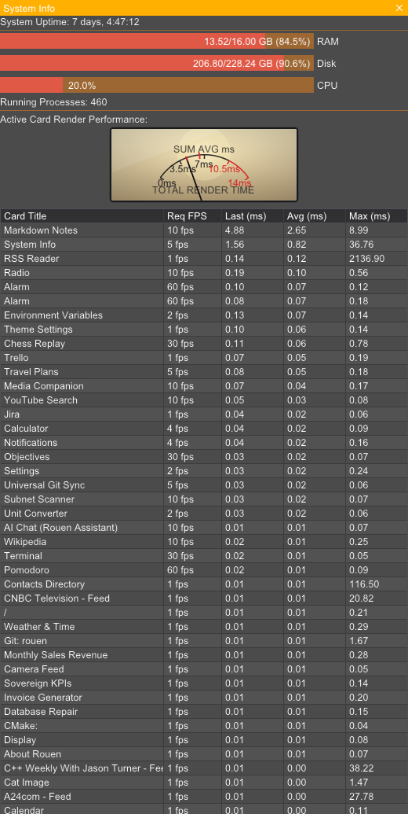

---

## Environment Variables Card

- **URI Schema**: `envvars`
- **Category**: System & Developer Tools

### Description & Features
Interactive environment variable inspector, search tool, and configuration editor.

### REST API Interaction
```bash
# Create card
curl -X POST http://127.0.0.1:8081/api/cards -H "Content-Type: application/json" -d '{"uri":"envvars"}'

# Focus card
curl -X POST http://127.0.0.1:8081/api/cards/focus -H "Content-Type: application/json" -d '{"uri":"envvars"}'

# Capture selected card snapshot
curl -X POST http://127.0.0.1:8081/api/screenshot -H "Content-Type: application/json" -d '{"target":"selected","filename":"/tmp/snapshot_envvars.png"}'
```

### Live UI Snapshot (Captured via REST API)

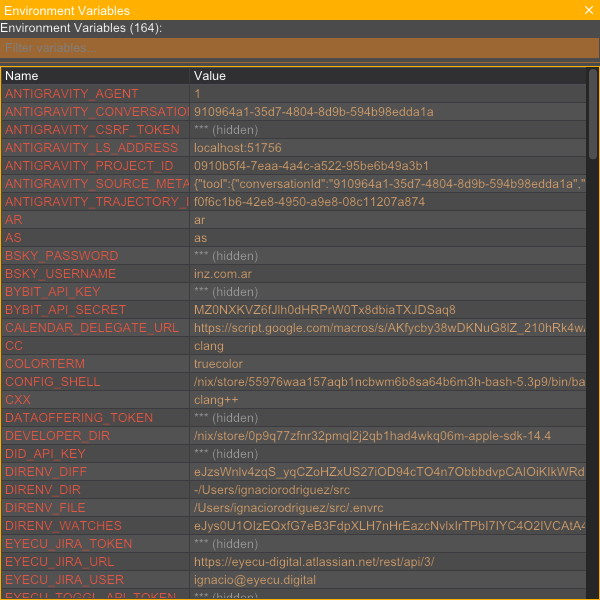

---

## Display Settings Card

- **URI Schema**: `display`
- **Category**: System & Developer Tools

### Description & Features
Rouen viewport display scaling card for tuning section width multipliers and card dimensions.

### REST API Interaction
```bash
# Create card
curl -X POST http://127.0.0.1:8081/api/cards -H "Content-Type: application/json" -d '{"uri":"display"}'

# Focus card
curl -X POST http://127.0.0.1:8081/api/cards/focus -H "Content-Type: application/json" -d '{"uri":"display"}'

# Capture selected card snapshot
curl -X POST http://127.0.0.1:8081/api/screenshot -H "Content-Type: application/json" -d '{"target":"selected","filename":"/tmp/snapshot_display.png"}'
```

### Live UI Snapshot (Captured via REST API)

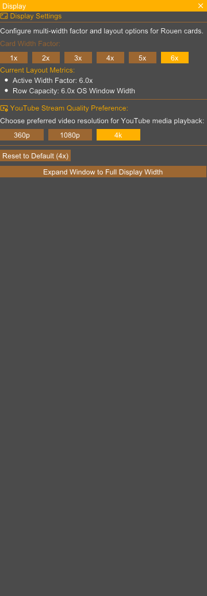

---

## Settings & Preferences Card

- **URI Schema**: `settings`
- **Category**: System & Developer Tools

### Description & Features
Global application preferences manager for network, audio, video, and API integrations.

### REST API Interaction
```bash
# Create card
curl -X POST http://127.0.0.1:8081/api/cards -H "Content-Type: application/json" -d '{"uri":"settings"}'

# Focus card
curl -X POST http://127.0.0.1:8081/api/cards/focus -H "Content-Type: application/json" -d '{"uri":"settings"}'

# Capture selected card snapshot
curl -X POST http://127.0.0.1:8081/api/screenshot -H "Content-Type: application/json" -d '{"target":"selected","filename":"/tmp/snapshot_settings.png"}'
```

### Live UI Snapshot (Captured via REST API)

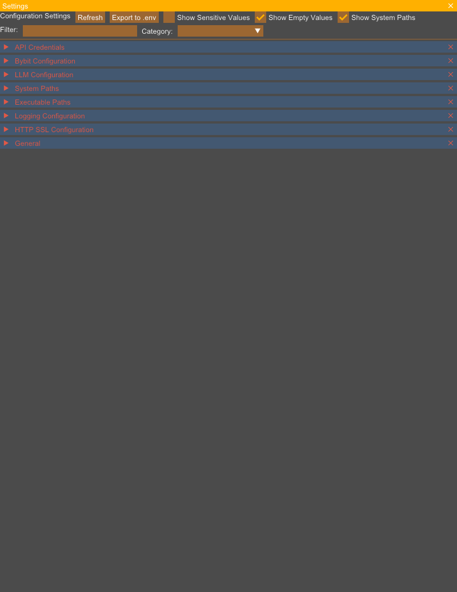

---

## Data Sync Card

- **URI Schema**: `sync`
- **Category**: System & Developer Tools

### Description & Features
Synchronization dashboard monitoring peer-to-peer and cloud database replication.

### REST API Interaction
```bash
# Create card
curl -X POST http://127.0.0.1:8081/api/cards -H "Content-Type: application/json" -d '{"uri":"sync"}'

# Focus card
curl -X POST http://127.0.0.1:8081/api/cards/focus -H "Content-Type: application/json" -d '{"uri":"sync"}'

# Capture selected card snapshot
curl -X POST http://127.0.0.1:8081/api/screenshot -H "Content-Type: application/json" -d '{"target":"selected","filename":"/tmp/snapshot_sync.png"}'
```

### Live UI Snapshot (Captured via REST API)

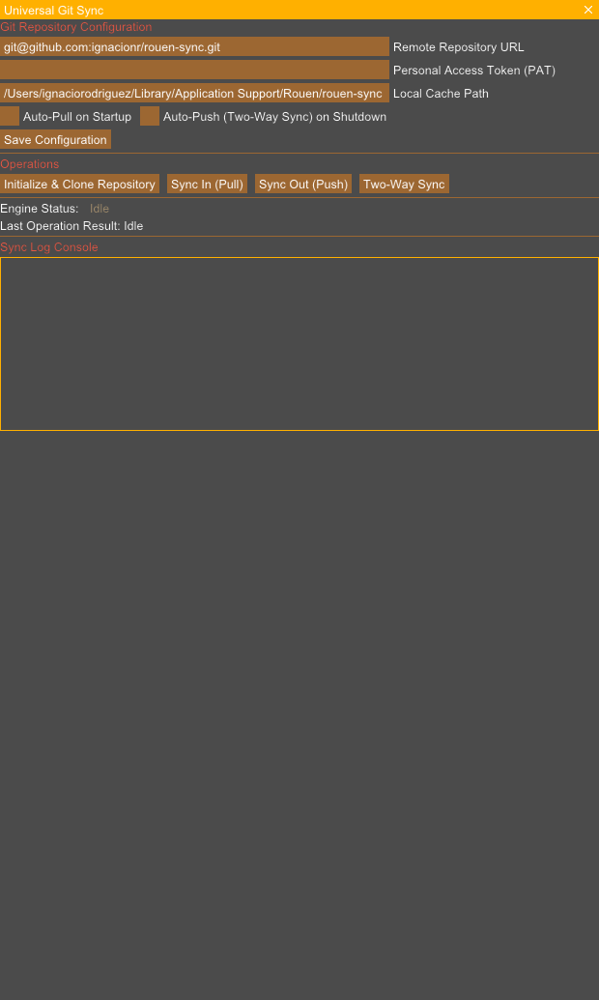

---

## Notifications Panel Card

- **URI Schema**: `notifications`
- **Category**: System & Developer Tools

### Description & Features
Centralized system notifications feed and action center.

### REST API Interaction
```bash
# Create card
curl -X POST http://127.0.0.1:8081/api/cards -H "Content-Type: application/json" -d '{"uri":"notifications"}'

# Focus card
curl -X POST http://127.0.0.1:8081/api/cards/focus -H "Content-Type: application/json" -d '{"uri":"notifications"}'

# Capture selected card snapshot
curl -X POST http://127.0.0.1:8081/api/screenshot -H "Content-Type: application/json" -d '{"target":"selected","filename":"/tmp/snapshot_notifications.png"}'
```

### Live UI Snapshot (Captured via REST API)

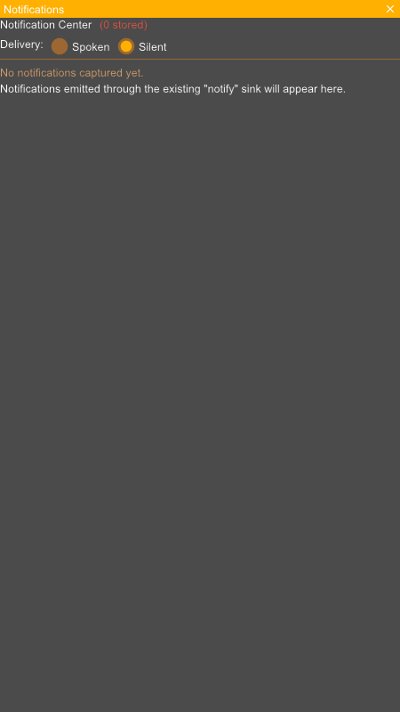

---

## Terminal Card

- **URI Schema**: `terminal`
- **Category**: System & Developer Tools

### Description & Features
Embedded POSIX terminal emulator supporting interactive shell commands, colored output, and PTY control.

### REST API Interaction
```bash
# Create card
curl -X POST http://127.0.0.1:8081/api/cards -H "Content-Type: application/json" -d '{"uri":"terminal"}'

# Focus card
curl -X POST http://127.0.0.1:8081/api/cards/focus -H "Content-Type: application/json" -d '{"uri":"terminal"}'

# Capture selected card snapshot
curl -X POST http://127.0.0.1:8081/api/screenshot -H "Content-Type: application/json" -d '{"target":"selected","filename":"/tmp/snapshot_terminal.png"}'
```

### Live UI Snapshot (Captured via REST API)

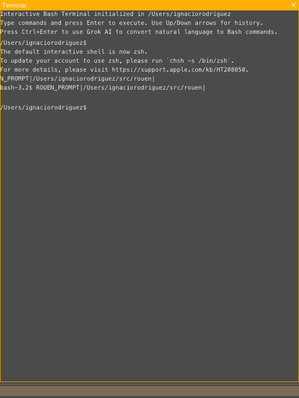

---

## Directory Browser Card

- **URI Schema**: `dir`
- **Category**: System & Developer Tools

### Description & Features
File system explorer for browsing directories, viewing file details, and launching associated cards.

### REST API Interaction
```bash
# Create card
curl -X POST http://127.0.0.1:8081/api/cards -H "Content-Type: application/json" -d '{"uri":"dir"}'

# Focus card
curl -X POST http://127.0.0.1:8081/api/cards/focus -H "Content-Type: application/json" -d '{"uri":"dir"}'

# Capture selected card snapshot
curl -X POST http://127.0.0.1:8081/api/screenshot -H "Content-Type: application/json" -d '{"target":"selected","filename":"/tmp/snapshot_dir.png"}'
```

### Live UI Snapshot (Captured via REST API)

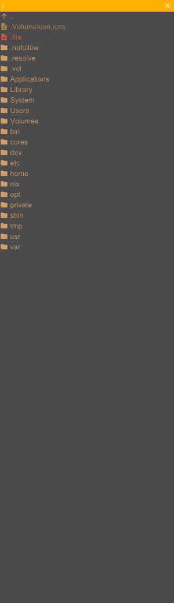

---

## CMake Build Manager Card

- **URI Schema**: `cmake`
- **Category**: System & Developer Tools

### Description & Features
C/C++ project build card parsing CMake targets and executing Ninja builds with incremental job controls.

### REST API Interaction
```bash
# Create card
curl -X POST http://127.0.0.1:8081/api/cards -H "Content-Type: application/json" -d '{"uri":"cmake"}'

# Focus card
curl -X POST http://127.0.0.1:8081/api/cards/focus -H "Content-Type: application/json" -d '{"uri":"cmake"}'

# Capture selected card snapshot
curl -X POST http://127.0.0.1:8081/api/screenshot -H "Content-Type: application/json" -d '{"target":"selected","filename":"/tmp/snapshot_cmake.png"}'
```

### Live UI Snapshot (Captured via REST API)

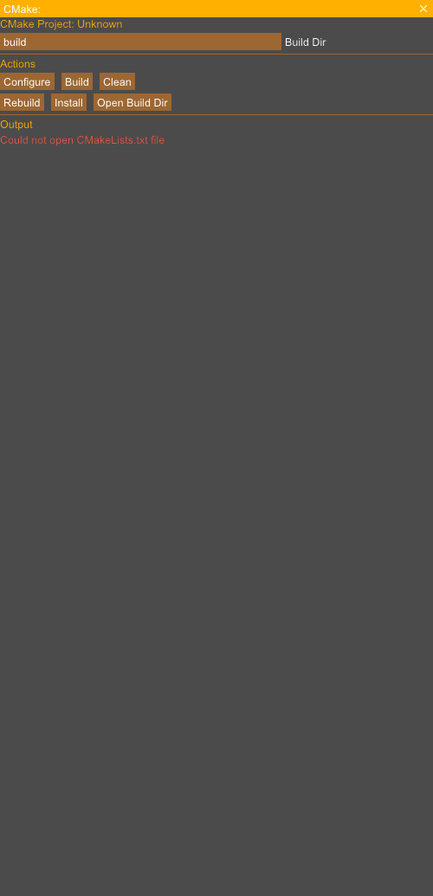

---

## Database Repair Card

- **URI Schema**: `dbrepair`
- **Category**: System & Developer Tools

### Description & Features
SQLite database diagnostics, integrity verification, and automatic schema repair card.

### REST API Interaction
```bash
# Create card
curl -X POST http://127.0.0.1:8081/api/cards -H "Content-Type: application/json" -d '{"uri":"dbrepair"}'

# Focus card
curl -X POST http://127.0.0.1:8081/api/cards/focus -H "Content-Type: application/json" -d '{"uri":"dbrepair"}'

# Capture selected card snapshot
curl -X POST http://127.0.0.1:8081/api/screenshot -H "Content-Type: application/json" -d '{"target":"selected","filename":"/tmp/snapshot_dbrepair.png"}'
```

### Live UI Snapshot (Captured via REST API)

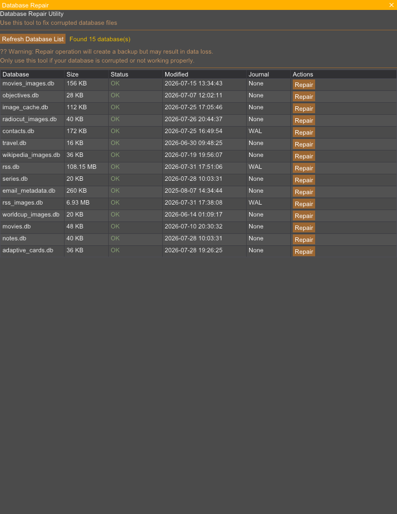

---

## About Rouen Card

- **URI Schema**: `about`
- **Category**: System & Developer Tools

### Description & Features
Application version information, system build metadata, active framework credits, and architecture overview.

### REST API Interaction
```bash
# Create card
curl -X POST http://127.0.0.1:8081/api/cards -H "Content-Type: application/json" -d '{"uri":"about"}'

# Focus card
curl -X POST http://127.0.0.1:8081/api/cards/focus -H "Content-Type: application/json" -d '{"uri":"about"}'

# Capture selected card snapshot
curl -X POST http://127.0.0.1:8081/api/screenshot -H "Content-Type: application/json" -d '{"target":"selected","filename":"/tmp/snapshot_about.png"}'
```

### Live UI Snapshot (Captured via REST API)

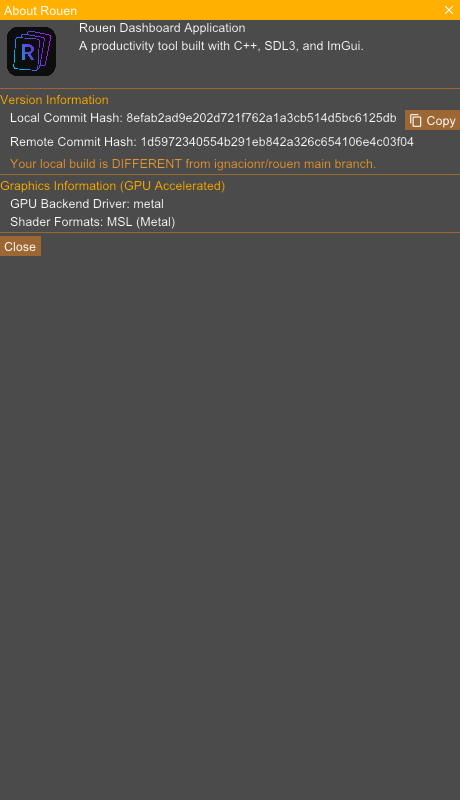

---

## Subnet Scanner Card

- **URI Schema**: `subnet-scanner`
- **Category**: System & Developer Tools

### Description & Features
Local IP network discovery scanner mapping connected devices and open service ports.

### REST API Interaction
```bash
# Create card
curl -X POST http://127.0.0.1:8081/api/cards -H "Content-Type: application/json" -d '{"uri":"subnet-scanner"}'

# Focus card
curl -X POST http://127.0.0.1:8081/api/cards/focus -H "Content-Type: application/json" -d '{"uri":"subnet-scanner"}'

# Capture selected card snapshot
curl -X POST http://127.0.0.1:8081/api/screenshot -H "Content-Type: application/json" -d '{"target":"selected","filename":"/tmp/snapshot_subnet-scanner.png"}'
```

### Live UI Snapshot (Captured via REST API)

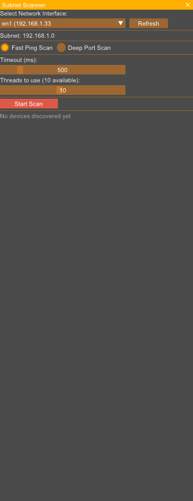

---

