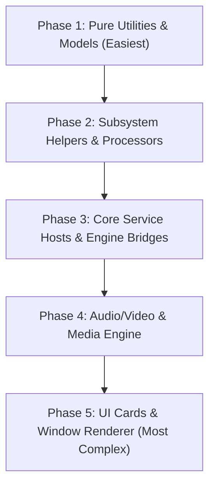

# C++20 Module Migration Plan for Rouen

This document outlines the step-by-step roadmap for converting Rouen's hybrid header-wrapper modules (`.hpp`/`.cpp`/`.cppm`) into **pure native C++20 module interface & implementation units**.

Modules are ordered by architectural complexity, from zero-dependency data utilities (easiest) up to complex ImGui rendering trees (most difficult).

---

## 📊 Migration Phasing Overview

---

## Phase 1: Pure Utility & Data Model Modules (Easiest)
> **Goal**: Convert standalone data parsers, configuration handlers, and domain model helpers.  
> **Key Characteristics**: Zero ImGui/UI dependency, standard library types only (`std::string`, `std::chrono`, `std::vector`), minimal header coupling.

| Module Name | Files | Complexity | Status |
| :--- | :--- | :--- | :--- |
| `rouen.models.rss.rss_date_parser` | `src/models/rss/rss_date_parser.*` | Low | ✅ **Converted** |
| `rouen.models.rss.rss_url_resolver` | `src/models/rss/rss_url_resolver.*` | Low | ⏳ Pending |
| `rouen.models.rss.feed_item` | `src/models/rss/feed_item.*` | Low | ⏳ Pending |
| `rouen.models.mail.metadata_serialization` | `src/models/mail/metadata_serialization.*` | Low | ⏳ Pending |
| `rouen.helpers.config_service` | `src/helpers/config_service.*` | Low | ⏳ Pending |
| `rouen.helpers.tag_manager` | `src/helpers/tag_manager.*` | Low | ⏳ Pending |
| `rouen.helpers.theme_manager` | `src/helpers/theme_manager.*` | Low | ⏳ Pending |
| `rouen.helpers.dynamic_library` | `src/helpers/dynamic_library.*` | Low-Med | ⏳ Pending |

---

## Phase 2: Autonomous Subsystem Helpers (Moderate)
> **Goal**: Convert file system monitors, process runners, and third-party data parsers.  
> **Key Characteristics**: Interacts with OS APIs (`std::filesystem`, `piped_process`) or light third-party C/C++ dependencies (`TinyXML2`, `SQLite3`).

| Module Name | Files | Key Dependencies | Status |
| :--- | :--- | :--- | :--- |
| `rouen.helpers.filetype_handler` | `src/helpers/filetype_handler.*` | `std::filesystem` | ⏳ Pending |
| `rouen.helpers.directory_watch` | `src/helpers/directory_watch.*` | OS Directory Watch API | ⏳ Pending |
| `rouen.helpers.piped_process` | `src/helpers/piped_process.*` | OS Process Pipes | ⏳ Pending |
| `rouen.models.git_process_helper` | `src/models/git_process_helper.*` | Git CLI Runner | ⏳ Pending |
| `rouen.models.git_scanner` | `src/models/git_scanner.*` | Git Repos Scanner | ⏳ Pending |
| `rouen.models.rss.feed_xml_parser` | `src/models/rss/feed_xml_parser.*` | TinyXML2 | ⏳ Pending |
| `rouen.models.rss.rss_item_repo` | `src/models/rss/rss_item_repo.*` | SQLite3 | ⏳ Pending |

---

## Phase 3: Core Service Hosts & Engine Bridges (Intermediate)
> **Goal**: Convert stateful host singletons, event buses, background sync services, and scripting engines.  
> **Key Characteristics**: Thread synchronization (`std::mutex`), global event bus, third-party C library headers (`mongoose.h`, `quickjs.h`).

| Module Name | Files | Key Dependencies | Status |
| :--- | :--- | :--- | :--- |
| `rouen.hosts.event_bus_host` | `src/hosts/event_bus_host.*` | Pub/Sub Event Bus | ⏳ Pending |
| `rouen.hosts.git_sync_host` | `src/hosts/git_sync_host.*` | Git Background Sync | ⏳ Pending |
| `rouen.hosts.universal_sync_host` | `src/hosts/universal_sync_host.*` | Sync Engine | ⏳ Pending |
| `rouen.hosts.rss_host` | `src/hosts/rss_host.*` | Feed Aggregator Host | ⏳ Pending |
| `rouen.hosts.footprints_host` | `src/hosts/footprints_host.*` | System Logger Host | ⏳ Pending |
| `rouen.hosts.api_server_host` | `src/hosts/api_server_host.*` | Mongoose HTTP Server | ⏳ Pending |
| `rouen.hosts.quickjs_host` | `src/hosts/quickjs_host.*` | QuickJS Engine | ⏳ Pending |
| `rouen.hosts.plugin_host` | `src/hosts/plugin_host.*` | Dynamic Plugin Host | ⏳ Pending |
| `rouen.hosts.mcp_host` | `src/hosts/mcp_host.*` | Model Context Protocol | ⏳ Pending |
| `rouen.hosts.llm_host` | `src/hosts/llm_host.*` | LLM API Bridge | ⏳ Pending |

---

## Phase 4: Audio, Video & Hardware Media Helpers (Advanced)
> **Goal**: Convert real-time audio/video processing and hardware-accelerated media components.  
> **Key Characteristics**: C multimedia headers (`FFmpeg`, `SDL3`, `AdLib`), real-time thread loops.

| Module Name | Files | Key Dependencies | Status |
| :--- | :--- | :--- | :--- |
| `rouen.helpers.adlib_engine` | `src/helpers/adlib_engine.*` | AdLib FM Synth | ⏳ Pending |
| `rouen.helpers.audio_capture` | `src/helpers/audio_capture.*` | Audio Input Stream | ⏳ Pending |
| `rouen.helpers.vu_meter` | `src/helpers/vu_meter.*` | Audio Level Meter | ⏳ Pending |
| `rouen.helpers.media_player_item` | `src/helpers/media_player_item.*` | Media Track State | ⏳ Pending |
| `rouen.helpers.media_player` | `src/helpers/media_player.*` | SDL3 / FFmpeg Player | ⏳ Pending |
| `rouen.helpers.mp4_writer` | `src/helpers/mp4_writer.*` | MP4 Muxer | ⏳ Pending |
| `rouen.helpers.ytdlp_service` | `src/helpers/ytdlp_service.*` | yt-dlp Process Bridge | ⏳ Pending |

---

## Phase 5: UI Cards & Window Renderer Tree (Most Complex)
> **Goal**: Convert card interface hierarchies, ImGui UI elements, and main application window loop.  
> **Key Characteristics**: ImGui context (`imgui.h`), platform window handles (`SDL3`), polymophic card factory, high header interdependence.

| Module Name | Files | Key Dependencies | Status |
| :--- | :--- | :--- | :--- |
| `rouen.helpers.card_decorations` | `src/helpers/card_decorations.*` | ImGui Styling | ⏳ Pending |
| `rouen.helpers.ui_automation_explorer` | `src/helpers/ui_automation_explorer.*` | UI Automation Tree | ⏳ Pending |
| `rouen.helpers.image_cache` | `src/helpers/image_cache.*` | GPU Texture Cache | ⏳ Pending |
| `rouen.editor` | `src/editor/editor.*` | ImGui Text Editor | ⏳ Pending |
| `rouen.cards.interface.card` | `src/cards/interface/card.*` | Abstract Base Card Class | ⏳ Pending |
| Card Category Modules | `src/cards/*/*_cards.cppm` | Card Factory & Registrars | ⏳ Pending |
| `rouen.main_wnd` | `src/main_wnd.*` | Main Application Window Loop | ⏳ Pending |

---

## 🛠️ Execution Recipe Per Module Conversion

For each target module, follow the procedure documented in [.agents/skills/cpp20-module-migration/SKILL.md](file:///Users/ignaciorodriguez/src/rouen/.agents/skills/cpp20-module-migration/SKILL.md):

1. **Refactor `.cppm`**: Place headers in `module;` block and declare direct interface exports (`export module <name>; export namespace ...`).
2. **Refactor `.cpp`**: Add `module;` fragment for headers, followed by `module <name>;`.
3. **Bridge `.hpp`**: Replace manual declarations with `import <name>;`.
4. **Register in `CMakeLists.txt`**: Add `.cppm` path to `target_sources(... PUBLIC FILE_SET CXX_MODULES FILES ...)`.
5. **Re-build & Verify**: Execute `nix develop --command cmake -G Ninja -B build -S .` and `nix develop --command cmake --build build --target rouen -j2`.
